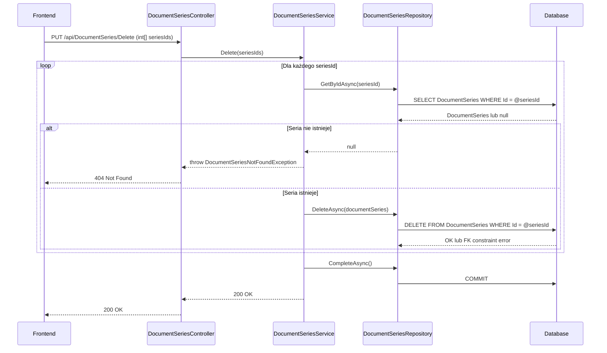

# Usuń serie dokumentów — proces techniczny

| Pole | Wartość |
|---|---|
| ID dokumentu | PROC-DeleteDocumentSeries |
| Typ dokumentu | proces |
| Wersja | 0.1 |
| Status | szkic |
| Autor (ostatnia modyfikacja) | Agent Claudiusz Sonte 4.6 max |
| Data ostatniej modyfikacji | 2026-05-31 |

## Streszczenie

Proces fizycznie usuwa jedną lub więcej serii dokumentów z systemu. Usunięcie jest nieodwracalne (hard delete). Jeśli seria jest powiązana z istniejącymi dokumentami przez FK constraint, operacja może zakończyć się błędem bazy danych bez czytelnego komunikatu dla użytkownika.

## Cel procesu

Usunąć serie numeracyjne, które nie są już potrzebne (np. po błędnym dodaniu lub zmianie systemu numeracji).

## Charakterystyka

| Atrybut | Wartość |
|---|---|
| ID procesu | PROC-DeleteDocumentSeries |
| Typ | główny |
| Inicjator | Ekran „Serie dokumentów" + zaznaczenie wierszy + operacja „Usuń" |
| Warunki startu | Użytkownik zalogowany (JWT); wybrane co najmniej jedna seria do usunięcia |
| Warunki zakończenia (sukces) | Rekordy `DocumentSeries` usunięte; HTTP 200 |
| Warunki zakończenia (błąd) | Seria nie istnieje (404); FK constraint naruszony (500) |
| Uczestnicy | Frontend (Angular), API (DocumentSeriesController), Service (DocumentSeriesService), Repository (DocumentSeriesRepository), Database (dbo.DocumentSeries) |

## Diagram sekwencji

## Kroki

1. **Odbiór żądania** — `DocumentSeriesController` odbiera tablicę `int[] seriesIds` z PUT `/api/DocumentSeries/Delete`.
2. **Pętla po ID** — dla każdego `seriesId`: `DocumentSeriesRepository.GetByIdAsync(id)`. Jeśli `null` → `DocumentSeriesNotFoundException` (HTTP 404).
3. **Fizyczne usunięcie** — `DocumentSeriesRepository.DeleteAsync(documentSeries)` — hard delete.
4. **Zapis** — `UnitOfWork.CompleteAsync()`.
5. **Odpowiedź** — HTTP 200 OK.

## Obsługa błędów

| Błąd | Miejsce wystąpienia | Reakcja |
|---|---|---|
| `DocumentSeriesNotFoundException` | DocumentSeriesService | HTTP 404 Not Found |
| FK constraint (seria ma dokumenty) | Database | HTTP 500 — błąd DB bez czytelnego komunikatu (anomalia DS-02) |
| Nieautoryzowany dostęp | AuthMiddleware | HTTP 401 Unauthorized |

## Powiązania

- Wywołany z ekranu: `01_ekrany/serie_dokumentow/`
- Powiązane API: `PUT /api/DocumentSeries/Delete`
- Powiązany algorytm: Nie dotyczy

## Powiązania z kodem

- Kontroler: `InvoiceJetAPI/Controllers/DocumentSeriesController.cs`
- Serwis: `InvoiceJetAPI/Services/DocumentSeriesService.cs`
- Repozytorium: `InvoiceJetAPI/Repositories/DocumentSeriesRepository.cs`

## Wątpliwości i braki

- Usunięcie serii z powiązanymi dokumentami powoduje błąd FK constraint — brak obsługi tego scenariusza (anomalia DS-02).
- Brak weryfikacji czy usuwana seria należy do firmy zalogowanego użytkownika.
- Hard delete — brak soft-delete.

## Rejestr zmian

| Wersja | Data | Autor | Opis zmiany |
|---|---|---|---|
| 0.1 | 2026-05-31 | Agent Claudiusz Sonte 4.6 max | Pierwsza wersja — wyodrębniona z P-07_ManageDocumentSeries.md (operacja Delete). |
