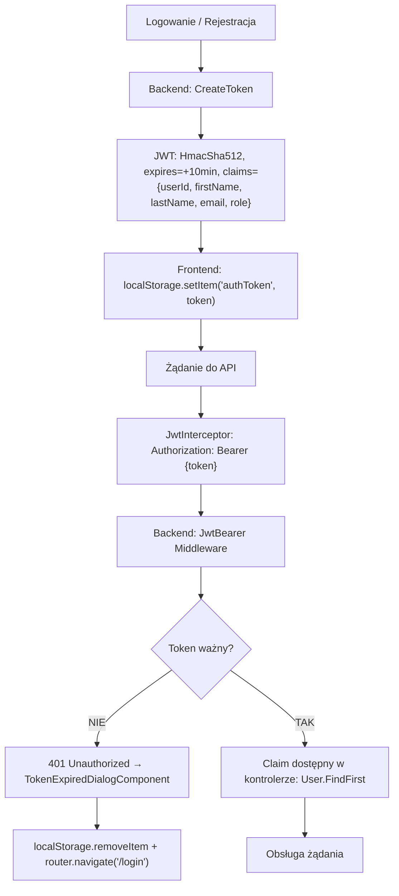

# Algorytm: Uwierzytelnienie JWT (JWT Authentication Pipeline)

| Atrybut | Wartość |
|---|---|
| ID | ALG-01 |
| Nazwa | JWT Authentication Pipeline |
| Kategoria | Bezpieczeństwo / Middleware |
| Pliki | `Program.cs`, `JwtInterceptor` (Angular), `AuthGuard` (Angular) |
| Ostatnia walidacja | 2026-05-31 |
| Autor | Agent Claudiusz Sonte 4.6 max |

## Cel

Opis pełnego cyklu życia tokenu JWT — od wystawienia przez backend, przez przechowywanie na frontendzie, dołączanie do żądań, aż po walidację na backendzie.

## Diagram przepływu



## Backend — konfiguracja JWT (Program.cs)

```csharp
builder.Services.AddAuthentication(JwtBearerDefaults.AuthenticationScheme)
    .AddJwtBearer(options => {
        options.TokenValidationParameters = new TokenValidationParameters {
            ValidateIssuerSigningKey = true,
            IssuerSigningKey = new SymmetricSecurityKey(
                Encoding.UTF8.GetBytes(builder.Configuration["AppSettings:Token"]!)
            ),
            ValidateIssuer = false,   // brak walidacji Issuer!
            ValidateAudience = false, // brak walidacji Audience!
            ClockSkew = TimeSpan.Zero // zero tolerancji na drift zegara
        };
    });
```

## Frontend — JwtInterceptor

```typescript
// Dołącza token do każdego żądania wychodzącego
intercept(request, next) {
    const token = localStorage.getItem("authToken");
    if (token) {
        request = request.clone({
            setHeaders: { Authorization: `Bearer ${token}` }
        });
    }
    return next.handle(request).pipe(
        catchError(error => {
            if (error.status === 401) {
                this.dialog.open(TokenExpiredDialogComponent);
                localStorage.removeItem("authToken");
                this.router.navigate(["/login"]);
            }
            return throwError(error);
        })
    );
}
```

## Frontend — AuthGuard

```typescript
canActivate(): boolean {
    if (this.jwtHelper.isTokenExpired(localStorage.getItem("authToken"))) {
        this.router.navigate(["/login"]);
        return false;
    }
    return true;
}
```

## Parametry tokenu

| Parametr | Wartość |
|---|---|
| Algorytm | `HmacSha512Signature` |
| Czas wygaśnięcia | 10 minut od wystawienia |
| ClockSkew | `TimeSpan.Zero` (zero tolerancji) |
| ValidateIssuer | `false` |
| ValidateAudience | `false` |
| Klucz | `AppSettings:Token` (z konfiguracji) |
| Przechowywanie | `localStorage` (nie HttpOnly cookie!) |

## Pobieranie userId z tokenu (backend)

```csharp
var userId = int.Parse(User.FindFirst("userId")!.Value);
```

Używane w każdym kontrolerze wymagającym izolacji danych.

## Anomalie

| # | Anomalia |
|---|---|
| JWT-01 | 10-minutowy token — bardzo krótki dla aplikacji biznesowej |
| JWT-02 | `localStorage` podatny na XSS |
| JWT-03 | `ValidateIssuer=false`, `ValidateAudience=false` — token z innego systemu z tym samym kluczem byłby akceptowany |
| JWT-04 | Brak refresh token — każde wygaśnięcie = ponowne logowanie |
| JWT-05 | Brak server-side invalidation — wylogowanie tylko lokalne, token na serwerze nadal ważny przez pozostałe minuty |

## Rejestr zmian

| Wersja | Data | Autor | Opis |
|---|---|---|---|
| 1.0 | 2026-05-31 | Agent Claudiusz Sonte 4.6 max | Dokument wstępny. |
