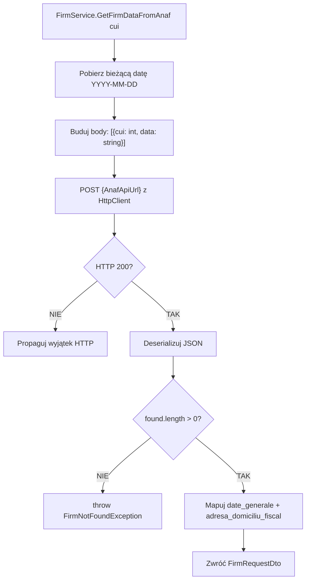

# Algorytm: Integracja z ANAF (ANAF API Integration)

| Atrybut | Wartość |
|---|---|
| ID | ALG-06 |
| Nazwa | ANAF API Integration |
| Kategoria | Integracja zewnętrzna |
| Pliki | `FirmService.cs › GetFirmDataFromAnaf()` |
| API zewnętrzne | ANAF (Agenția Națională de Administrare Fiscală) — rumuński urząd skarbowy |
| Ostatnia walidacja | 2026-05-31 |
| Autor | Agent Claudiusz Sonte 4.6 max |

## Cel

Automatyczne pobieranie danych firmy (nazwa, adres, NIP, rejestracja) z zewnętrznego API rumuńskiej administracji podatkowej na podstawie numeru CUI. Eliminuje ręczne wpisywanie danych.

## Diagram przepływu



## Żądanie do ANAF

```http
POST {AppSettings:AnafApiUrl}
Content-Type: application/json

[
  {
    "cui": 12345678,
    "data": "2026-05-31"
  }
]
```

**Uwaga:** `cui` to integer (nie string), `data` to data w formacie `YYYY-MM-DD`.

## Odpowiedź ANAF (fragment)

```json
{
  "found": [
    {
      "date_generale": {
        "denumire": "EXAMPLE SRL",
        "cui": 12345678,
        "nrRegCom": "J40/1234/2020",
        "adresa": "STR. EXEMPLU NR. 1, BUKARESZT"
      },
      "adresa_domiciliu_fiscal": {
        "ddenumire_Judet": "ILFOV",
        "ddenumire_Localitate": "BUKARESZT"
      }
    }
  ],
  "notFound": []
}
```

## Mapowanie pól

| Pole DTO | Ścieżka JSON ANAF |
|---|---|
| `firmName` | `found[0].date_generale.denumire` |
| `cuiValue` | `found[0].date_generale.cui` |
| `regCom` | `found[0].date_generale.nrRegCom` |
| `address` | `found[0].date_generale.adresa` |
| `county` | `found[0].adresa_domiciliu_fiscal.ddenumire_Judet` |
| `city` | `found[0].adresa_domiciliu_fiscal.ddenumire_Localitate` |

## Konfiguracja

```json
// appsettings.json
{
  "AppSettings": {
    "AnafApiUrl": "https://webservicesp.anaf.ro/PlatitorTvaRest/api/v8/ws/tva"
  }
}
```

## Anomalie

| # | Anomalia |
|---|---|
| ANAF-01 | Brak timeout dla HttpClient — jeśli ANAF nie odpowiada, żądanie blokuje wątek bez limitu |
| ANAF-02 | Brak cache — każde kliknięcie "chmury" wysyła nowe żądanie do ANAF |
| ANAF-03 | `cui` przekazywany jako `string` z URL, konwertowany na `int` — brak walidacji formatu CUI |
| ANAF-04 | Brak retry logic — jeden timeout = błąd dla użytkownika |
| ANAF-05 | ANAF URL w `appsettings.json` bez środowiskowego overridu — zmiana URL wymaga przebudowy |

## Rejestr zmian

| Wersja | Data | Autor | Opis |
|---|---|---|---|
| 1.0 | 2026-05-31 | Agent Claudiusz Sonte 4.6 max | Dokument wstępny. |
