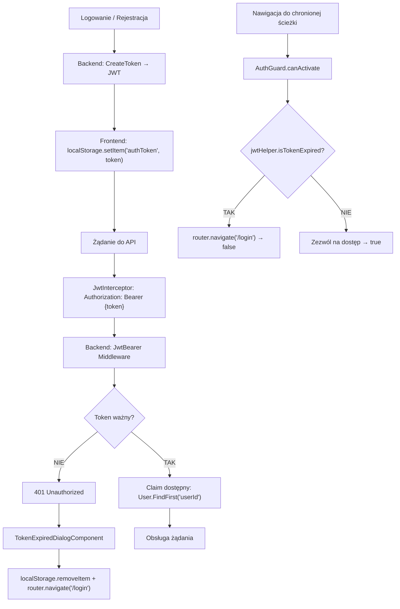

# Weryfikacja tokenu JWT (pipeline) — algorytm

| Pole | Wartość |
|---|---|
| ID dokumentu | ALG-Autoryzacyjne-WeryfikacjaTokenuJwt |
| Typ dokumentu | algorytm |
| Wersja | 0.1 |
| Status | szkic |
| Autor (ostatnia modyfikacja) | Agent Claudiusz Sonte 4.6 max |
| Data ostatniej modyfikacji | 2026-05-31 |

## Streszczenie

Algorytm opisuje pełny cykl życia tokenu JWT w systemie InvoiceJet — od wystawienia po stronie backendu, przez przechowywanie w `localStorage` na frontendzie, dołączanie do każdego żądania HTTP przez `JwtInterceptor`, aż po walidację przez middleware `JwtBearer` na backendzie. Zawiera obsługę wygasłego tokenu przez `TokenExpiredDialogComponent` i `AuthGuard`.

## Cel algorytmu

Zapewnienie że tylko uwierzytelnieni użytkownicy mogą wykonywać chronione żądania API. Token jest weryfikowany po stronie backendu przy każdym żądaniu; wygaśnięcie tokenu skutkuje wylogowaniem użytkownika i przekierowaniem na stronę logowania.

## Charakterystyka

| Atrybut | Wartość |
|---|---|
| ID algorytmu | ALG-Autoryzacyjne-WeryfikacjaTokenuJwt |
| Kategoria | autoryzacyjne |
| Wejście | Token JWT (string) w nagłówku `Authorization: Bearer {token}` |
| Wyjście | Dostęp do zasobu (claims dostępne przez `User.FindFirst`) lub HTTP 401 |
| Złożoność (orientacyjna) | O(1) — weryfikacja HMAC + sprawdzenie daty wygaśnięcia |
| Gdzie wywoływany | `Program.cs` (konfiguracja middleware), `JwtInterceptor` (Angular), `AuthGuard` (Angular) |
| Powiązana metoda w kodzie | `Program.cs: builder.Services.AddAuthentication(JwtBearerDefaults.AuthenticationScheme)` |

## Opis krok po kroku

### Strona backendu — konfiguracja weryfikacji (Program.cs)

1. Przy starcie aplikacji zarejestruj `JwtBearer` middleware z parametrami walidacji:
   ```csharp
   builder.Services.AddAuthentication(JwtBearerDefaults.AuthenticationScheme)
       .AddJwtBearer(options => {
           options.TokenValidationParameters = new TokenValidationParameters {
               ValidateIssuerSigningKey = true,
               IssuerSigningKey = new SymmetricSecurityKey(
                   Encoding.UTF8.GetBytes(builder.Configuration["AppSettings:Token"]!)
               ),
               ValidateIssuer = false,
               ValidateAudience = false,
               ClockSkew = TimeSpan.Zero
           };
       });
   ```
2. Dla każdego przychodzącego żądania HTTP middleware wyciąga nagłówek `Authorization: Bearer {token}`.
3. Weryfikuje podpis tokenu kluczem symetrycznym (`HmacSha512`) z `AppSettings:Token`.
4. Sprawdza datę wygaśnięcia (`exp`) z zerową tolerancją (`ClockSkew = TimeSpan.Zero`).
5. Jeśli token nieważny lub wygasły → odpowiedź `401 Unauthorized`.
6. Jeśli token ważny → claims dostępne przez `User.FindFirst("userId")` w kontrolerach.

### Strona frontendu — JwtInterceptor (Angular)

1. `JwtInterceptor` przechwytuje każde żądanie HTTP wychodzące z aplikacji Angular.
2. Odczytuje token z `localStorage.getItem("authToken")`.
3. Jeśli token istnieje, klonuje żądanie z nagłówkiem:
   ```typescript
   request = request.clone({
       setHeaders: { Authorization: `Bearer ${token}` }
   });
   ```
4. Przekazuje żądanie dalej i obserwuje odpowiedź.
5. Jeśli odpowiedź to `HTTP 401`:
   - Otwiera `TokenExpiredDialogComponent` (dialog informujący użytkownika).
   - Usuwa token: `localStorage.removeItem("authToken")`.
   - Przekierowuje na stronę logowania: `router.navigate(["/login"])`.

### Strona frontendu — AuthGuard (Angular)

1. Przy nawigacji do chronionej ścieżki `AuthGuard.canActivate()` jest wywoływany.
2. Sprawdza czy token istnieje i nie jest wygasły:
   ```typescript
   if (this.jwtHelper.isTokenExpired(localStorage.getItem("authToken"))) {
       this.router.navigate(["/login"]);
       return false;
   }
   return true;
   ```
3. Jeśli token wygasły lub brak → blokuje nawigację i przekierowuje na `/login`.

## Diagram przepływu



## Parametry tokenu

| Parametr | Wartość |
|---|---|
| Algorytm podpisywania | `HmacSha512Signature` |
| Czas wygaśnięcia | 10 minut od wystawienia |
| `ClockSkew` | `TimeSpan.Zero` — zero tolerancji na drift zegara |
| `ValidateIssuer` | `false` — brak walidacji wystawcy |
| `ValidateAudience` | `false` — brak walidacji odbiorcy |
| Klucz | `AppSettings:Token` (z konfiguracji) |
| Przechowywanie na froncie | `localStorage` |

## Pobieranie userId z tokenu (backend)

```csharp
var userId = int.Parse(User.FindFirst("userId")!.Value);
```

Używane w każdym kontrolerze wymagającym izolacji danych.

## Przypadki brzegowe

| Przypadek | Dane wejściowe | Oczekiwane zachowanie |
|---|---|---|
| Token wygasły (exp przekroczony) | Wygasły JWT | Backend 401; frontend otwiera TokenExpiredDialog i przekierowuje na /login |
| Brak tokenu w localStorage | null | JwtInterceptor nie dodaje nagłówka; backend zwraca 401 (endpoint wymaga auth) |
| Token z innym kluczem (inny system) | JWT podpisany innym kluczem | Backend 401 — niepoprawna sygnatura |
| Manipulacja claims (userId) | Zmodyfikowany payload | Backend 401 — sygnatura nie zgadza się po modyfikacji |
| `AppSettings:Token` brak w konfiguracji | — | Wyjątek null-forgiving przy starcie aplikacji |

## Powiązania

- Wywoływany z procesu: [`../../02_procesy/autentykacja/logowanie/proces.md`](../../02_procesy/autentykacja/logowanie/proces.md)
- Wywoływany z endpointu: [`../../04_api_i_integracje/01_api_frontend/auth/`](../../04_api_i_integracje/01_api_frontend/auth/) — wszystkie chronione endpointy
- Powiązane algorytmy: [`tworzenie_tokenu_jwt.md`](tworzenie_tokenu_jwt.md) — faza tworzenia tokenu

## Powiązania z kodem

- Klasa implementująca (backend): `InvoiceJet.Presentation/Program.cs`
- Klasa implementująca (frontend): `InvoiceJetUI/src/app/interceptors/JwtInterceptor.ts`, `InvoiceJetUI/src/app/guards/AuthGuard.ts`
- Metoda: `JwtBearer Middleware (wbudowany ASP.NET Core)`, `JwtInterceptor.intercept()`, `AuthGuard.canActivate()`

## Wątpliwości i braki

- **JWT-01:** 10-minutowy token jest bardzo krótki dla aplikacji biznesowej — każde 10 minut użytkownik jest wylogowywany. Decyzja świadoma?
- **JWT-02:** Przechowywanie tokenu w `localStorage` jest podatne na ataki XSS. Rozważyć HttpOnly cookie.
- **JWT-03:** `ValidateIssuer=false` i `ValidateAudience=false` — token z innego systemu używającego tego samego klucza byłby akceptowany.
- **JWT-04:** Brak refresh token — każde wygaśnięcie tokenu wymaga ponownego logowania.
- **JWT-05:** Brak server-side invalidation tokenu — po wylogowaniu token jest ważny przez pozostałe minuty sesji.

## Rejestr zmian

| Wersja | Data | Autor | Opis zmiany |
|---|---|---|---|
| 0.1 | 2026-05-31 | Agent Claudiusz Sonte 4.6 max | Pierwsza wersja — na podstawie ALG-01_JwtAuthentication.md. |
