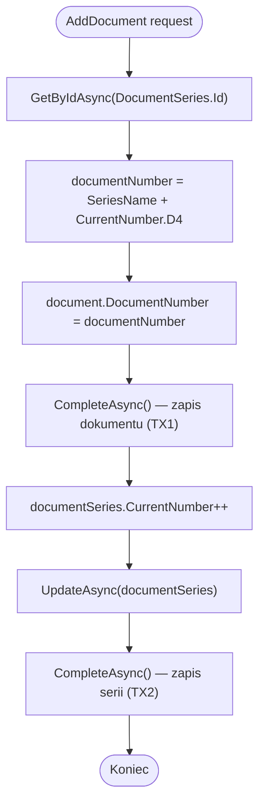

# Generowanie numeru dokumentu (Document Number Generation) — algorytm

| Pole | Wartość |
|---|---|
| ID dokumentu | ALG-Dedykowane-GenerowanieNumeruDokumentu |
| Typ dokumentu | algorytm |
| Wersja | 0.1 |
| Status | szkic |
| Autor (ostatnia modyfikacja) | Agent Claudiusz Sonte 4.6 max |
| Data ostatniej modyfikacji | 2026-05-31 |

## Streszczenie

Algorytm generuje unikalny numer dokumentu w formacie `<SeriesName><CurrentNumber:D4>` (np. `FV0001`, `PRF0003`) i automatycznie inkrementuje licznik serii po zapisaniu dokumentu. Zawiera **race condition** przy równoległych żądaniach oraz brak atomowości między zapisem dokumentu a inkrementacją licznika.

## Cel algorytmu

Wygenerowanie unikalnego, sformatowanego numeru dokumentu handlowego na podstawie wybranej serii dokumentów i automatyczne zwiększenie licznika serii, aby kolejny dokument otrzymał następny numer.

## Charakterystyka

| Atrybut | Wartość |
|---|---|
| ID algorytmu | ALG-Dedykowane-GenerowanieNumeruDokumentu |
| Kategoria | dedykowane |
| Wejście | `documentRequestDto.DocumentSeries` — obiekt serii zawierający `SeriesName` (string) i `CurrentNumber` (int) |
| Wyjście | `documentNumber: string` — wygenerowany numer dokumentu; efekt uboczny: inkrementacja `DocumentSeries.CurrentNumber` w DB |
| Złożoność (orientacyjna) | O(1) — operacje na pojedynczym rekordzie |
| Gdzie wywoływany | `DocumentService.AddDocument()` |
| Powiązana metoda w kodzie | `DocumentService.AddDocument(DocumentRequestDto documentRequestDto)` |

## Wzór

```
DocumentNumber = SeriesName + CurrentNumber.ToString("D4")
```

Format `D4` — minimalna szerokość 4 cyfry, z zerami wiodącymi:

| CurrentNumber | Sformatowany | Przykład dla SeriesName="FV" |
|---|---|---|
| 1 | `0001` | `FV0001` |
| 15 | `0015` | `FV0015` |
| 999 | `0999` | `FV0999` |
| 1000 | `1000` | `FV1000` |
| 9999 | `9999` | `FV9999` |
| 10000 | `10000` | `FV10000` (przekracza 4 cyfry — bez obcinania!) |

## Opis krok po kroku

1. Pobierz obiekt `DocumentSeries` z bazy danych:
   ```csharp
   var documentSeries = await _unitOfWork.DocumentSeries.GetByIdAsync(
       documentRequestDto.DocumentSeries!.Id
   );
   ```
2. Oblicz numer dokumentu z danych przekazanych w żądaniu:
   ```csharp
   string documentNumber = documentRequestDto.DocumentSeries?.SeriesName +
                           documentRequestDto.DocumentSeries?.CurrentNumber.ToString("D4");
   ```
   **Uwaga:** `CurrentNumber` pochodzi z obiektu DTO z żądania frontendu — nie jest re-pobierany z DB w tym momencie (anomalia ALG02-03).
3. Zmapuj DTO na encję `Document` i przypisz wygenerowany numer:
   ```csharp
   var document = _mapper.Map<Document>(documentRequestDto);
   document.DocumentNumber = documentNumber;
   ```
4. Zapisz dokument do bazy danych → `CompleteAsync()` (pierwsza transakcja).
5. Inkrementuj licznik serii:
   ```csharp
   documentSeries.CurrentNumber++;
   await _unitOfWork.DocumentSeries.UpdateAsync(documentSeries);
   await _unitOfWork.CompleteAsync(); // drugi CompleteAsync — osobna transakcja!
   ```

## Diagram przepływu



## Przypadki brzegowe

| Przypadek | Dane wejściowe | Oczekiwane zachowanie |
|---|---|---|
| Dwa równoległe żądania dla tej samej serii | Dwa POST jednocześnie | **Race condition:** obydwa odczytują ten sam `CurrentNumber` → zduplikowany numer dokumentu |
| TX1 sukces, TX2 błąd | Dokument zapisany, sieć pada | Dokument ma numer, ale licznik nie inkrementowany — następny dokument dostanie ten sam numer |
| `CurrentNumber` = 10000 | `D4` format | Numer ma 5 cyfr: `FV10000` — brak obcinania (niestandardowy format) |
| Frontend przekazuje zmanipulowany `CurrentNumber` | `CurrentNumber = 1` mimo że DB = 5 | Wygenerowany numer oparty na wartości frontendu (anomalia ALG02-03) |
| Seria nie istnieje (`GetByIdAsync` = null) | Nieprawidłowe `DocumentSeries.Id` | NullReferenceException lub `DocumentSeriesNotFoundException` |

## Powiązania

- Wywoływany z procesu: [`../../02_procesy/dokumenty/dodaj_dokument/proces.md`](../../02_procesy/dokumenty/dodaj_dokument/proces.md)
- Wywoływany z endpointu: [`../../04_api_i_integracje/01_api_frontend/document/`](../../04_api_i_integracje/01_api_frontend/document/) — endpoint `AddDocument`
- Powiązane encje: [`../../05_model_danych/01_db/dbo/dbo.DocumentSeries.md`](../../05_model_danych/01_db/dbo/dbo.DocumentSeries.md), [`../../05_model_danych/01_db/dbo/dbo.Document.md`](../../05_model_danych/01_db/dbo/dbo.Document.md)

## Powiązania z kodem

- Klasa implementująca: `InvoiceJet.Application/Services/DocumentService.cs`
- Metoda: `DocumentService.AddDocument(DocumentRequestDto documentRequestDto)`

## Wątpliwości i braki

- **ALG02-01 [KRYTYCZNE — Race condition]:** Brak pesymistycznej blokady (`SELECT FOR UPDATE`) ani optymistycznej (ETag/RowVersion) na `CurrentNumber` — przy równoległych żądaniach możliwe duplikaty numerów dokumentów.
- **ALG02-02:** Dwa osobne `CompleteAsync()` — inkrementacja serii w oddzielnej transakcji od zapisu dokumentu. Możliwy stan niespójny: dokument zapisany z numerem, ale licznik nie zwiększony.
- **ALG02-03:** `CurrentNumber` odczytywany z DTO frontendu, nie re-pobierany z DB tuż przed generowaniem numeru — frontend może przekazać zmanipulowany lub przestarzały numer.

## Rejestr zmian

| Wersja | Data | Autor | Opis zmiany |
|---|---|---|---|
| 0.1 | 2026-05-31 | Agent Claudiusz Sonte 4.6 max | Pierwsza wersja — na podstawie ALG-02_DocumentNumberGeneration.md. |
