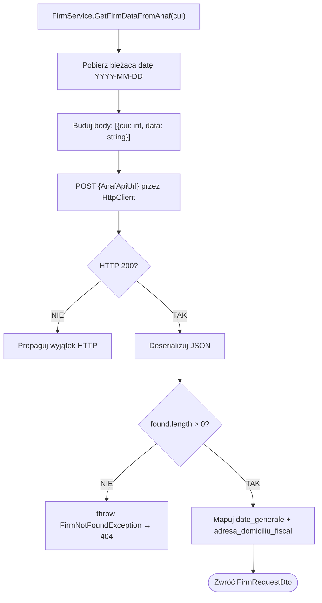

# Integracja z ANAF (ANAF API Integration) — algorytm

| Pole | Wartość |
|---|---|
| ID dokumentu | ALG-Dedykowane-IntegracjaAnaf |
| Typ dokumentu | algorytm |
| Wersja | 0.1 |
| Status | szkic |
| Autor (ostatnia modyfikacja) | Agent Claudiusz Sonte 4.6 max |
| Data ostatniej modyfikacji | 2026-05-31 |

## Streszczenie

Algorytm automatycznie pobiera dane rejestrowe firmy rumuńskiej z zewnętrznego API ANAF (Agenția Națională de Administrare Fiscală — rumuński urząd skarbowy) na podstawie numeru CUI (odpowiednik NIP). Eliminuje ręczne wpisywanie danych firmy przez użytkownika, zwracając nazwę, adres, numer rejestracyjny i dane geograficzne.

## Cel algorytmu

Pobranie danych identyfikacyjnych firmy z rejestru podatników ANAF na podstawie numeru CUI i zmapowanie ich do `FirmRequestDto` gotowego do wyświetlenia w formularzu użytkownika.

## Charakterystyka

| Atrybut | Wartość |
|---|---|
| ID algorytmu | ALG-Dedykowane-IntegracjaAnaf |
| Kategoria | dedykowane |
| Wejście | `cui: string` — numer CUI firmy rumuńskiej (przekazany jako parametr URL, konwertowany na `int`) |
| Wyjście | `FirmRequestDto` — dane firmy (nazwa, adres, CUI, nr rejestracyjny, województwo, miasto) |
| Złożoność (orientacyjna) | O(1) — jedno żądanie HTTP do API zewnętrznego |
| Gdzie wywoływany | `FirmService.GetFirmDataFromAnaf(string cui)` |
| Powiązana metoda w kodzie | `FirmService.GetFirmDataFromAnaf()` |

## Opis krok po kroku

1. Odbierz `cui` jako parametr URL (string); skonwertuj na `int`.
2. Pobierz bieżącą datę w formacie `YYYY-MM-DD`: `DateTime.Now.ToString("yyyy-MM-dd")`.
3. Zbuduj ciało żądania POST jako JSON:
   ```http
   POST {AppSettings:AnafApiUrl}
   Content-Type: application/json

   [{ "cui": 12345678, "data": "2026-05-31" }]
   ```
4. Wyślij żądanie przez `HttpClient` do `AppSettings:AnafApiUrl`.
5. Jeśli odpowiedź HTTP != 200 → propaguj wyjątek HTTP.
6. Deserializuj odpowiedź JSON z ANAF.
7. Sprawdź czy `found.length > 0`:
   - Jeśli `false` → rzuć `FirmNotFoundException()` (HTTP 404).
8. Zmapuj pola z `found[0]` do `FirmRequestDto`:
   ```
   firmName  ← found[0].date_generale.denumire
   cuiValue  ← found[0].date_generale.cui
   regCom    ← found[0].date_generale.nrRegCom
   address   ← found[0].date_generale.adresa
   county    ← found[0].adresa_domiciliu_fiscal.ddenumire_Judet
   city      ← found[0].adresa_domiciliu_fiscal.ddenumire_Localitate
   ```
9. Zwróć `FirmRequestDto` do kontrolera.

## Diagram przepływu



## Format żądania do ANAF

```json
[
  {
    "cui": 12345678,
    "data": "2026-05-31"
  }
]
```

**Uwaga:** `cui` to `integer`, nie `string`. `data` — data w formacie `YYYY-MM-DD`.

## Fragment odpowiedzi ANAF

```json
{
  "found": [
    {
      "date_generale": {
        "denumire": "EXAMPLE SRL",
        "cui": 12345678,
        "nrRegCom": "J40/1234/2020",
        "adresa": "STR. EXEMPLU NR. 1, BUKARESZT"
      },
      "adresa_domiciliu_fiscal": {
        "ddenumire_Judet": "ILFOV",
        "ddenumire_Localitate": "BUKARESZT"
      }
    }
  ],
  "notFound": []
}
```

## Mapowanie pól

| Pole DTO | Ścieżka w odpowiedzi ANAF |
|---|---|
| `firmName` | `found[0].date_generale.denumire` |
| `cuiValue` | `found[0].date_generale.cui` |
| `regCom` | `found[0].date_generale.nrRegCom` |
| `address` | `found[0].date_generale.adresa` |
| `county` | `found[0].adresa_domiciliu_fiscal.ddenumire_Judet` |
| `city` | `found[0].adresa_domiciliu_fiscal.ddenumire_Localitate` |

## Konfiguracja

```json
// appsettings.json
{
  "AppSettings": {
    "AnafApiUrl": "https://webservicesp.anaf.ro/PlatitorTvaRest/api/v8/ws/tva"
  }
}
```

## Przypadki brzegowe

| Przypadek | Dane wejściowe | Oczekiwane zachowanie |
|---|---|---|
| CUI nieistniejący w ANAF | `cui = 99999999` | `found = []` → `FirmNotFoundException` → 404 |
| ANAF niedostępny (timeout) | Brak odpowiedzi | Brak timeout — żądanie blokuje wątek bezterminowo (anomalia ANAF-01) |
| CUI nie jest liczbą | `cui = "abc"` | Wyjątek przy konwersji string → int; brak walidacji formatu |
| Firma w `notFound` | Nieaktywny NIP | `found = []` → `FirmNotFoundException` → 404 |
| ANAF zwraca wiele firm | Wiele rekordów w `found` | Mapowany tylko `found[0]` — reszta ignorowana |

## Powiązania

- Wywoływany z procesu: [`../../02_procesy/firma/pobierz_z_anaf/proces.md`](../../02_procesy/firma/pobierz_z_anaf/proces.md)
- Wywoływany z endpointu: [`../../04_api_i_integracje/01_api_frontend/firm/`](../../04_api_i_integracje/01_api_frontend/firm/) — endpoint `GetFirmDataFromAnaf`
- Powiązane systemy dziedzinowe: [`../../04_api_i_integracje/02_systemy_dziedzinowe/anaf/`](../../04_api_i_integracje/02_systemy_dziedzinowe/anaf/)

## Powiązania z kodem

- Klasa implementująca: `InvoiceJet.Application/Services/FirmService.cs`
- Metoda: `FirmService.GetFirmDataFromAnaf(string cui)`

## Wątpliwości i braki

- **ANAF-01:** Brak timeout dla `HttpClient` — jeśli ANAF nie odpowiada, żądanie blokuje wątek bez limitu. Dodać `HttpClient.Timeout`.
- **ANAF-02:** Brak cache odpowiedzi — każde kliknięcie "pobierz z ANAF" wysyła nowe żądanie. Dla tego samego CUI dane rzadko się zmieniają.
- **ANAF-03:** `cui` przekazywany jako `string` z URL, konwertowany na `int` bez walidacji formatu CUI (powinien mieć 6–10 cyfr).
- **ANAF-04:** Brak retry logic — jeden timeout = błąd dla użytkownika.
- **ANAF-05:** URL ANAF w `appsettings.json` bez środowiskowego override'u — zmiana wersji API wymaga przebudowy i wdrożenia.

## Rejestr zmian

| Wersja | Data | Autor | Opis zmiany |
|---|---|---|---|
| 0.1 | 2026-05-31 | Agent Claudiusz Sonte 4.6 max | Pierwsza wersja — na podstawie ALG-06_AnafIntegration.md. |
