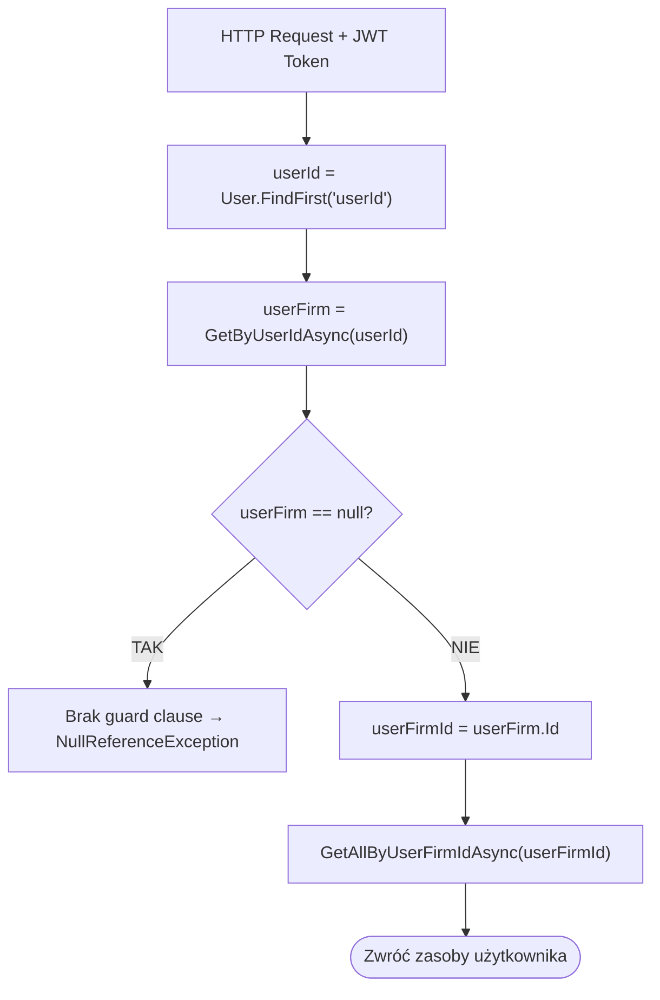

# Izolacja danych użytkownika (UserFirm Data Isolation Pattern) — algorytm

| Pole | Wartość |
|---|---|
| ID dokumentu | ALG-Dedykowane-IzolacjaDanychUserFirm |
| Typ dokumentu | algorytm |
| Wersja | 0.1 |
| Status | szkic |
| Autor (ostatnia modyfikacja) | Agent Claudiusz Sonte 4.6 max |
| Data ostatniej modyfikacji | 2026-05-31 |

## Streszczenie

Wzorzec izolacji danych zapewnia, że każdy zalogowany użytkownik widzi i modyfikuje wyłącznie własne zasoby (produkty, dokumenty, konta bankowe, serie dokumentów). Realizowany przez powiązanie wszystkich zasobów z `UserFirm.Id` — nie bezpośrednio z `User.Id`. Każde żądanie autoryzowane wyciąga `userId` z tokenu JWT, pobiera powiązane `UserFirm` i filtruje zasoby przez `userFirmId`.

## Cel algorytmu

Zapewnienie separacji danych między różnymi użytkownikami systemu InvoiceJet — każdy użytkownik operuje tylko na swoich zasobach, bez możliwości odczytu ani modyfikacji zasobów innych użytkowników.

## Charakterystyka

| Atrybut | Wartość |
|---|---|
| ID algorytmu | ALG-Dedykowane-IzolacjaDanychUserFirm |
| Kategoria | dedykowane |
| Wejście | Token JWT (claim `userId`) w nagłówku `Authorization` |
| Wyjście | Zasoby filtrowane przez `userFirmId` (kolekcja lub pojedynczy zasób) |
| Złożoność (orientacyjna) | O(1) — dwa dodatkowe zapytania DB per żądanie (userId → userFirmId → zasoby) |
| Gdzie wywoływany | Wszystkie serwisy: `ProductService`, `DocumentService`, `BankAccountService`, `DocumentSeriesService`, `FirmService` |
| Powiązana metoda w kodzie | `UserFirmRepository.GetByUserIdAsync(int userId)` |

## Opis krok po kroku

1. Kontroler wyciąga `userId` z claimu tokenu JWT:
   ```csharp
   var userId = int.Parse(User.FindFirst("userId")!.Value);
   ```
2. Serwis pobiera `UserFirm` dla `userId`:
   ```csharp
   var userFirm = await _unitOfWork.UserFirms.GetByUserIdAsync(userId);
   var userFirmId = userFirm.Id;
   ```
3. Serwis filtruje wszystkie zasoby przez `userFirmId`:
   ```csharp
   var products = await _unitOfWork.Products.GetAllByUserFirmIdAsync(userFirmId);
   ```
4. Operacje zapisu przypisują `userFirmId` do nowego zasobu:
   ```csharp
   product.UserFirmId = userFirmId;
   ```

## Model relacji

```
User (1) ──── (1) UserFirm (1) ──── (N) BankAccount
                              (1) ──── (N) Product
                              (1) ──── (N) DocumentSeries
                              (1) ──── (N) Document (jako wystawiający)
                              (N) ──── (M) Firm (klienci)
```

## Schemat tabeli UserFirm

```sql
UserFirm:
  Id       INT PK IDENTITY
  UserId   INT FK → User.Id
  FirmId   INT FK → Firm.Id (NULLABLE — użytkownik bez firmy)

-- Zasoby powiązane z UserFirm (nie z User):
BankAccount.UserFirmId    → UserFirm.Id
Product.UserFirmId        → UserFirm.Id
DocumentSeries.UserFirmId → UserFirm.Id
Document.UserFirmId       → UserFirm.Id
```

## Diagram przepływu



## Weryfikacja własności przy edycji/usuwaniu

Przy operacjach modyfikacji zasobu brak pełnej weryfikacji właściciela:

```csharp
// Przykład z BankAccountService
var bankAccount = await _unitOfWork.BankAccounts.GetByIdAsync(id);
if (bankAccount == null) throw new BankAccountNotFoundException();
// BRAK: if (bankAccount.UserFirmId != userFirmId) throw new UnauthorizedException();
```

To oznacza, że użytkownik znający `id` zasobu może go edytować lub usunąć, nawet jeśli nie jest jego właścicielem.

## Przypadki brzegowe

| Przypadek | Dane wejściowe | Oczekiwane zachowanie |
|---|---|---|
| Użytkownik bez firmy (`FirmId = null`) | Nowy użytkownik, brak dodanej firmy | `userFirm.FirmId == null`; serwisy pobierające firmę mogą rzucić wyjątek (brak guard clause) |
| Zasób innego użytkownika (znany ID) | `bankAccountId = 999` (cudzy) | Brak weryfikacji właściciela → zasób zostaje zmodyfikowany (anomalia ISO-01) |
| `userId` z tokenu nieistniejący w DB | Usunięty użytkownik | `GetByUserIdAsync` zwraca `null` → NullReferenceException |
| Duplikat nazwy produktu | Ten sam `Name` u różnych użytkowników | UNIQUE INDEX na `Product.Name` jest globalny (nie per UserFirm) → błąd 500 (anomalia ISO-02) |

## Powiązania

- Wywoływany z procesu: Wszystkie procesy wymagające autoryzacji
- Wywoływany z endpointu: Wszystkie chronione endpointy API
- Powiązane algorytmy: [`../autoryzacyjne/weryfikacja_tokenu_jwt.md`](../autoryzacyjne/weryfikacja_tokenu_jwt.md) — dostarcza `userId` z claimu

## Powiązania z kodem

- Klasy implementujące: Wszystkie serwisy aplikacyjne w `InvoiceJet.Application/Services/`
- Kluczowe repozytorium: `InvoiceJet.Infrastructure/Repositories/UserFirmRepository.cs`
- Metoda izolacji: `UserFirmRepository.GetByUserIdAsync(int userId)`

## Wątpliwości i braki

- **ISO-01 [Potencjalna luka bezpieczeństwa]:** Przy edycji i usuwaniu zasobu brak weryfikacji czy `zasób.UserFirmId == userFirmId` — użytkownik znający `id` cudzego zasobu może go modyfikować lub usunąć.
- **ISO-02:** `Product.Name` ma UNIQUE INDEX globalny (nie per `UserFirmId`) — naruszenie izolacji na poziomie katalogowym; dwóch użytkowników nie może mieć produktu o tej samej nazwie.
- **ISO-03:** `UserFirm.FirmId` może być `null` gdy użytkownik nie dodał jeszcze firmy — brak guard clause w serwisach; możliwy `NullReferenceException`.
- **ISO-04:** Izolacja danych realizowana wyłącznie na poziomie aplikacyjnym (kod C#) — brak row-level security w bazie danych (SQL Server RLS). Bezpośredni dostęp do DB omija całą izolację.

## Rejestr zmian

| Wersja | Data | Autor | Opis zmiany |
|---|---|---|---|
| 0.1 | 2026-05-31 | Agent Claudiusz Sonte 4.6 max | Pierwsza wersja — na podstawie ALG-10_DataIsolationPattern.md. |
