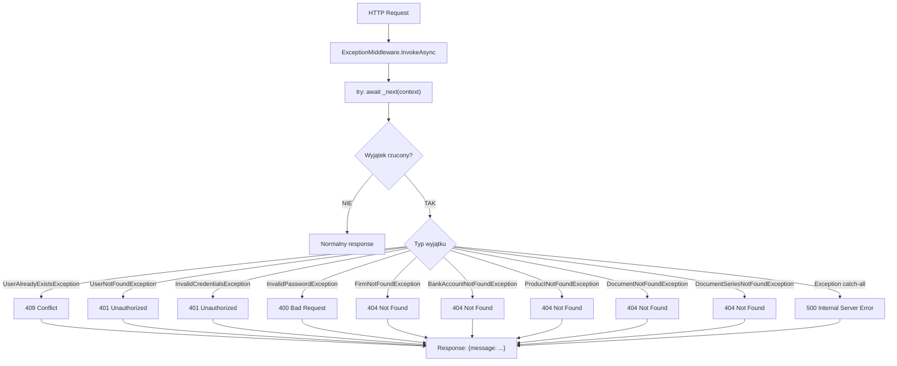

# Pipeline obsługi wyjątków (ExceptionMiddleware) — algorytm

| Pole | Wartość |
|---|---|
| ID dokumentu | ALG-Dedykowane-PipelineObslugiWyjatkow |
| Typ dokumentu | algorytm |
| Wersja | 0.1 |
| Status | szkic |
| Autor (ostatnia modyfikacja) | Agent Claudiusz Sonte 4.6 max |
| Data ostatniej modyfikacji | 2026-05-31 |

## Streszczenie

Algorytm realizuje globalną obsługę wyjątków na poziomie middleware ASP.NET Core. Przechwytuje wszystkie wyjątki rzucane przez serwisy aplikacyjne i mapuje je na właściwe kody HTTP z ujednoliconą odpowiedzią JSON `{"message": "..."}`. Eliminuje konieczność obsługi wyjątków w każdym kontrolerze osobno.

## Cel algorytmu

Centralne przechwycenie i obsługa wyjątków domenowych w pipeline HTTP — mapowanie znanych wyjątków biznesowych na właściwe kody HTTP (400, 401, 404, 409) i zabezpieczenie przed ujawnianiem szczegółów technicznych w przypadku nieobsłużonych wyjątków (500).

## Charakterystyka

| Atrybut | Wartość |
|---|---|
| ID algorytmu | ALG-Dedykowane-PipelineObslugiWyjatkow |
| Kategoria | dedykowane |
| Wejście | `HttpContext` — kontekst żądania HTTP; wyjątek rzucony gdziekolwiek w pipeline |
| Wyjście | Odpowiedź HTTP z kodem statusu i JSON `{"message": "..."}` |
| Złożoność (orientacyjna) | O(1) — catch na typie wyjątku |
| Gdzie wywoływany | Globalnie — każde żądanie HTTP przechodzi przez `ExceptionMiddleware` |
| Powiązana metoda w kodzie | `ExceptionMiddleware.InvokeAsync(HttpContext context)` |

## Opis krok po kroku

1. Middleware przechwytuje każde żądanie HTTP wchodzące w pipeline.
2. Wykonuje `try { await _next(context); }` — przekazuje żądanie do kolejnych middleware.
3. Jeśli żaden wyjątek nie zostanie rzucony → normalna odpowiedź.
4. Jeśli wyjątek zostanie rzucony → identyfikuje jego typ i ustawia odpowiedni kod HTTP:
   ```csharp
   catch (UserAlreadyExistsException ex) {
       context.Response.StatusCode = 409;
       await context.Response.WriteAsJsonAsync(new { message = ex.Message });
   }
   catch (UserNotFoundException ex) {
       context.Response.StatusCode = 401;
       // ...
   }
   // ... pozostałe wyjątki domenowe ...
   catch (Exception ex) {
       context.Response.StatusCode = 500;
       await context.Response.WriteAsJsonAsync(new { message = ex.Message });
   }
   ```
5. Zwraca odpowiedź JSON z polem `message`.

## Mapa wyjątków → kody HTTP

| Wyjątek domenowy | Kod HTTP | Komunikat zwracany klientowi |
|---|---|---|
| `UserAlreadyExistsException` | 409 Conflict | "User already exists" |
| `UserNotFoundException` | 401 Unauthorized | "User not found" |
| `InvalidCredentialsException` | 401 Unauthorized | "Invalid credentials" |
| `InvalidPasswordException` | 400 Bad Request | "Invalid password" |
| `FirmNotFoundException` | 404 Not Found | "Firm not found" |
| `BankAccountNotFoundException` | 404 Not Found | "Bank account not found" |
| `ProductNotFoundException` | 404 Not Found | "Product not found" |
| `DocumentNotFoundException` | 404 Not Found | "Document not found" |
| `DocumentSeriesNotFoundException` | 404 Not Found | "Document series not found" |
| `Exception` (catch-all) | 500 Internal Server Error | Treść `ex.Message` (szczegóły techniczne!) |

## Format odpowiedzi błędu

```json
{
  "message": "User not found"
}
```

## Diagram przepływu



## Rejestracja w Program.cs

```csharp
// Program.cs
app.UseMiddleware<ExceptionMiddleware>();
// Musi być zarejestrowane przed UseAuthentication i UseAuthorization
```

## Przypadki brzegowe

| Przypadek | Dane wejściowe | Oczekiwane zachowanie |
|---|---|---|
| Wyjątek UniqueConstraint (duplikat nazwy produktu) | INSERT z duplikatem | Trafia do catch-all → 500; brak własnego wyjątku domenowego (anomalia EXC-01) |
| Wyjątek w middleware przed ExceptionMiddleware | Błąd w innym middleware | Nie jest przechwytywany przez ExceptionMiddleware — propaguje dalej |
| `ex.Message` zawiera stack trace | Wyjątek systemowy | 500 z pełnym stack trace w odpowiedzi — ryzyko ujawnienia szczegółów w produkcji (anomalia EXC-02) |
| Kontroler z własnym try/catch | `DocumentController` | Wyjątek obsłużony lokalnie — nie dociera do ExceptionMiddleware (podwójna obsługa) |

## Powiązania

- Wywoływany z procesu: Wszystkie procesy backendu — middleware globalne
- Wywoływany z endpointu: Wszystkie endpointy API
- Powiązane algorytmy: [`../walidacji/walidacja_hasla.md`](../walidacji/walidacja_hasla.md) — rzuca `InvalidPasswordException`

## Powiązania z kodem

- Klasa implementująca: `InvoiceJet.Presentation/Middleware/ExceptionMiddleware.cs`
- Rejestracja: `InvoiceJet.Presentation/Program.cs`
- Metoda: `ExceptionMiddleware.InvokeAsync(HttpContext context)`

## Wątpliwości i braki

- **EXC-01:** Wyjątek naruszenia unikalności (np. duplikat nazwy produktu w tabeli `Product`) trafia do catch-all → HTTP 500 zamiast 409 Conflict. Brak własnego wyjątku domenowego `DuplicateProductNameException`.
- **EXC-02:** Catch-all 500 zwraca `ex.Message` — w środowisku produkcyjnym może ujawniać szczegóły techniczne (stack trace, nazwy tabel, szczegóły połączenia). Zalecane: zwracaj generyczny komunikat "Internal server error" w produkcji.
- **EXC-03:** Kontrolery `DocumentController` i `BankAccountController` mają własne `try/catch` obok middleware — podwójna obsługa błędów, niespójna odpowiedź w zależności od ścieżki.

## Rejestr zmian

| Wersja | Data | Autor | Opis zmiany |
|---|---|---|---|
| 0.1 | 2026-05-31 | Agent Claudiusz Sonte 4.6 max | Pierwsza wersja — na podstawie ALG-09_ExceptionMiddlewarePipeline.md. |
