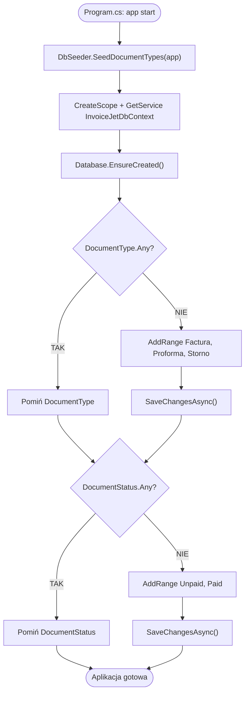

# Seedowanie słowników przy starcie aplikacji (DbSeeder) — algorytm

| Pole | Wartość |
|---|---|
| ID dokumentu | ALG-Dedykowane-SeedTypowDokumentow |
| Typ dokumentu | algorytm |
| Wersja | 0.1 |
| Status | szkic |
| Autor (ostatnia modyfikacja) | Agent Claudiusz Sonte 4.6 max |
| Data ostatniej modyfikacji | 2026-05-31 |

## Streszczenie

Algorytm inicjalizuje słownikowe dane referencyjne bazy danych przy każdym starcie aplikacji InvoiceJet. Wypełnia tabele `DocumentType` (3 rekordy: Faktura/Proforma/Storno) i `DocumentStatus` (2 rekordy: Unpaid/Paid) jeśli są puste. Operacja jest idempotentna — wywołanie wielokrotne nie duplikuje danych dzięki sprawdzeniu `Any()` przed insertami.

## Cel algorytmu

Zapewnienie że tabele słownikowe (`DocumentType`, `DocumentStatus`) zawierają wymagane dane bazowe niezbędne do poprawnego działania aplikacji, niezależnie od stanu bazy danych (nowa instalacja lub restart po czyszczeniu).

## Charakterystyka

| Atrybut | Wartość |
|---|---|
| ID algorytmu | ALG-Dedykowane-SeedTypowDokumentow |
| Kategoria | dedykowane |
| Wejście | `IApplicationBuilder applicationBuilder` — builder aplikacji ASP.NET Core |
| Wyjście | Wypełnione tabele `DocumentType` i `DocumentStatus` (jeśli były puste) |
| Złożoność (orientacyjna) | O(1) — stała liczba rekordów; dwa sprawdzenia `AnyAsync()` + maksymalnie dwa `AddRange` |
| Gdzie wywoływany | `Program.cs` przy starcie aplikacji (po wywołaniu `app.Build()`) |
| Powiązana metoda w kodzie | `DbSeeder.SeedDocumentTypes(IApplicationBuilder applicationBuilder)` |

## Opis krok po kroku

1. W `Program.cs`, po wywołaniu `app.Build()`, uruchom seeder:
   ```csharp
   await DbSeeder.SeedDocumentTypes(app);
   ```
2. Seeder tworzy nowy scope DI i pobiera `InvoiceJetDbContext`:
   ```csharp
   using (var serviceScope = applicationBuilder.ApplicationServices.CreateScope())
   {
       var context = serviceScope.ServiceProvider.GetService<InvoiceJetDbContext>();
       context.Database.EnsureCreated();
   ```
3. Wywołaj `context.Database.EnsureCreated()` — tworzy bazę danych i schemat jeśli nie istnieją.
4. Sprawdź czy tabela `DocumentType` jest pusta:
   ```csharp
   if (!context.DocumentType.Any())
   {
       var documentTypes = new List<DocumentType>
       {
           new() { Name = "Factura" },
           new() { Name = "Factura Proforma" },
           new() { Name = "Factura Storno" }
       };
       context.DocumentType.AddRange(documentTypes);
       await context.SaveChangesAsync();
   }
   ```
5. Sprawdź czy tabela `DocumentStatus` jest pusta:
   ```csharp
   if (!context.DocumentStatus.Any())
   {
       var documentStatuses = new List<DocumentStatus>
       {
           new() { Status = "Unpaid" },
           new() { Status = "Paid" },
       };
       context.DocumentStatus.AddRange(documentStatuses);
       await context.SaveChangesAsync();
   }
   ```
6. Seeder kończy działanie — aplikacja kontynuuje start.

## Dane seedowane

### DocumentType

| Id (auto) | Name |
|---|---|
| 1 | Factura |
| 2 | Factura Proforma |
| 3 | Factura Storno |

**Uwaga:** ID generowane automatycznie przez SQL Server IDENTITY — kolejność insertów gwarantuje wartości 1, 2, 3 przy pustej tabeli.

### DocumentStatus

| Id (auto) | Status |
|---|---|
| 1 | Unpaid |
| 2 | Paid |

## Diagram przepływu



## Właściwości algorytmu

| Właściwość | Wartość |
|---|---|
| Idempotentność | TAK — `Any()` zapobiega duplikatom |
| Atomowość | Częściowa — `DocumentType` i `DocumentStatus` w osobnych transakcjach (`SaveChangesAsync`) |
| Wywoływanie | Przy każdym starcie aplikacji (każdy cold start) |
| Seedowanie danych użytkowników | NIE — tylko dane słownikowe |
| Seedowanie firm | NIE — dane biznesowe wprowadzane przez UI |

## Przypadki brzegowe

| Przypadek | Dane wejściowe | Oczekiwane zachowanie |
|---|---|---|
| Baza pusta (nowa instalacja) | Puste tabele | Seed wstawia wszystkie rekordy |
| Baza z danymi (restart) | Tabele niepuste | `Any()` = true → oba bloki pominięte |
| Seed DocumentType OK, SaveChanges dla DocumentStatus błąd | Błąd połączenia podczas drugiego save | DocumentType zasilony, DocumentStatus pusty — aplikacja może nie działać poprawnie |
| Ręcznie usunięty jeden typ dokumentu | `DocumentType` z 2 rekordami | `Any()` = true → seed nie uzupełnia brakującego rekordu |
| Tabela `DocumentType` nie istnieje | Błąd schematu | `EnsureCreated()` tworzy schemat; potem seed działa |

## Powiązania

- Wywoływany z procesu: Start aplikacji — `Program.cs`
- Powiązane encje: [`../../05_model_danych/01_db/dbo/dbo.DocumentType.md`](../../05_model_danych/01_db/dbo/dbo.DocumentType.md), [`../../05_model_danych/01_db/dbo/dbo.DocumentStatus.md`](../../05_model_danych/01_db/dbo/dbo.DocumentStatus.md)
- Powiązane algorytmy: [`generowanie_numeru_dokumentu.md`](generowanie_numeru_dokumentu.md) — `DocumentTypeId` z tabeli seedowanej przez ten algorytm

## Powiązania z kodem

- Klasa implementująca: `InvoiceJet.Presentation/Seeders/DbSeeder.cs`
- Metoda: `DbSeeder.SeedDocumentTypes(IApplicationBuilder applicationBuilder)` — metoda statyczna
- Wywołanie: `InvoiceJet.Presentation/Program.cs`
- Kontekst bazy: `InvoiceJet.Infrastructure/Persistence/InvoiceJetDbContext.cs`

## Wątpliwości i braki

- Klasa `DbSeeder` jest `static` z metodą `static async Task` — nie jest rejestrowana w DI; wywołanie przez `IApplicationBuilder` zamiast przez scope. Czy to właściwy wzorzec dla seedera?
- Metoda `Database.EnsureCreated()` nie wspiera migracji (ignoruje migracje Entity Framework). Czy projekt stosuje migracje EF? Jeśli tak, `EnsureCreated()` może nie zaktualizować schematu po zmianach modelu.
- Seed nie jest idempotentny na poziomie jednego rekordu — jeśli ręcznie usunięto np. `Factura Storno`, brakujący rekord nie zostanie uzupełniony przy ponownym starcie (block `if (!Any())` jest całościowy).
- Dwa osobne `SaveChangesAsync()` — brak atomowości między seeder'em `DocumentType` i `DocumentStatus`.

## Rejestr zmian

| Wersja | Data | Autor | Opis zmiany |
|---|---|---|---|
| 0.1 | 2026-05-31 | Agent Claudiusz Sonte 4.6 max | Pierwsza wersja — nowy dokument na podstawie kodu DbSeeder.cs i ALG-10 (sekcja Seeder). |
