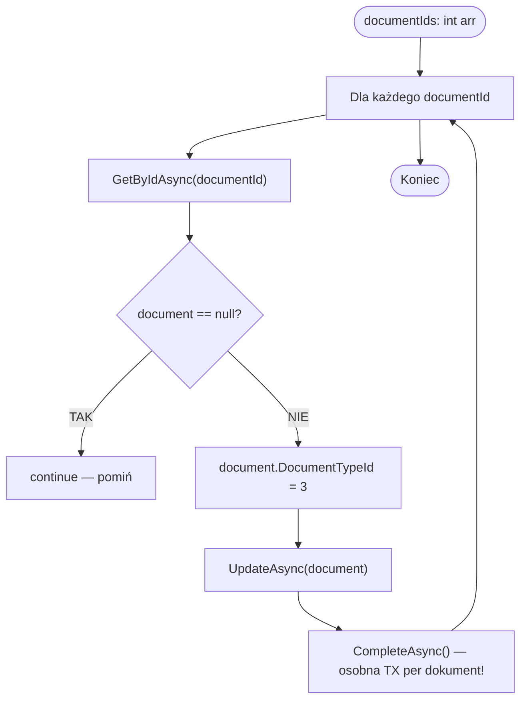

# Transformacja dokumentów na storno (TransformToStorno) — algorytm

| Pole | Wartość |
|---|---|
| ID dokumentu | ALG-Dedykowane-TransformacjaNaStorno |
| Typ dokumentu | algorytm |
| Wersja | 0.1 |
| Status | szkic |
| Autor (ostatnia modyfikacja) | Agent Claudiusz Sonte 4.6 max |
| Data ostatniej modyfikacji | 2026-05-31 |

## Streszczenie

Algorytm realizuje masową zmianę typu istniejących dokumentów na fakturę storno (`DocumentTypeId = 3`). Przyjmuje tablicę identyfikatorów dokumentów i dla każdego z nich ustawia typ na `StornoInvoice`. Zawiera **krytyczny brak atomowości** — `CompleteAsync()` wywoływany wewnątrz pętli skutkuje osobną transakcją dla każdego dokumentu.

## Cel algorytmu

Zrealizowanie biznesowej operacji "anulowania" dokumentów przez masową zmianę ich `DocumentTypeId` na wartość odpowiadającą fakturze storno.

## Charakterystyka

| Atrybut | Wartość |
|---|---|
| ID algorytmu | ALG-Dedykowane-TransformacjaNaStorno |
| Kategoria | dedykowane |
| Wejście | `documentIds: int[]` — tablica identyfikatorów dokumentów do przekształcenia |
| Wyjście | `void` — efekt uboczny: zmiana `DocumentTypeId` w DB dla każdego dokumentu z listy |
| Złożoność (orientacyjna) | O(n) — n oddzielnych transakcji bazodanowych |
| Gdzie wywoływany | `DocumentService.TransformToStorno(int[] documentIds)` |
| Powiązana metoda w kodzie | `DocumentService.TransformToStorno(int[] documentIds)` |

## Opis krok po kroku

1. Odbierz tablicę `documentIds`.
2. Dla każdego `documentId` w tablicy:
   ```csharp
   foreach (var documentId in documentIds)
   {
       var document = await _unitOfWork.Documents.GetByIdAsync(documentId);
       if (document == null) continue; // pominięcie brakującego dokumentu — bez wyjątku
       document.DocumentTypeId = (int)DocumentTypeEnum.StornoInvoice; // = 3
       await _unitOfWork.Documents.UpdateAsync(document);
       await _unitOfWork.CompleteAsync(); // WEWNĄTRZ pętli — osobna transakcja!
   }
   ```
3. Każdy dokument zapisywany w osobnej transakcji bazodanowej.

## Wartości enum

```csharp
public enum DocumentTypeEnum {
    Invoice = 1,
    ProformaInvoice = 2,
    StornoInvoice = 3
}
```

## Diagram przepływu



## Poprawna implementacja (referencyjna)

```csharp
// Zalecany pattern — jedna transakcja dla całej operacji
public async Task TransformToStorno(int[] documentIds)
{
    var documents = await _unitOfWork.Documents
        .GetByIdsAsync(documentIds); // batch fetch

    foreach (var doc in documents)
        doc.DocumentTypeId = (int)DocumentTypeEnum.StornoInvoice;

    await _unitOfWork.CompleteAsync(); // JEDEN zapis na końcu
}
```

## Przypadki brzegowe

| Przypadek | Dane wejściowe | Oczekiwane zachowanie |
|---|---|---|
| Jeden z ID nie istnieje w DB | `[1, 999, 3]` gdzie 999 nie istnieje | `document == null` → `continue` — pominięcie bez błędu; dokumenty 1 i 3 zostają przekształcone |
| Błąd przy N-tym dokumencie | TX1 i TX2 OK, TX3 błąd | Dokumenty 1..N-1 już przekształcone; dokument N i kolejne nie — brak rollback (anomalia STORNO-01) |
| Pusta tablica | `documentIds = []` | Pętla nie wykonuje żadnej iteracji — OK |
| Dokument już jest stornem | `DocumentTypeId = 3` | `DocumentTypeId` ustawiony ponownie na 3 — operacja idempotentna |
| Dokument obcego użytkownika | ID dokumentu innego użytkownika | Brak weryfikacji właściciela — dokument zostaje przekształcony (anomalia STORNO-02) |

## Powiązania

- Wywoływany z procesu: [`../../02_procesy/dokumenty/transformuj_na_storno/proces.md`](../../02_procesy/dokumenty/transformuj_na_storno/proces.md)
- Wywoływany z endpointu: [`../../04_api_i_integracje/01_api_frontend/document/`](../../04_api_i_integracje/01_api_frontend/document/) — endpoint `TransformToStorno`
- Powiązane encje: [`../../05_model_danych/01_db/dbo/dbo.Document.md`](../../05_model_danych/01_db/dbo/dbo.Document.md)

## Powiązania z kodem

- Klasa implementująca: `InvoiceJet.Application/Services/DocumentService.cs`
- Metoda: `DocumentService.TransformToStorno(int[] documentIds)`

## Wątpliwości i braki

- **STORNO-01 [KRYTYCZNE — brak atomowości]:** `CompleteAsync()` wewnątrz pętli — każdy dokument to osobna transakcja. Przy błędzie w N-tym dokumencie dokumenty 1..N-1 są już przekształcone bez możliwości rollback.
- **STORNO-02:** Brak walidacji czy dokument należy do zalogowanego użytkownika (`UserFirmId` check) — możliwa modyfikacja cudzych dokumentów przez zgadywanie ID.
- **STORNO-03:** Zmiana tylko `DocumentTypeId` — numer dokumentu pozostaje bez zmian (brak odrębnego numeru storno, np. `STORNO/FV0001`).
- **STORNO-04:** Brak zmiany `DocumentStatusId` — storno może mieć status "Zapłacona" co jest semantycznie niespójne.
- **STORNO-05:** `int[]` bez `[FromBody]` w atrybucie kontrolera — potencjalny problem z deserializacją żądania JSON.

## Rejestr zmian

| Wersja | Data | Autor | Opis zmiany |
|---|---|---|---|
| 0.1 | 2026-05-31 | Agent Claudiusz Sonte 4.6 max | Pierwsza wersja — na podstawie ALG-08_TransformToStorno.md. |
