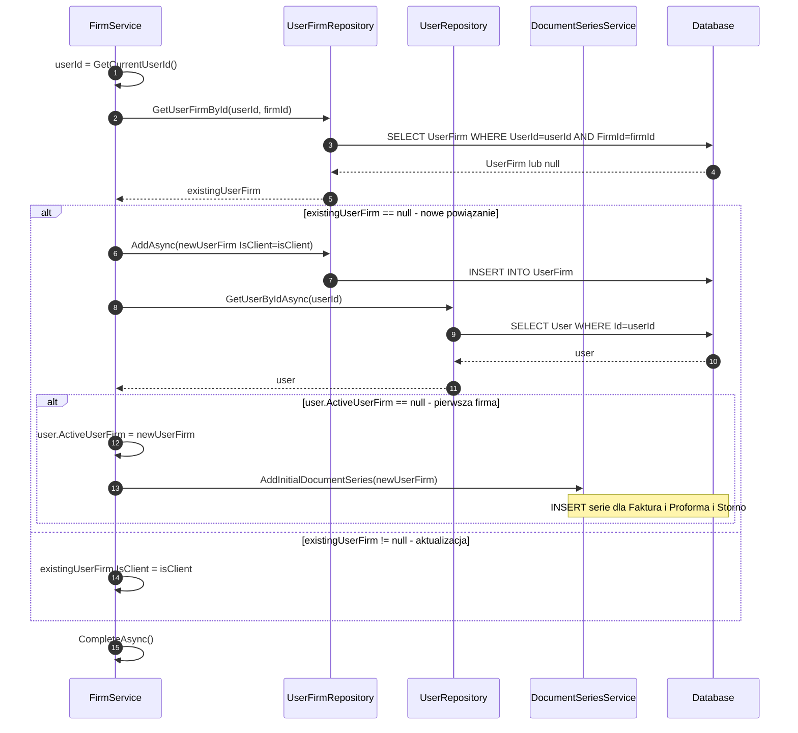

# ManageUserFirmRelation — algorytm zarządzania relacją firma↔user

| Pole | Wartość |
|---|---|
| ID | ALG-Dedykowane-ZarzadzanieRelacjaUserFirm |
| Kategoria | dedykowane |
| Metoda | `FirmService.ManageUserFirmRelation()` (private) |
| Wywoływana z | `FirmService.AddFirm()` i `FirmService.EditFirm()` |
| Ostatnia walidacja | 2026-05-31 (kod źródłowy `FirmService.cs`) |

---

## Co robi

Tworzy lub aktualizuje powiązanie między użytkownikiem a firmą w tabeli `UserFirm`. Dla **pierwszej firmy** użytkownika automatycznie ustawia ją jako aktywną i tworzy domyślne serie numeracji dokumentów.

---

## Kod źródłowy (zweryfikowany)

```csharp
private async Task ManageUserFirmRelation(int firmId, bool isClient)
{
    var userId = _userService.GetCurrentUserId();

    // 1. Sprawdź czy powiązanie już istnieje
    var existingUserFirm = await _unitOfWork.UserFirms
        .GetUserFirmById(userId, firmId);

    if (existingUserFirm == null)
    {
        // 2a. Nowe powiązanie — utwórz UserFirm
        var newUserFirm = new UserFirm
        {
            UserId  = userId,
            FirmId  = firmId,
            IsClient = isClient   // false = własna firma, true = klient
        };
        await _unitOfWork.UserFirms.AddAsync(newUserFirm);

        // 3. Czy to pierwsza firma użytkownika?
        var user = await _unitOfWork.Users.GetUserByIdAsync(userId);
        if (user!.ActiveUserFirm == null)
        {
            // Ustaw jako aktywną firmę
            user.ActiveUserFirm = newUserFirm;
            // Utwórz domyślne serie dokumentów
            await _documentSeriesService.AddInitialDocumentSeries(newUserFirm);
        }
    }
    else
    {
        // 2b. Powiązanie istnieje — zaktualizuj tylko flagę IsClient
        existingUserFirm.IsClient = isClient;
    }

    await _unitOfWork.CompleteAsync();
}
```

---

## Diagram sekwencji



---

## Parametr `isClient` — co oznacza

| Wartość | Znaczenie | Inicjator |
|---|---|---|
| `false` | Własna firma użytkownika (wystawca faktur) | Ekran [Dane firmy](../../01_ekrany/firma/dane_firmy/ekran.md) |
| `true` | Firma klienta (nabywca na fakturach) | Dialog [Dodaj klienta](../../01_ekrany/firma/klienci/dialog_dodaj_klienta/modal.md) |

**Uwaga:** nie istnieje osobna tabela dla firm-klientów — wszystkie firmy są w [dbo.Firm](../../05_model_danych/01_db/dbo/dbo.Firm.md), rozróżniane wyłącznie przez `UserFirm.IsClient`.

---

## Model danych — tabela UserFirm

| Kolumna | Typ | Opis |
|---|---|---|
| `UserFirmId` | `int` PK | ID powiązania |
| `UserId` | `Guid` FK→User | Właściciel |
| `FirmId` | `int` FK→Firm | Firma |
| `IsClient` | `bool` | `false` = własna, `true` = klient |

→ [dbo.UserFirm](../../05_model_danych/01_db/dbo/dbo.UserFirm.md)

---

## Anomalie

| ID | Opis |
|---|---|
| UFR-01 | `GetUserFirmById(userId, firmId)` — w kontekście `AddFirm` firma jest właśnie dodana, więc powiązanie zawsze będzie `null`. Sprawdzenie istnienia jest tu zbędne (kod obsługuje też `EditFirm` gdzie ma sens) |
| UFR-02 | Brak transakcji obejmującej cały przepływ — `AddFirm` ma `CompleteAsync()` przed wywołaniem `ManageUserFirmRelation`, a `ManageUserFirmRelation` ma własny `CompleteAsync()`. Stan możliwy: firma zapisana, UserFirm nie (błąd między dwoma SaveChanges) |

---

## Powiązane

| Typ | Dokument |
|---|---|
| Algorytm | [inicjalizacja_serii_dokumentow.md](inicjalizacja_serii_dokumentow.md) — AddInitialDocumentSeries |
| Algorytm | [izolacja_danych_userfirm.md](izolacja_danych_userfirm.md) — UserFirm-based isolation pattern |
| Proces | [dodaj_firme](../../02_procesy/firma/dodaj_firme/proces.md) |
| Ekran | [Dane firmy](../../01_ekrany/firma/dane_firmy/ekran.md) |
| Model | [dbo.UserFirm](../../05_model_danych/01_db/dbo/dbo.UserFirm.md) |
