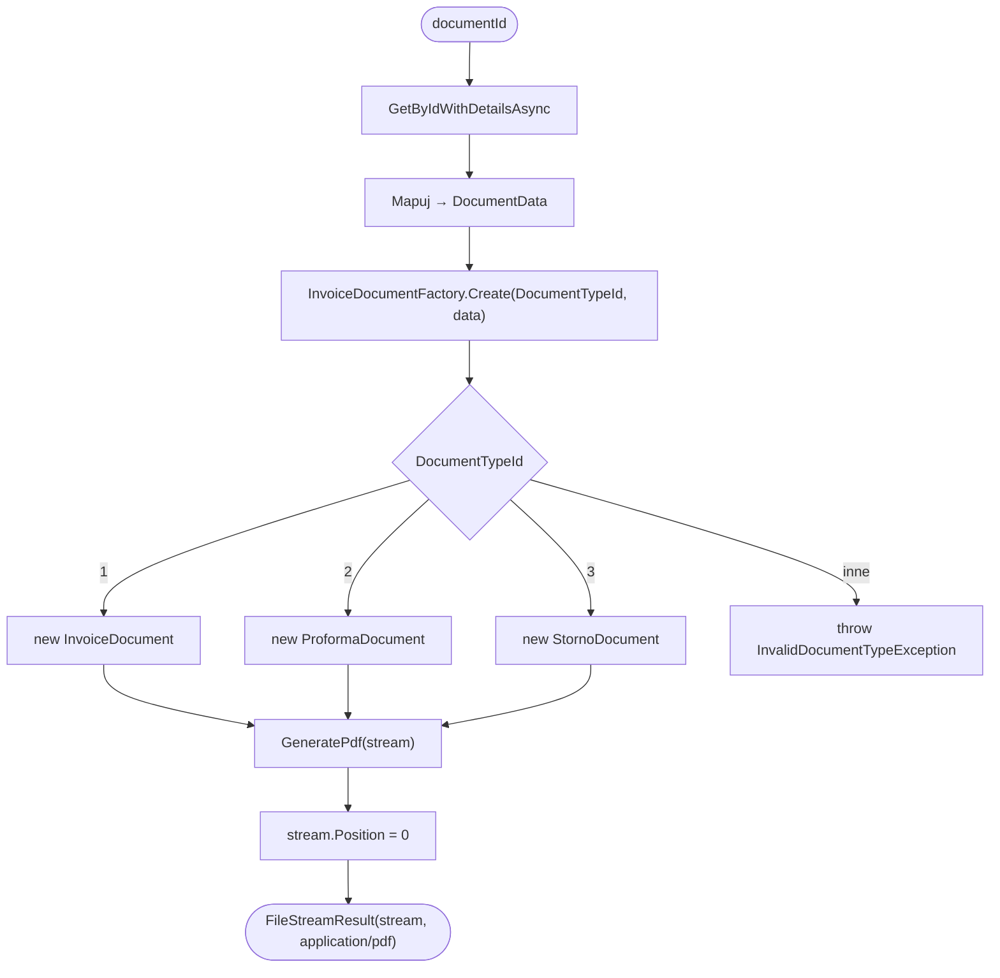

# Generuj PDF jako stream — GetPdfStream (poprawna fabryka) — algorytm

| Pole | Wartość |
|---|---|
| ID dokumentu | ALG-GenerowaniaPdf-GenerujPdfStream |
| Typ dokumentu | algorytm |
| Wersja | 0.1 |
| Status | szkic |
| Autor (ostatnia modyfikacja) | Agent Claudiusz Sonte 4.6 max |
| Data ostatniej modyfikacji | 2026-05-31 |

## Streszczenie

Algorytm generuje plik PDF faktury, pro-formy lub storno jako strumień (`MemoryStream`) i zwraca go jako `FileStreamResult` z typem MIME `application/pdf`. Jest to **druga z dwóch ścieżek generowania PDF** w systemie InvoiceJet — implementacja poprawna, używająca `InvoiceDocumentFactory` do wyboru właściwego szablonu na podstawie `DocumentTypeId`.

## Cel algorytmu

Wygenerowanie pliku PDF dokumentu handlowego z właściwym szablonem (faktura/proforma/storno) i zwrócenie go jako odpowiedź HTTP ze streamem — umożliwiając podgląd lub pobranie pliku w przeglądarce.

## Charakterystyka

| Atrybut | Wartość |
|---|---|
| ID algorytmu | ALG-GenerowaniaPdf-GenerujPdfStream |
| Kategoria | generowania_pdf |
| Wejście | `documentId: int` — identyfikator dokumentu z bazy danych |
| Wyjście | `FileStreamResult` z `MemoryStream` i `ContentType = "application/pdf"` |
| Złożoność (orientacyjna) | O(n) — zależna od liczby pozycji dokumentu |
| Gdzie wywoływany | `DocumentService.GetPdfStream(int documentId)` |
| Powiązana metoda w kodzie | `DocumentService.GetPdfStream()` |

## Opis krok po kroku

1. Pobierz dane dokumentu z bazy danych przez `_unitOfWork.Documents.GetByIdWithDetailsAsync(documentId)`.
2. Zmapuj dane dokumentu do obiektu `DocumentData` (DTO dla QuestPDF).
3. Użyj `InvoiceDocumentFactory.Create()` z `DocumentTypeId` dokumentu:
   ```csharp
   var invoiceDoc = InvoiceDocumentFactory.Create(document.DocumentTypeId, documentData);
   ```
4. Fabryka wybiera właściwy szablon:
   ```csharp
   public static IInvoiceDocument Create(int documentTypeId, DocumentData data)
   {
       return documentTypeId switch {
           1 => new InvoiceDocument(data),
           2 => new ProformaDocument(data),
           3 => new StornoDocument(data),
           _ => throw new InvalidDocumentTypeException()
       };
   }
   ```
5. Utwórz `MemoryStream` i wygeneruj PDF do strumienia:
   ```csharp
   var stream = new MemoryStream();
   invoiceDoc.GeneratePdf(stream);
   stream.Position = 0;
   ```
6. Zwróć `FileStreamResult`:
   ```csharp
   return new FileStreamResult(stream, "application/pdf");
   ```

## Diagram przepływu



## Architektura QuestPDF

```
IInvoiceDocument (interface)
    ├── InvoiceDocument        ← DocumentTypeId = 1 (Faktura)
    ├── ProformaDocument       ← DocumentTypeId = 2 (Proforma)
    └── StornoDocument         ← DocumentTypeId = 3 (Storno)

InvoiceDocumentFactory
    └── Create(documentTypeId, documentData) → IInvoiceDocument
```

## Struktura dokumentu QuestPDF

```csharp
public class InvoiceDocument : IDocument
{
    public void Compose(IDocumentContainer container)
    {
        container.Page(page => {
            page.Header().Element(ComposeHeader);
            page.Content().Element(ComposeContent);
            page.Footer().Element(ComposeFooter);
        });
    }
}
```

## Przypadki brzegowe

| Przypadek | Dane wejściowe | Oczekiwane zachowanie |
|---|---|---|
| Dokument nie istnieje | `documentId` bez rekordu w DB | `DocumentNotFoundException` → 404 |
| DocumentTypeId = 1 | Faktura | Poprawnie generuje `InvoiceDocument` |
| DocumentTypeId = 2 | Proforma | Poprawnie generuje `ProformaDocument` |
| DocumentTypeId = 3 | Storno | Poprawnie generuje `StornoDocument` |
| DocumentTypeId = 99 (nieznany) | Niestandardowy typ | `InvalidDocumentTypeException` → middleware → 500 lub dedykowany kod |
| Brak pozycji dokumentu | Dokument bez `DocumentProduct` | QuestPDF generuje PDF z pustą tabelą pozycji |
| Duży dokument (wiele pozycji) | 100+ pozycji | Stream może być duży; brak paginacji wewnętrznej (QuestPDF automatycznie łamie strony) |

## Powiązania

- Wywoływany z procesu: [`../../02_procesy/dokumenty/generuj_pdf/proces.md`](../../02_procesy/dokumenty/generuj_pdf/proces.md)
- Wywoływany z endpointu: [`../../04_api_i_integracje/01_api_frontend/document/`](../../04_api_i_integracje/01_api_frontend/document/) — endpoint `GetPdfStream`
- Powiązane algorytmy: [`generuj_pdf_na_dysk.md`](generuj_pdf_na_dysk.md) — alternatywna ścieżka z błędem A-KRIT-04

## Powiązania z kodem

- Klasa implementująca: `InvoiceJet.Application/Services/DocumentService.cs`
- Metoda: `DocumentService.GetPdfStream(int documentId)`
- Fabryka: `InvoiceJet.Application/Documents/InvoiceDocumentFactory.cs`
- Klasy PDF: `InvoiceJet.Application/Documents/InvoiceDocument.cs`, `ProformaDocument.cs`, `StornoDocument.cs`
- Biblioteka: `QuestPDF 2024.3.10 Community`

## Wątpliwości i braki

- **PDF-03:** Brak cache wygenerowanych PDF — każde żądanie generuje PDF od nowa (obciążenie CPU przy częstych wywołaniach).
- **PDF-04:** QuestPDF Community Edition — przy przekroczeniu $1M rocznego przychodu firmy wymagana licencja komercyjna.
- Wyjaśnić: czy `InvalidDocumentTypeException` jest zdefiniowany i mapowany przez `ExceptionMiddleware` do właściwego kodu HTTP (nie 500)?

## Rejestr zmian

| Wersja | Data | Autor | Opis zmiany |
|---|---|---|---|
| 0.1 | 2026-05-31 | Agent Claudiusz Sonte 4.6 max | Pierwsza wersja — wydzielona z ALG-07_PdfGeneration.md (ścieżka GetPdfStream). |
