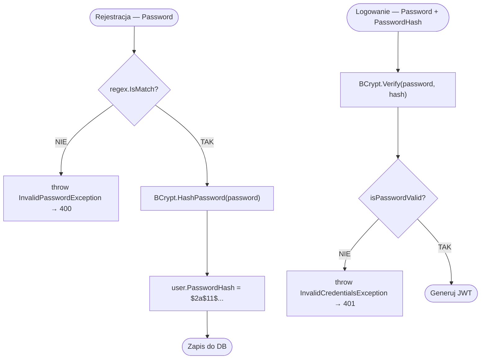

# Walidacja hasła (BCrypt + regex) — algorytm

| Pole | Wartość |
|---|---|
| ID dokumentu | ALG-Walidacji-WalidacjaHasla |
| Typ dokumentu | algorytm |
| Wersja | 0.1 |
| Status | szkic |
| Autor (ostatnia modyfikacja) | Agent Claudiusz Sonte 4.6 max |
| Data ostatniej modyfikacji | 2026-05-31 |

## Streszczenie

Algorytm odpowiada za bezpieczne przechowywanie haseł użytkowników w systemie InvoiceJet. Składa się z dwóch faz: walidacji siły hasła przy rejestracji (wyrażenie regularne) oraz adaptacyjnego haszowania BCrypt. Przy logowaniu weryfikuje zgodność podanego hasła z przechowywanym hashem bez ujawniania oryginalnego hasła.

## Cel algorytmu

Zapewnienie że hasła użytkowników spełniają minimalne wymagania bezpieczeństwa przed zapisaniem do bazy danych, a następnie bezpieczne ich przechowywanie w formie nieodwracalnego hasha BCrypt z wbudowanym saltem.

## Charakterystyka

| Atrybut | Wartość |
|---|---|
| ID algorytmu | ALG-Walidacji-WalidacjaHasla |
| Kategoria | walidacji |
| Wejście | `registerUserDto.Password` (string) — przy rejestracji; `loginUserDto.Password` (string) + `user.PasswordHash` (string) — przy logowaniu |
| Wyjście | Rejestracja: `passwordHash` (string BCrypt); Logowanie: `bool isPasswordValid` |
| Złożoność (orientacyjna) | O(1) — BCrypt celowo wolny (2^11 iteracji) |
| Gdzie wywoływany | `AuthService` — metody `RegisterUser()` i `LoginUser()` |
| Powiązana metoda w kodzie | `AuthService.RegisterUser()`, `AuthService.LoginUser()` |

## Opis krok po kroku

### Faza 1 — Rejestracja (haszowanie)

1. Pobierz hasło z `registerUserDto.Password`.
2. Zbuduj wyrażenie regularne walidujące siłę hasła:
   ```csharp
   Regex regex = new Regex(@"^(?=.*[a-z])(?=.*[A-Z])(?=.*\d)(?=.*[@$!%*?&]).{8,}$");
   ```
3. Sprawdź `regex.IsMatch(registerUserDto.Password)`.
   - Jeśli `false` → rzuć `InvalidPasswordException()` (HTTP 400).
4. Wywołaj `BCrypt.Net.BCrypt.HashPassword(registerUserDto.Password)`.
   - BCrypt automatycznie generuje losowy salt i wbudowuje go w wynikowy hash.
   - Wynik ma format: `$2a$11$<22-znakowy-salt><31-znakowy-hash>`.
   - Work factor: `11` (2^11 = 2048 iteracji; domyślny BCrypt.Net-Next 4.0.3).
5. Przypisz hash do encji użytkownika: `user.PasswordHash = passwordHash`.
6. Zapisz użytkownika do bazy danych.

### Faza 2 — Logowanie (weryfikacja)

1. Pobierz `user` z bazy na podstawie emaila.
2. Wywołaj `BCrypt.Net.BCrypt.Verify(loginUserDto.Password, user.PasswordHash)`.
   - BCrypt wyciąga salt z przechowywanego hasha i porównuje.
   - Operacja zabezpieczona przed timing attacks (stały czas porównania).
3. Jeśli `isPasswordValid == false` → rzuć `InvalidCredentialsException()` (HTTP 401).
4. Wygeneruj token JWT i zwróć odpowiedź.

## Diagram przepływu



## Reguły walidacji hasła

| Reguła | Wyrażenie regex | Opis |
|---|---|---|
| Min. 8 znaków | `.{8,}` | Co najmniej osiem dowolnych znaków |
| Co najmniej 1 mała litera | `(?=.*[a-z])` | Lookahead na małą literę ASCII |
| Co najmniej 1 duża litera | `(?=.*[A-Z])` | Lookahead na dużą literę ASCII |
| Co najmniej 1 cyfra | `(?=.*\d)` | Lookahead na cyfrę |
| Co najmniej 1 znak specjalny | `(?=.*[@$!%*?&])` | Tylko te 7 znaków specjalnych |

## Przypadki brzegowe

| Przypadek | Dane wejściowe | Oczekiwane zachowanie |
|---|---|---|
| Hasło z niedozwolonym znakiem specjalnym | `Abcd1234#` | `InvalidPasswordException` — `#` nie jest w `[@$!%*?&]` |
| Hasło poniżej 8 znaków | `Ab1@` | `InvalidPasswordException` |
| Hasło bez cyfry | `Abcdefgh@` | `InvalidPasswordException` |
| Hasło bez znaku specjalnego | `Abcdefg1` | `InvalidPasswordException` |
| Puste hasło | `""` | `InvalidPasswordException` |
| Zły hash w DB (uszkodzone dane) | Dowolne | `BCrypt.Verify` rzuca wyjątek BCrypt; trafia do catch-all → 500 |
| `AppSettings:Token` brak w konfiguracji | — | Wyjątek `null-forgiving` przy odczycie klucza JWT (nie dotyczy BCrypt bezpośrednio) |

## Powiązania

- Wywoływany z procesu: [`../../02_procesy/autentykacja/rejestracja/proces.md`](../../02_procesy/autentykacja/rejestracja/proces.md), [`../../02_procesy/autentykacja/logowanie/proces.md`](../../02_procesy/autentykacja/logowanie/proces.md)
- Wywoływany z endpointu: [`../../04_api_i_integracje/01_api_frontend/auth/`](../../04_api_i_integracje/01_api_frontend/auth/)
- Powiązane reguły walidacji: Walidacja frontendu (Angular) — niezależna od backendu; brak synchronizacji

## Powiązania z kodem

- Klasa implementująca: `InvoiceJet.Application/Services/AuthService.cs`
- Metoda (rejestracja): `AuthService.RegisterUser(RegisterUserDto registerUserDto)`
- Metoda (logowanie): `AuthService.LoginUser(LoginUserDto loginUserDto)`
- Biblioteka: `BCrypt.Net-Next 4.0.3`

## Wątpliwości i braki

- **BCR-01:** Znaki specjalne ograniczone do `[@$!%*?&]` — użytkownicy nie mogą używać innych znaków specjalnych (np. `#`, `^`, `(`, `)`). Decyzja świadoma czy ograniczenie?
- **BCR-02:** Walidacja hasła tylko po stronie backend (regex) — frontend może nie ostrzegać o wymaganiach. Weryfikacja: czy komponent Angular `RegisterComponent` ma własną walidację formularza zgodną z tym regex?

## Rejestr zmian

| Wersja | Data | Autor | Opis zmiany |
|---|---|---|---|
| 0.1 | 2026-05-31 | Agent Claudiusz Sonte 4.6 max | Pierwsza wersja — na podstawie ALG-03_PasswordHashingVerification.md. |
