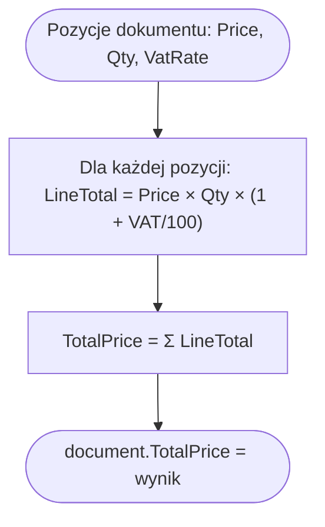

# Obliczanie wartości dokumentu (Document Total Calculation) — algorytm

| Pole | Wartość |
|---|---|
| ID dokumentu | ALG-Wyliczeniowe-ObliczanieWartosciDokumentu |
| Typ dokumentu | algorytm |
| Wersja | 0.1 |
| Status | szkic |
| Autor (ostatnia modyfikacja) | Agent Claudiusz Sonte 4.6 max |
| Data ostatniej modyfikacji | 2026-05-31 |

## Streszczenie

Algorytm oblicza łączną wartość brutto dokumentu (`TotalPrice`) jako sumę wartości brutto wszystkich pozycji. Wykonywany dwukrotnie: po stronie frontendu (Angular) w celu podglądu na żywo podczas edycji formularza oraz po stronie backendu (`DocumentService`) przed zapisem dokumentu do bazy danych.

## Cel algorytmu

Wyznaczenie sumy brutto dokumentu na podstawie pozycji: ilości, ceny jednostkowej netto i stawki VAT. Wartość brutto jest przechowywana w kolumnie `Document.TotalPrice`.

## Charakterystyka

| Atrybut | Wartość |
|---|---|
| ID algorytmu | ALG-Wyliczeniowe-ObliczanieWartosciDokumentu |
| Kategoria | wyliczeniowe |
| Wejście | Kolekcja pozycji dokumentu: `[{Price: decimal, Quantity: decimal, VatRate: decimal}]` |
| Wyjście | `TotalPrice: decimal` — suma brutto całego dokumentu |
| Złożoność (orientacyjna) | O(n) — liniowa względem liczby pozycji dokumentu |
| Gdzie wywoływany | Backend: `DocumentService.AddDocument()`; Frontend: `BaseInvoiceComponent.calculateTotals()` |
| Powiązana metoda w kodzie | `DocumentService.AddDocument()`, `BaseInvoiceComponent.calculateTotals()` |

## Wzór obliczenia

### Wartość brutto jednej pozycji

```
LineTotal = Price × Quantity × (1 + VatRate / 100)
```

### Suma całego dokumentu

```
TotalPrice = Σ(LineTotal) dla każdej pozycji
```

## Opis krok po kroku

### Backend (DocumentService.AddDocument)

1. Pobierz kolekcję pozycji dokumentu z `documentRequestDto.Products`.
2. Dla każdej pozycji `p` oblicz wartość brutto: `p.Price × p.Quantity × (1 + p.VatRate / 100)`.
3. Zsumuj wszystkie wartości brutto:
   ```csharp
   decimal totalPrice = documentRequestDto.Products!.Sum(p =>
       p.Price * p.Quantity * (1 + p.VatRate / 100)
   );
   ```
4. Przypisz wynik do encji: `document.TotalPrice = totalPrice`.
5. Zapisz dokument do bazy danych.

### Frontend (BaseInvoiceComponent — Angular)

1. Subskrybuj zmiany wartości formularza (`valueChanges`).
2. Przy każdej zmianie wywołaj `calculateTotals()`.
3. Oblicz sumę netto: `totalNetAmount = Σ(price × quantity)`.
4. Oblicz sumę VAT: `totalVatAmount = Σ(price × quantity × vatRate / 100)`.
5. Oblicz sumę brutto: `totalGrossAmount = totalNetAmount + totalVatAmount`.
6. Wyświetl wartości na ekranie (podgląd na żywo).

```typescript
calculateTotals() {
    this.totalNetAmount = this.products.controls.reduce((sum, ctrl) =>
        sum + (ctrl.value.price * ctrl.value.quantity), 0);

    this.totalVatAmount = this.products.controls.reduce((sum, ctrl) =>
        sum + (ctrl.value.price * ctrl.value.quantity * ctrl.value.vatRate / 100), 0);

    this.totalGrossAmount = this.totalNetAmount + this.totalVatAmount;
}
```

## Diagram przepływu



## Model danych

| Tabela | Kolumna | Typ SQL | Rola |
|---|---|---|---|
| `Document` | `TotalPrice` | `decimal(18,2)` | Suma brutto całego dokumentu |
| `DocumentProduct` | `Price` | `decimal(18,2)` | Cena jednostkowa netto pozycji |
| `DocumentProduct` | `Quantity` | `decimal(18,2)` | Ilość |
| `DocumentProduct` | `VatRate` | `decimal(18,2)` | Stawka VAT w % (np. 19.00) |

## Przykłady obliczenia

| Price | Quantity | VatRate | LineTotal |
|---|---|---|---|
| 100.00 | 2 | 19 | 100 × 2 × 1.19 = 238.00 |
| 50.00 | 1 | 5 | 50 × 1 × 1.05 = 52.50 |
| 200.00 | 3 | 0 | 200 × 3 × 1.00 = 600.00 |

Dokument z trzema powyższymi pozycjami: `TotalPrice = 238.00 + 52.50 + 600.00 = 890.50`

## Przypadki brzegowe

| Przypadek | Dane wejściowe | Oczekiwane zachowanie |
|---|---|---|
| Brak pozycji (pusta lista) | `Products = []` | `Sum()` zwraca `0` — `TotalPrice = 0` |
| VatRate = 0 | `VatRate = 0` | `LineTotal = Price × Quantity × 1.00` — bez naliczenia VAT |
| Bardzo duża liczba pozycji | N pozycji × duże kwoty | Możliwy błąd precyzji `decimal(18,2)` przy zaokrągleniu |
| Ujemna cena lub ilość | `Price < 0` lub `Quantity < 0` | Brak walidacji w algorytmie — wynik ujemny bez błędu |

## Powiązania

- Wywoływany z procesu: [`../../02_procesy/dokumenty/dodaj_dokument/proces.md`](../../02_procesy/dokumenty/dodaj_dokument/proces.md)
- Wywoływany z endpointu: [`../../04_api_i_integracje/01_api_frontend/document/`](../../04_api_i_integracje/01_api_frontend/document/)
- Powiązane reguły walidacji: Brak walidacji zakresu `Price`, `Quantity`, `VatRate` po stronie backend

## Powiązania z kodem

- Klasa implementująca (backend): `InvoiceJet.Application/Services/DocumentService.cs`
- Metoda (backend): `DocumentService.AddDocument(DocumentRequestDto documentRequestDto)`
- Klasa implementująca (frontend): `InvoiceJetUI/src/app/components/BaseInvoiceComponent.ts`
- Metoda (frontend): `BaseInvoiceComponent.calculateTotals()`

## Wątpliwości i braki

- **CALC-01:** Tabela `Document` przechowuje tylko `TotalPrice` (brutto) — brak osobnych kolumn `TotalNetAmount` i `TotalVatAmount`. Rozbicie na netto/VAT dostępne tylko na froncie (w pamięci). Czy to wymaganie?
- **CALC-02:** Precyzja `decimal(18,2)` — przy wielu pozycjach z różnymi stawkami VAT możliwe błędy zaokrąglenia na poziomie groszy. Czy zaokrąglenie ma być per pozycja czy per całość?

## Rejestr zmian

| Wersja | Data | Autor | Opis zmiany |
|---|---|---|---|
| 0.1 | 2026-05-31 | Agent Claudiusz Sonte 4.6 max | Pierwsza wersja — na podstawie ALG-05_DocumentTotalCalculation.md. |
