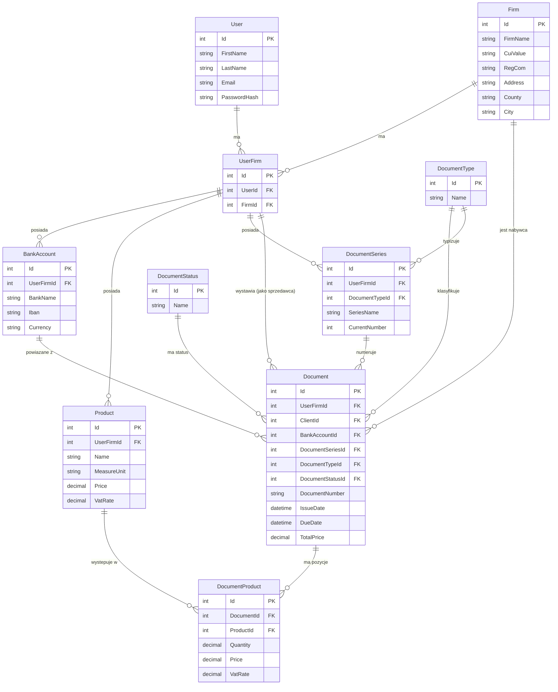

# ERD schematu dbo — InvoiceJet

| Pole | Wartość |
|---|---|
| ID dokumentu | ERD-DBO-01 |
| Typ dokumentu | Diagram ERD |
| Wersja | 0.1 |
| Status | szkic |
| Autor (ostatnia modyfikacja) | Agent Claudiusz Sonte 4.6 max |
| Data ostatniej modyfikacji | 2026-05-31 |

## Opis

Skrócony diagram ERD dla schematu `dbo` projektu InvoiceJet. Zawiera wszystkie 10 tabel z kluczowymi relacjami (PK, FK). Pola nie będące kluczami głównie pominięte dla czytelności — szczegółowe definicje kolumn dostępne w plikach per-tabela.

## Diagram Mermaid

## Uwagi do diagramu

- `UserFirm` to tabela pośrednicząca User–Firm (wystawiający fakturę). Relacja User:UserFirm = 1:1 praktycznie (jeden użytkownik ma jedną aktywną firmę).
- `Firm` jest reużywana zarówno jako firma własna (poprzez `UserFirm.FirmId`) jak i firma klienta (poprzez `Document.ClientId`).
- `DocumentProduct` to tabela junction między `Document` a `Product` — przechowuje snapshot wartości produktu w chwili wystawienia.
- Tabele `DocumentType` i `DocumentStatus` są tabelami słownikowymi — wypełniane przez `DbSeeder` przy starcie.
- Relacja `UserFirm` ↔ klienci (`Firm`) jest relacją M:N przez dodatkową tabelę junction `UserFirm_Firm` (szczegóły w [dbo.UserFirm_relations.md](dbo.UserFirm_relations.md)).

## Powiązane dokumenty

| Dokument | Opis |
|---|---|
| [erd_globalny.md](../erd_globalny.md) | Rozszerzony ERD z pełną listą kolumn |
| [dbo.UserFirm_relations.md](dbo.UserFirm_relations.md) | Szczegóły relacji M:N UserFirm–Firm (klienci) |
| [dbo.Document.md](dbo.Document.md) | Tabela centralna — dokumenty finansowe |

## Rejestr zmian

| Wersja | Data | Autor | Opis |
|---|---|---|---|
| 0.1 | 2026-05-31 | Agent Claudiusz Sonte 4.6 max | Pierwsza wersja — schemat dbo. |
