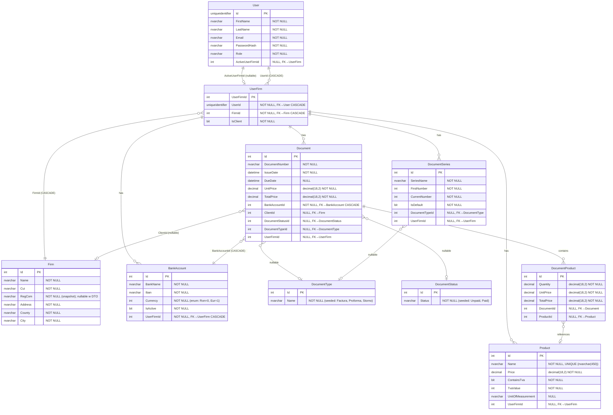

# ERD Globalny — diagram encji

| Atrybut | Wartość |
|---|---|
| Ostatnia walidacja | 2026-05-31 |
| Autor | Agent Claudiusz Sonte 4.6 max |
| Źródło | `InvoiceJetDbContextModelSnapshot.cs` |

## Diagram Mermaid

## Legenda relacji

| Notacja | Znaczenie |
|---|---|
| `||--||` | jeden do jednego (obowiązkowy) |
| `||--o|` | jeden do zero-lub-jeden (nullable FK) |
| `||--o{` | jeden do wielu (obowiązkowy) |
| `}o--||` | wiele do jednego (wymagany FK) |
| `}o--o|` | wiele do zero-lub-jeden (nullable FK) |
| CASCADE | kasowanie rodzica kasuje dzieci |

## Kluczowe obserwacje

| # | Obserwacja |
|---|---|
| OBS-01 | `Document.BankAccountId` NOT NULL + CASCADE → usunięcie konta bankowego kasuje WSZYSTKIE powiązane dokumenty |
| OBS-02 | `Document.UserFirmId` jest nullable (int?) mimo że logicznie każdy dokument musi mieć firmę |
| OBS-03 | `Document.DocumentTypeId` i `DocumentStatusId` są nullable — dokument może być bez statusu/typu |
| OBS-04 | `Product.Name` — UNIQUE INDEX na `nvarchar(450)` — nazwy produktów muszą być unikalne globalnie (nie per UserFirm!) |
| OBS-05 | `Firm.RegCom` — w snapshot IsRequired (nvarchar(max)), ale w `FirmDto.RegCom` jest nullable string? — niespójność |
| OBS-06 | `UserFirm.IsClient` — flaga odróżniająca firmę własną od klienta; ta sama tabela `Firm` służy dla obu |
| OBS-07 | Brak jawnego `UpdatedAt`/`CreatedAt` — żadna tabela nie ma timestampów audytowych |
| OBS-08 | `User.Id` — `uniqueidentifier` (GUID), podczas gdy wszystkie inne klucze to `int` IDENTITY |

## Rejestr zmian

| Wersja | Data | Autor | Opis |
|---|---|---|---|
| 1.0 | 2026-05-31 | Agent Claudiusz Sonte 4.6 max | ERD na podstawie ModelSnapshot EF Core. |
