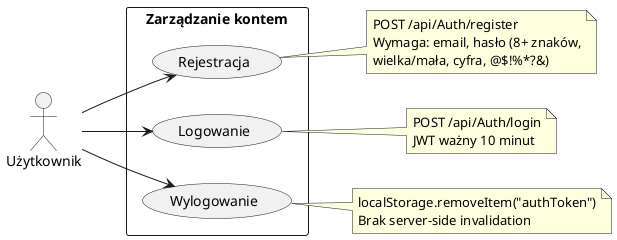

# Use Case: Zarządzanie kontem użytkownika

| Atrybut | Wartość |
|---|---|
| ID | UC-01 |
| Aktor | Użytkownik (niezalogowany / zalogowany) |
| Ostatnia walidacja | 2026-05-31 |
| Autor | Agent Claudiusz Sonte 4.6 max |

## Diagram (PlantUML)

## Scenariusz główny — Rejestracja

1. Użytkownik otwiera `/register`
2. Wypełnia formularz (imię, nazwisko, email, hasło x2)
3. Submit → `POST /api/Auth/register`
4. Backend waliduje email (unikalność) i hasło (regex)
5. Backend haszuje hasło (BCrypt), tworzy User i UserFirm
6. Backend zwraca JWT token
7. Frontend zapisuje token w `localStorage`
8. Przekierowanie na `/dashboard`

## Scenariusz główny — Logowanie

1. Użytkownik otwiera `/login`
2. Wypełnia email i hasło
3. Submit → `POST /api/Auth/login`
4. Backend weryfikuje email (istnienie) i hasło (BCrypt.Verify)
5. Backend zwraca JWT token
6. Frontend zapisuje token w `localStorage`
7. Przekierowanie na `/dashboard`

## Scenariusz alternatywny — Wygaśnięcie sesji

1. Użytkownik pracuje w aplikacji
2. Po 10 minutach token wygasa
3. Następne żądanie API zwraca 401
4. `JwtInterceptor` otwiera `TokenExpiredDialogComponent`
5. Token usuwany z `localStorage`
6. Przekierowanie na `/login`

## Rejestr zmian

| Wersja | Data | Autor | Opis |
|---|---|---|---|
| 1.0 | 2026-05-31 | Agent Claudiusz Sonte 4.6 max | Dokument wstępny. |
