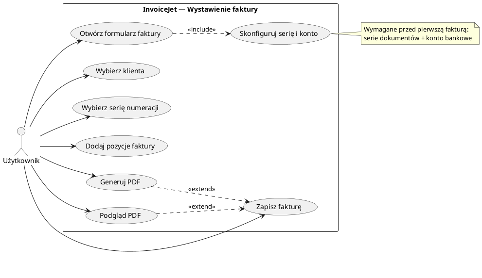

# Use Case: Wystawienie faktury

| Atrybut | Wartość |
|---|---|
| ID | UC-02 |
| Aktor | Użytkownik (zalogowany, z założoną firmą) |
| Ostatnia walidacja | 2026-05-31 |
| Autor | Agent Claudiusz Sonte 4.6 max |

## Warunki wstępne

- Użytkownik zalogowany (ważny JWT)
- Firma zdefiniowana (EKRAN-04)
- Co najmniej jedna seria numeracji (DIALOG-04)
- Co najmniej jedno konto bankowe (DIALOG-02)

## Diagram (PlantUML)

## Scenariusz główny

1. Użytkownik przechodzi do `/dashboard/invoices` (EKRAN-09)
2. Klik "Nowa faktura" → `/dashboard/add-invoice` (EKRAN-10)
3. Frontend wywołuje `GET /api/Document/GetDocumentAutofillInfo/1` → wypełnienie selektorów
4. Użytkownik wybiera serię, klienta, konto bankowe, daty
5. Użytkownik dodaje pozycje (wybiera produkty z katalogu lub wpisuje ręcznie)
6. Frontend oblicza sumy w czasie rzeczywistym
7. Użytkownik klika "Zapisz" → `POST /api/Document/Add`
8. Backend generuje numer dokumentu (np. `FV0015`), inkrementuje serię
9. Przekierowanie na listę faktur `/dashboard/invoices`
10. Opcjonalnie: Użytkownik klika "PDF" → `POST /api/Document/GetPdfStream`

## Scenariusz alternatywny — Edycja

1. Użytkownik klika "Edytuj" przy dokumencie
2. Przekierowanie na `/dashboard/edit-invoice/:id`
3. Frontend ładuje dane: `GET /api/Document/GetDocumentById/{id}`
4. Formularz wypełniony danymi dokumentu
5. Użytkownik modyfikuje i zapisuje → `PUT /api/Document/Edit`

## Dotyczy też

- UC-03: Wystawienie proformy (identyczny flow, `documentTypeId=2`)
- UC-04: Wystawienie storna (identyczny flow, `documentTypeId=3`)

## Rejestr zmian

| Wersja | Data | Autor | Opis |
|---|---|---|---|
| 1.0 | 2026-05-31 | Agent Claudiusz Sonte 4.6 max | Dokument wstępny. |
