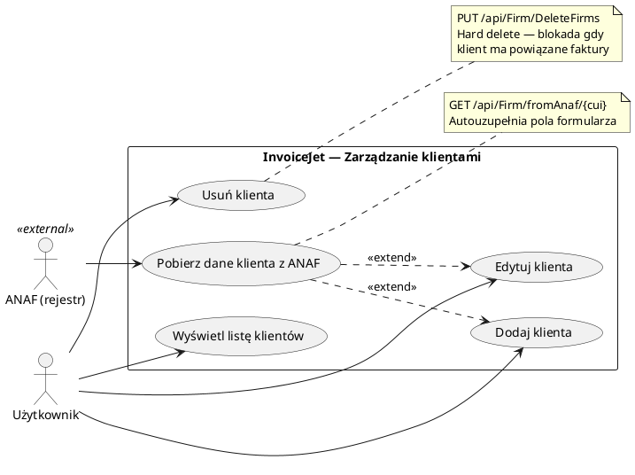

# Use Case: Zarządzanie klientami

| Atrybut | Wartość |
|---|---|
| ID | UC-03 |
| Aktor | Użytkownik (zalogowany) |
| Ostatnia walidacja | 2026-05-31 |
| Autor | Agent Claudiusz Sonte 4.6 max |

## Diagram (PlantUML)

## Scenariusze

### Dodanie klienta

1. Użytkownik otwiera EKRAN-05 (Klienci)
2. Klik "Dodaj klienta" → DIALOG-01
3. Opcjonalnie: podaje CUI i klika ikonę chmury → autouzupełnienie z ANAF
4. Wypełnia/weryfikuje dane
5. Zapisuje → `POST /api/Firm/AddFirm/true`

### Edycja klienta

1. Użytkownik klika "Edytuj" przy kliencie → DIALOG-01 (tryb edycji)
2. Modyfikuje dane
3. Zapisuje → `PUT /api/Firm/EditFirm/true`

### Usunięcie klienta

1. Użytkownik klika "Usuń" przy kliencie
2. Potwierdzenie (jeśli dialog) → `PUT /api/Firm/DeleteFirms`
3. Klient usunięty (hard delete)

## Ważna uwaga

Klient w InvoiceJet to firma (`Firm`) z flagą `isClient=true` powiązana z `UserFirm`. Ta sama tabela `Firm` służy zarówno do przechowywania własnej firmy jak i firm klientów.

## Powiązane endpointy

| Akcja | Endpoint |
|---|---|
| Lista klientów | `GET /api/Firm/GetUserClientFirms` |
| Dodanie | `POST /api/Firm/AddFirm/true` |
| Edycja | `PUT /api/Firm/EditFirm/true` |
| Usunięcie | `PUT /api/Firm/DeleteFirms` |
| ANAF | `GET /api/Firm/fromAnaf/{cui}` |

## Rejestr zmian

| Wersja | Data | Autor | Opis |
|---|---|---|---|
| 1.0 | 2026-05-31 | Agent Claudiusz Sonte 4.6 max | Dokument wstępny. |
