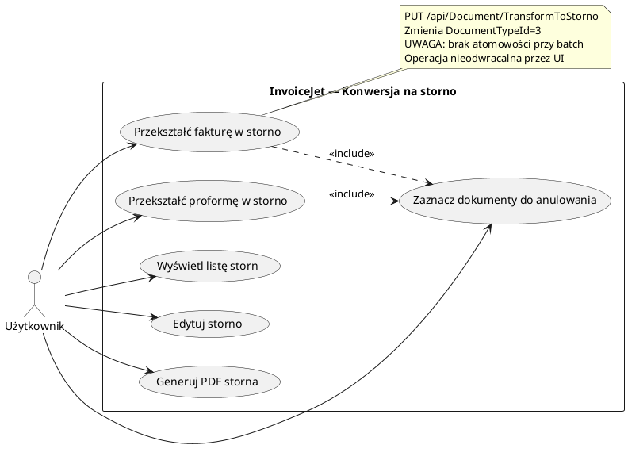

# Use Case: Konwersja dokumentów na storno

| Atrybut | Wartość |
|---|---|
| ID | UC-04 |
| Aktor | Użytkownik (zalogowany) |
| Ostatnia walidacja | 2026-05-31 |
| Autor | Agent Claudiusz Sonte 4.6 max |

## Diagram (PlantUML)

## Opis

Użytkownik może przekształcić istniejące dokumenty (faktury, proformy) w faktury storno bez ręcznego tworzenia nowego dokumentu.

## Scenariusz główny

1. Użytkownik otwiera EKRAN-13 (Storna) lub EKRAN-09 (Faktury)
2. Zaznacza jeden lub więcej dokumentów checkboxami
3. Klika "Przekształć na storno"
4. Backend: `PUT /api/Document/TransformToStorno` z tablicą ID
5. Dla każdego dokumentu: `DocumentTypeId` zmieniane na `3`
6. Lista odświeżana — dokumenty teraz widoczne jako storna

## Ograniczenia

- Zmiana dotyczy tylko `DocumentTypeId` — numer dokumentu pozostaje bez zmian
- Brak atomowości — częściowa konwersja możliwa przy błędzie
- Brak możliwości cofnięcia operacji przez UI

## Wymagania wstępne

- Dokumenty muszą istnieć w bazie
- Użytkownik musi być właścicielem dokumentów (przez UserFirm)

## Rejestr zmian

| Wersja | Data | Autor | Opis |
|---|---|---|---|
| 1.0 | 2026-05-31 | Agent Claudiusz Sonte 4.6 max | Dokument wstępny. |
