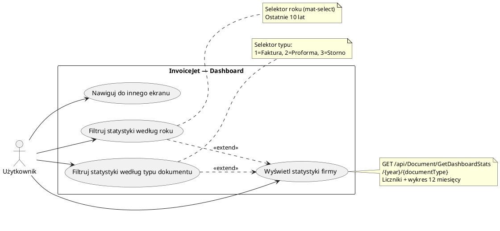

# Use Case: Przeglądanie statystyk na dashboardzie

| Pole | Wartość |
|---|---|
| ID dokumentu | UC-Dokumenty-Dashboard |
| Typ dokumentu | use case |
| Wersja | 0.1 |
| Status | szkic |
| Autor (ostatnia modyfikacja) | Agent Claudiusz Sonte 4.6 max |
| Data ostatniej modyfikacji | 2026-05-31 |

## Streszczenie

Przypadek użycia opisuje przeglądanie statystyk biznesowych firmy na ekranie dashboardu. Użytkownik widzi cztery liczniki (dokumenty, klienci, produkty, konta bankowe) oraz interaktywny wykres liniowy przedstawiający miesięczne przychody dla wybranego roku i typu dokumentu. Filtry roku i typu dokumentu aktualizują dane na żądanie. Dashboard jest ekranem startowym po zalogowaniu.

## Aktorzy

| Aktor | Rola |
|---|---|
| Użytkownik | Zalogowany właściciel konta; przegląda statystyki i wykres przychodów swojej firmy |

## Warunki wstępne

- Użytkownik zalogowany (ważny token JWT)
- Firma użytkownika zarejestrowana w systemie (`UserFirm` istnieje)

## Scenariusz główny — Wyświetlenie dashboardu

1. Użytkownik loguje się do aplikacji lub klika „Dashboard" w pasku bocznym
2. System ładuje ekran `/dashboard`
3. System wywołuje `GET /api/Document/GetDashboardStats/{year}/{documentType}` z bieżącym rokiem i `documentTypeId=1`
4. Wyświetlane są cztery liczniki: TotalDocuments, TotalClients, TotalProducts, TotalBankAccounts
5. Wyświetlany jest wykres liniowy z 12 miesięcznymi danymi przychodów (dwie serie: `invoiceAmount` i `incomeAmount`)
6. Oś X wykresu zawiera angielskie nazwy miesięcy (January–December)

## Scenariusz główny — Zmiana roku

1. Użytkownik rozwija selektor roku (mat-select; ostatnie 10 lat)
2. Wybiera inny rok
3. Wywoływana jest metoda `onSelectionChange()` → `GET /api/Document/GetDashboardStats/{nowyRok}/{documentType}`
4. Liczniki i wykres odświeżane danymi dla wybranego roku

## Scenariusz główny — Zmiana typu dokumentu

1. Użytkownik rozwija selektor typu dokumentu (mat-select; Factura=1, Factura Proforma=2, Factura Storno=3)
2. Wybiera inny typ dokumentu
3. Wywoływana jest metoda `onSelectionChange()` → `GET /api/Document/GetDashboardStats/{year}/{nowyTyp}`
4. Liczniki i wykres odświeżane danymi dla wybranego typu

## Scenariusze alternatywne

### A1: Brak danych dla wybranego roku i typu

1. API zwraca `monthlyTotals` jako pustą tablicę lub z zerowymi wartościami
2. Liczniki dokumentów dla wybranego okresu pokazują 0
3. Wykres liniowy wyświetla płaską linię (wartości zerowe)
4. Liczniki ogólne (TotalClients, TotalProducts, TotalBankAccounts) mogą nadal wykazywać wartości > 0

### A2: Nieciągłości na wykresie

1. API zwraca `monthlyTotals` tylko dla miesięcy z dokumentami (np. styczeń, marzec)
2. Luty i pozostałe miesiące bez dokumentów mogą nie być reprezentowane w danych
3. Wykres może wykazywać nieciągłości lub pominięte miesiące
4. (Znane ograniczenie — DA-02 z dokumentacji ekranu)

### A3: Błąd API

1. `GET /api/Document/GetDashboardStats` zwraca błąd serwera lub timeout
2. Liczniki i wykres pozostają puste lub z poprzednimi danymi
3. System może wyświetlić komunikat o błędzie ładowania danych

## Diagram (PlantUML UseCase)

## Powiązane ekrany

| Ekran | Link |
|---|---|
| Dashboard | `../../01_ekrany/dashboard/ekran.md` |

## Powiązane procesy

| Proces | Link |
|---|---|
| Statystyki dashboardu | `../../02_procesy/dokumenty/dashboard_statystyki/proces.md` |

## Wątpliwości i braki

- DA-01: `console.log(invoiceAmounts)` i `console.log(incomeAmounts)` aktywne w kodzie produkcyjnym (`updateChartData()`).
- DA-02: `monthlyTotals` zwracane przez API tylko dla miesięcy z dokumentami — brak danych dla pustych miesięcy może powodować nieciągłości na wykresie liniowym.
- Liczniki ogólne (TotalClients, TotalProducts, TotalBankAccounts) nie są filtrowane przez rok ani typ dokumentu — wyświetlają stan globalny firmy.

## Rejestr zmian

| Wersja | Data | Autor | Opis zmiany |
|---|---|---|---|
| 0.1 | 2026-05-31 | Agent Claudiusz Sonte 4.6 max | Pierwsza wersja — na podstawie ekranu dashboardu (EKRAN-Dashboard). |
