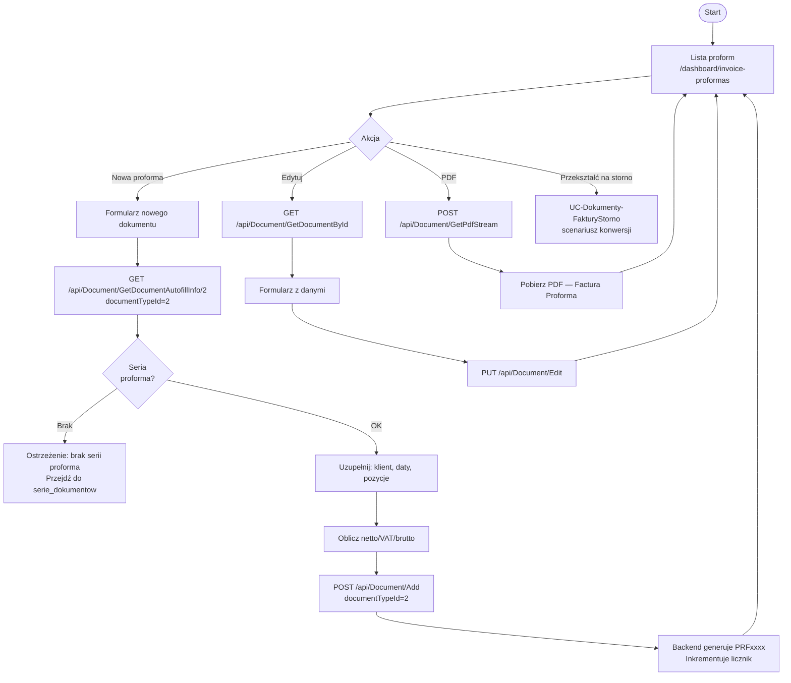

# Use Case: Wystawianie i zarządzanie fakturami proforma

| Pole | Wartość |
|---|---|
| ID dokumentu | UC-Dokumenty-FakturyProforma |
| Typ dokumentu | use case |
| Wersja | 0.1 |
| Status | szkic |
| Autor (ostatnia modyfikacja) | Agent Claudiusz Sonte 4.6 max |
| Data ostatniej modyfikacji | 2026-05-31 |

## Streszczenie

Przypadek użycia opisuje wystawianie i zarządzanie fakturami proforma (`documentTypeId=2`, Factura Proforma) w systemie InvoiceJet. Faktura proforma jest dokumentem wstępnym — nie jest dokumentem księgowym, lecz służy jako oferta lub zapowiedź faktury właściwej. Przepływ jest identyczny z wystawianiem faktury (UC-Dokumenty-Faktury), z różnicą w typie dokumentu i serii numeracji. Proformy mogą być konwertowane na storno przez UC-Dokumenty-FakturyStorno.

## Aktorzy

| Aktor | Rola |
|---|---|
| Użytkownik | Zalogowany właściciel konta; wystawia i zarządza proformami swojej firmy |

## Warunki wstępne

- Użytkownik zalogowany (ważny token JWT)
- Firma zdefiniowana w systemie (dane rejestrowe uzupełnione)
- Co najmniej jedna seria numeracji dla proformy (`documentTypeId=2`) zdefiniowana
- Co najmniej jedno konto bankowe zdefiniowane

## Scenariusz główny — Wystawienie proformy

1. Użytkownik przechodzi do `/dashboard/invoice-proformas` (lista proform)
2. Klika „Nowa proforma" → przekierowanie na formularz nowego dokumentu
3. System wywołuje `GET /api/Document/GetDocumentAutofillInfo/2` i wypełnia selektory (seria dla proform, klienci, konta bankowe)
4. Użytkownik wybiera serię numeracji (typ proforma), klienta, konto bankowe, daty
5. Użytkownik dodaje pozycje: wybiera produkt z katalogu lub wpisuje ręcznie (nazwa, cena, ilość, VAT)
6. Frontend oblicza wartości netto, VAT i brutto w czasie rzeczywistym
7. Użytkownik klika „Zapisz" → system wywołuje `POST /api/Document/Add` z `documentTypeId=2`
8. Backend generuje numer dokumentu (np. `PRF0003`) i inkrementuje licznik serii proforma
9. Użytkownik zostaje przekierowany na listę proform `/dashboard/invoice-proformas`

## Scenariusz główny — Edycja proformy

1. Użytkownik klika „Edytuj" przy wybranej proformie na liście
2. System ładuje dane: `GET /api/Document/GetDocumentById/{id}`
3. Formularz wypełniany danymi proformy
4. Użytkownik modyfikuje pola i klika „Zapisz" → `PUT /api/Document/Edit`
5. Użytkownik zostaje przekierowany na listę proform

## Scenariusz główny — Generowanie PDF proformy

1. Użytkownik klika „PDF" przy wybranej proformie
2. System wywołuje `POST /api/Document/GetPdfStream` z ID dokumentu
3. Backend generuje PDF przy użyciu QuestPDF; nagłówek zawiera typ „Factura Proforma"
4. Plik PDF pobierany przez przeglądarkę

## Scenariusze alternatywne

### A1: Brak serii numeracji dla proformy

1. Użytkownik otwiera formularz nowej proformy
2. `GET /api/Document/GetDocumentAutofillInfo/2` zwraca pustą listę serii
3. Selektor serii jest pusty; użytkownik nie może zapisać dokumentu
4. Komunikat informuje o konieczności zdefiniowania serii dla proform
5. Użytkownik przechodzi do `/dashboard/document-series` i dodaje serię dla `documentTypeId=2`

### A2: Konwersja proformy na storno

1. Użytkownik chce anulować wystawioną proformę
2. Zaznacza proformę na liście i klika „Przekształć na storno"
3. Przepływ przechodzi do UC-Dokumenty-FakturyStorno (scenariusz konwersji)

### A3: Błąd zapisu proformy

1. Backend zwraca błąd walidacji lub serwera
2. Formularz pozostaje otwarty; wyświetlany jest komunikat o błędzie

## Diagram (Mermaid flowchart)

## Powiązane ekrany

| Ekran | Link |
|---|---|
| Lista faktur (analogicznie proformy) | `../../01_ekrany/faktury/lista_faktur/ekran.md` |
| Formularz dodaj/edytuj | `../../01_ekrany/faktury/dodaj_edytuj_fakture/ekran.md` |
| Serie dokumentów | `../../01_ekrany/serie_dokumentow/ekran.md` |

## Powiązane procesy

| Proces | Link |
|---|---|
| Dodaj dokument | `../../02_procesy/dokumenty/dodaj_dokument/proces.md` |
| Generuj PDF | `../../02_procesy/dokumenty/generuj_pdf/proces.md` |

## Wątpliwości i braki

- Proforma nie jest dokumentem księgowym — brak mechanizmu powiązania proformy z wystawioną na jej podstawie fakturą właściwą.
- Brak statusu „opłacona/nieopłacona" na proformie — użytkownik nie widzi, które proformy zostały uregulowane.

## Rejestr zmian

| Wersja | Data | Autor | Opis zmiany |
|---|---|---|---|
| 0.1 | 2026-05-31 | Agent Claudiusz Sonte 4.6 max | Pierwsza wersja — analogia do UC-02/uc_faktury.md dla documentTypeId=2. |
