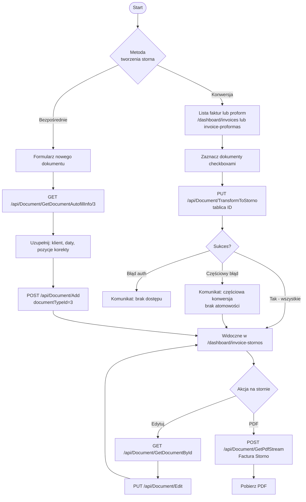

# Use Case: Zarządzanie fakturami storno

| Pole | Wartość |
|---|---|
| ID dokumentu | UC-Dokumenty-FakturyStorno |
| Typ dokumentu | use case |
| Wersja | 0.1 |
| Status | szkic |
| Autor (ostatnia modyfikacja) | Agent Claudiusz Sonte 4.6 max |
| Data ostatniej modyfikacji | 2026-05-31 |

## Streszczenie

Przypadek użycia opisuje dwa sposoby tworzenia faktur storno (`documentTypeId=3`, Factura Storno): konwersję istniejących dokumentów (faktur lub proform) na storno w operacji batch oraz bezpośrednie wystawienie nowego dokumentu storno przez formularz. Konwersja zmienia wyłącznie pole `DocumentTypeId` — numer dokumentu i wszystkie dane pozostają bez zmian. Operacja konwersji jest nieodwracalna przez UI.

## Aktorzy

| Aktor | Rola |
|---|---|
| Użytkownik | Zalogowany właściciel konta; anuluje dokumenty przez konwersję na storno lub wystawia storno bezpośrednio |

## Warunki wstępne

- Użytkownik zalogowany (ważny token JWT)
- Dokumenty do konwersji muszą istnieć w bazie danych
- Użytkownik musi być właścicielem dokumentów (powiązanie przez `UserFirm`)

## Scenariusz główny — Konwersja dokumentów na storno

1. Użytkownik przechodzi do `/dashboard/invoices` (faktury) lub `/dashboard/invoice-proformas` (proformy)
2. Zaznacza jeden lub więcej dokumentów checkboxami
3. Klika „Przekształć na storno"
4. System wywołuje `PUT /api/Document/TransformToStorno` z tablicą identyfikatorów dokumentów
5. Backend zmienia `DocumentTypeId` na `3` dla każdego wskazanego dokumentu
6. Lista odświeża się — skonwertowane dokumenty znikają z listy faktur/proform
7. Dokumenty są teraz widoczne w `/dashboard/invoice-stornos`

## Scenariusz główny — Bezpośrednie wystawienie storna

1. Użytkownik przechodzi do `/dashboard/invoice-stornos`
2. Klika „Nowe storno" → formularz nowego dokumentu
3. System wywołuje `GET /api/Document/GetDocumentAutofillInfo/3` i wypełnia selektory
4. Użytkownik wybiera serię (typ storno), klienta, konto bankowe, daty
5. Użytkownik dodaje pozycje (wartości ujemne lub opis korekty)
6. Klika „Zapisz" → `POST /api/Document/Add` z `documentTypeId=3`
7. Backend generuje numer storna i inkrementuje licznik serii
8. Użytkownik zostaje przekierowany na listę storn

## Scenariusz główny — Edycja storna

1. Użytkownik klika „Edytuj" przy wybranym stornie
2. System ładuje dane: `GET /api/Document/GetDocumentById/{id}`
3. Formularz wypełniany danymi storna
4. Użytkownik modyfikuje i zapisuje → `PUT /api/Document/Edit`

## Scenariusz główny — Generowanie PDF storna

1. Użytkownik klika „PDF" przy wybranym stornie
2. System wywołuje `POST /api/Document/GetPdfStream`
3. Backend generuje PDF z nagłówkiem „Factura Storno" przez QuestPDF
4. Plik pobierany przez przeglądarkę

## Scenariusze alternatywne

### A1: Częściowa konwersja przy błędzie

1. Użytkownik zaznacza 3 dokumenty i klika „Przekształć na storno"
2. Backend przetwarza dokumenty sekwencyjnie
3. Przy 2. dokumencie występuje błąd (np. problem z bazą danych)
4. Dokument 1 jest już skonwertowany, dokumenty 2 i 3 pozostają bez zmian
5. Brak atomowości — możliwa niespójna konwersja
6. System wyświetla komunikat o błędzie częściowej konwersji

### A2: Próba cofnięcia konwersji

1. Użytkownik chce cofnąć konwersję dokumentu na storno
2. Brak opcji cofnięcia w UI — operacja jest nieodwracalna przez interfejs
3. Cofnięcie możliwe wyłącznie bezpośrednio w bazie danych

### A3: Zaznaczono tylko dokumenty innego właściciela

1. Użytkownik próbuje przekształcić dokumenty, do których nie ma dostępu
2. Backend weryfikuje właściciela przez `UserFirm`
3. Zwraca błąd autoryzacji (403 Forbidden lub 404)
4. Lista nie ulega zmianie

## Diagram (Mermaid flowchart)

## Powiązane ekrany

| Ekran | Link |
|---|---|
| Lista faktur | `../../01_ekrany/faktury/lista_faktur/ekran.md` |
| Formularz dodaj/edytuj | `../../01_ekrany/faktury/dodaj_edytuj_fakture/ekran.md` |

## Powiązane procesy

| Proces | Link |
|---|---|
| Konwersja na storno | `../../02_procesy/dokumenty/konwersja_na_storno/proces.md` |
| Dodaj dokument | `../../02_procesy/dokumenty/dodaj_dokument/proces.md` |
| Generuj PDF | `../../02_procesy/dokumenty/generuj_pdf/proces.md` |

## Wątpliwości i braki

- Brak atomowości przy konwersji wsadowej — możliwa częściowa konwersja bez możliwości cofnięcia.
- Konwersja zmienia tylko `DocumentTypeId` — numer dokumentu pozostaje z oryginalnym prefiksem serii (np. `FV0015` staje się stornem z numerem `FV0015`).
- Brak możliwości cofnięcia konwersji przez UI — wymagana interwencja w bazie danych.

## Rejestr zmian

| Wersja | Data | Autor | Opis zmiany |
|---|---|---|---|
| 0.1 | 2026-05-31 | Agent Claudiusz Sonte 4.6 max | Pierwsza wersja — rozszerzona na podstawie UC-04 o bezpośrednie wystawienie storna i diagram Mermaid. |
