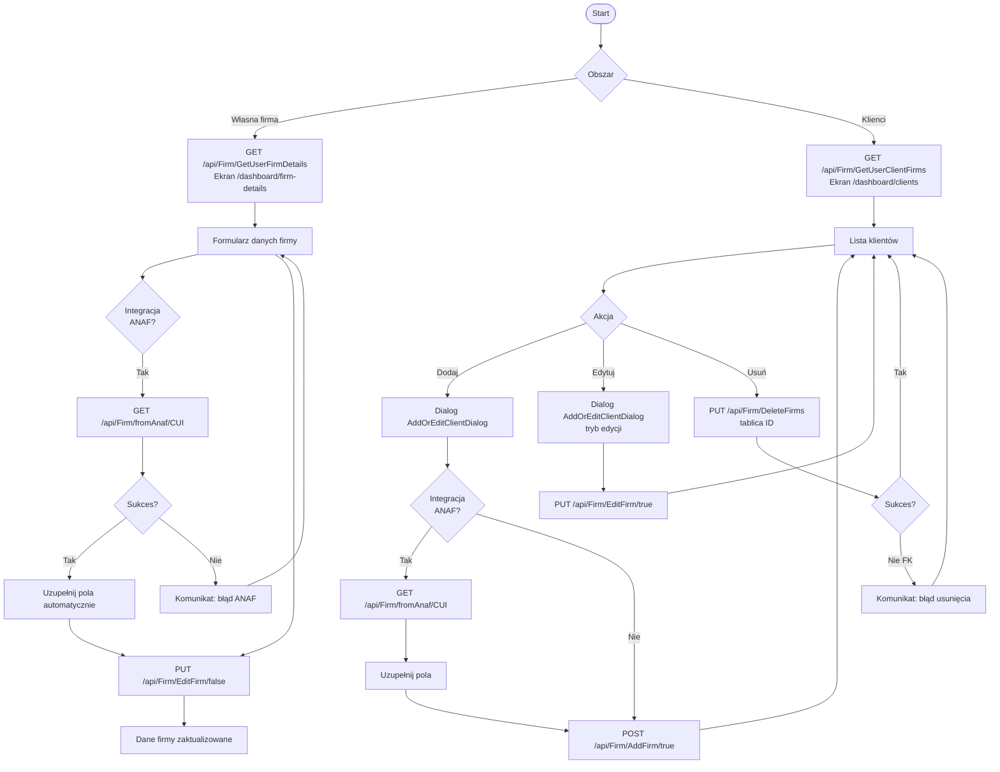

# Use Case: Zarządzanie firmą i klientami

| Pole | Wartość |
|---|---|
| ID dokumentu | UC-Firma-Firma |
| Typ dokumentu | use case |
| Wersja | 0.1 |
| Status | szkic |
| Autor (ostatnia modyfikacja) | Agent Claudiusz Sonte 4.6 max |
| Data ostatniej modyfikacji | 2026-05-31 |

## Streszczenie

Przypadek użycia opisuje zarządzanie dwoma powiązanymi obszarami: danymi własnej firmy użytkownika (dane rejestrowe, adres, CUI) oraz listą firm klientów. Oba obszary korzystają z tej samej tabeli `Firm` w bazie danych — własna firma i klienci różnią się flagą `isClient`. System umożliwia integrację z rumuńskim rejestrem ANAF w celu automatycznego uzupełniania danych firmy na podstawie numeru CUI.

## Aktorzy

| Aktor | Rola |
|---|---|
| Użytkownik | Zalogowany właściciel konta; edytuje dane swojej firmy i zarządza listą klientów |

## Warunki wstępne

- Użytkownik zalogowany (ważny token JWT)
- Rekord `UserFirm` istnieje w bazie (tworzony automatycznie przy rejestracji)

## Scenariusz główny — Edycja danych własnej firmy

1. Użytkownik przechodzi do `/dashboard/firm-details`
2. System ładuje dane firmy: `GET /api/Firm/GetUserFirmDetails`
3. Formularz wypełniany danymi z API (nazwa, CUI, adres, numer rejestrowy, IBAN)
4. Użytkownik opcjonalnie wpisuje CUI i klika ikonę pobierania danych z ANAF
5. System wywołuje `GET /api/Firm/fromAnaf/{cui}` i uzupełnia pola automatycznie
6. Użytkownik weryfikuje i modyfikuje dane
7. Klika „Zapisz" → `PUT /api/Firm/EditFirm/false`
8. System potwierdza zapis; formularz wyświetla zaktualizowane dane

## Scenariusz główny — Dodanie klienta

1. Użytkownik przechodzi do `/dashboard/clients`
2. System ładuje listę klientów: `GET /api/Firm/GetUserClientFirms`
3. Użytkownik klika „Dodaj klienta" → otwiera się dialog `AddOrEditClientDialog`
4. Opcjonalnie: użytkownik wpisuje CUI i klika ikonę chmury → `GET /api/Firm/fromAnaf/{cui}` uzupełnia pola
5. Użytkownik wypełnia/weryfikuje dane (nazwa, CUI, adres, e-mail, telefon)
6. Klika „Zapisz" → `POST /api/Firm/AddFirm/true`
7. Dialog zamyka się; lista klientów odświeża się

## Scenariusz główny — Edycja klienta

1. Użytkownik klika „Edytuj" przy wybranym kliencie na liście
2. Otwiera się dialog `AddOrEditClientDialog` z danymi klienta
3. Użytkownik modyfikuje dane
4. Klika „Zapisz" → `PUT /api/Firm/EditFirm/true`
5. Dialog zamyka się; lista klientów odświeża się

## Scenariusz główny — Usunięcie klienta

1. Użytkownik zaznacza jednego lub więcej klientów checkboxami
2. Klika „Usuń zaznaczone"
3. System wywołuje `PUT /api/Firm/DeleteFirms` z tablicą identyfikatorów
4. Klienci są usuwani z bazy (hard delete)
5. Lista klientów odświeża się

## Scenariusze alternatywne

### A1: Błąd integracji ANAF

1. System wywołuje `GET /api/Firm/fromAnaf/{cui}`
2. ANAF zwraca błąd lub timeout
3. System wyświetla komunikat o niedostępności ANAF
4. Użytkownik wypełnia dane ręcznie

### A2: Próba usunięcia klienta powiązanego z dokumentami

1. Użytkownik zaznacza klienta i klika „Usuń zaznaczone"
2. Backend próbuje usunąć rekord
3. Ograniczenie klucza obcego powoduje błąd
4. System wyświetla komunikat o błędzie usunięcia
5. Klient pozostaje na liście

## Diagram (Mermaid flowchart)

## Powiązane ekrany

| Ekran | Link |
|---|---|
| Dane firmy | `../../01_ekrany/firma/dane_firmy/ekran.md` |
| Klienci | `../../01_ekrany/firma/klienci/ekran.md` |

## Powiązane procesy

| Proces | Link |
|---|---|
| Pobierz dane firmy | `../../02_procesy/firma/pobierz_dane_firmy/proces.md` |
| Edytuj dane firmy | `../../02_procesy/firma/edytuj_firme/proces.md` |
| Dodaj klienta | `../../02_procesy/klienci/dodaj_klienta/proces.md` |
| Usuń klientów | `../../02_procesy/klienci/usun_klientow/proces.md` |

## Wątpliwości i braki

- Usunięcie klienta jest operacją hard delete — brak możliwości przywrócenia przez UI.
- Brak walidacji po stronie frontendu przed próbą usunięcia klienta powiązanego z dokumentami.

## Rejestr zmian

| Wersja | Data | Autor | Opis zmiany |
|---|---|---|---|
| 0.1 | 2026-05-31 | Agent Claudiusz Sonte 4.6 max | Pierwsza wersja — na podstawie UC-03 rozszerzona o zarządzanie własną firmą i diagram Mermaid. |
