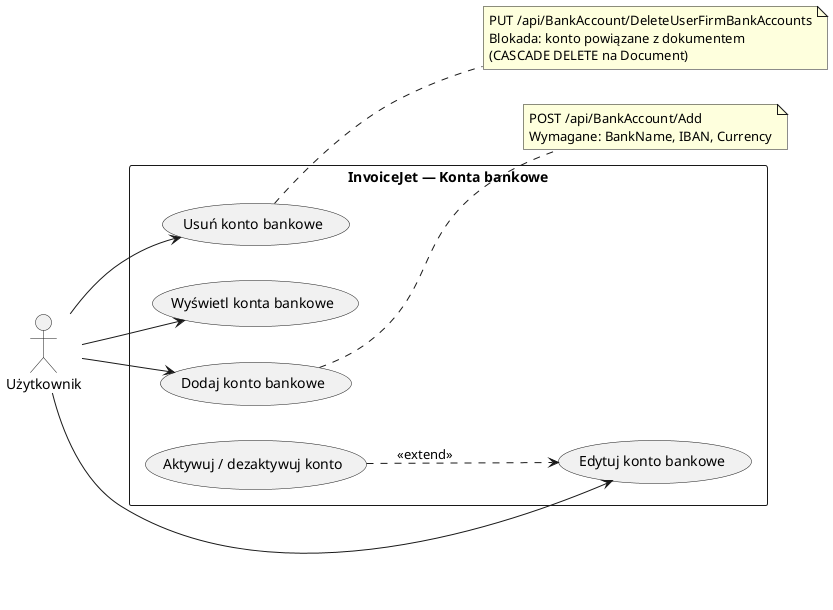

# Use Case: Zarządzanie kontami bankowymi

| Pole | Wartość |
|---|---|
| ID dokumentu | UC-KontaBankowe-KontaBankowe |
| Typ dokumentu | use case |
| Wersja | 0.1 |
| Status | szkic |
| Autor (ostatnia modyfikacja) | Agent Claudiusz Sonte 4.6 max |
| Data ostatniej modyfikacji | 2026-05-31 |

## Streszczenie

Przypadek użycia opisuje zarządzanie kontami bankowymi firmy użytkownika w systemie InvoiceJet. Konto bankowe zawiera nazwę banku, numer IBAN oraz walutę (RON lub EUR). Konta bankowe są widoczne na wystawianych fakturach i proformach jako dane do płatności. System umożliwia dodawanie, edytowanie i usuwanie kont w operacjach batch.

## Aktorzy

| Aktor | Rola |
|---|---|
| Użytkownik | Zalogowany właściciel konta; zarządza kontami bankowymi swojej firmy |

## Warunki wstępne

- Użytkownik zalogowany (ważny token JWT)
- Firma użytkownika zarejestrowana w systemie (`UserFirm` istnieje)

## Scenariusz główny — Przeglądanie listy kont bankowych

1. Użytkownik klika „Konta bankowe" w pasku bocznym
2. System ładuje ekran `/dashboard/bank-accounts`
3. System wywołuje `GET /api/BankAccount/GetUserFirmBankAccounts`
4. Wyświetlana jest tabela z kolumnami: Nazwa banku, IBAN, Waluta, Aktywne
5. Tabela obsługuje paginację i zaznaczanie wierszy

## Scenariusz główny — Dodanie konta bankowego

1. Użytkownik klika „Dodaj konto bankowe"
2. Otwiera się dialog `AddOrEditBankAccountDialog`
3. Użytkownik wypełnia pola: Nazwa banku, IBAN, Waluta (RON / EUR), status aktywności
4. Klika „Zapisz" → system wywołuje odpowiedni endpoint API (dodanie)
5. Dialog zamyka się; lista kont odświeża się

## Scenariusz główny — Edycja konta bankowego

1. Użytkownik klika „Edytuj" w wierszu wybranego konta
2. Otwiera się dialog `AddOrEditBankAccountDialog` z wypełnionymi danymi
3. Użytkownik modyfikuje pola
4. Klika „Zapisz" → system wysyła zaktualizowane dane do API
5. Dialog zamyka się; lista kont odświeża się

## Scenariusz główny — Usunięcie kont bankowych

1. Użytkownik zaznacza jedno lub więcej kont checkboxami
2. Klika „Usuń zaznaczone"
3. System wywołuje `PUT /api/BankAccount/DeleteUserFirmBankAccounts` z tablicą ID w body (`[FromBody] int[]`)
4. Konta są usuwane (hard delete)
5. Lista kont odświeża się

## Scenariusze alternatywne

### A1: Pusta lista kont bankowych

1. System otrzymuje pustą odpowiedź z API
2. Ekran wyświetla pustą tabelę lub komunikat „Brak kont bankowych"
3. Przycisk „Dodaj konto bankowe" pozostaje aktywny
4. Uwaga: brak konta bankowego blokuje możliwość wystawienia faktury (warunek wstępny)

### A2: Próba usunięcia konta powiązanego z dokumentem

1. Użytkownik zaznacza konto i klika „Usuń zaznaczone"
2. Backend wykrywa powiązanie z wystawionym dokumentem i zwraca błąd
3. System wyświetla komunikat o niemożności usunięcia
4. Konto pozostaje na liście

### A3: Nieprawidłowy format IBAN

1. Użytkownik wpisuje nieprawidłowy IBAN w dialogu
2. Walidacja frontendu lub backendu wykrywa błąd formatu
3. Wyświetlany jest komunikat o wymaganiach dotyczących formatu IBAN
4. Dialog pozostaje otwarty

## Diagram (PlantUML UseCase)

## Powiązane ekrany

| Ekran | Link |
|---|---|
| Konta bankowe | `../../01_ekrany/firma/konta_bankowe/ekran.md` |

## Powiązane procesy

| Proces | Link |
|---|---|
| Pobierz konta bankowe | `../../02_procesy/konta_bankowe/pobierz_konta/proces.md` |
| Usuń konta bankowe | `../../02_procesy/konta_bankowe/usun_konta/proces.md` |

## Wątpliwości i braki

- Brak walidacji formatu IBAN po stronie frontendu — formularz może przyjąć nieprawidłowy numer.
- Brak interfejsu do oznaczania konta jako domyślne — przy wystawianiu dokumentów użytkownik musi wybrać konto ręcznie.
- Flaga `isActive` istnieje w modelu, lecz jej wpływ na widoczność konta w formularzu dokumentu nie jest w pełni udokumentowany.

## Rejestr zmian

| Wersja | Data | Autor | Opis zmiany |
|---|---|---|---|
| 0.1 | 2026-05-31 | Agent Claudiusz Sonte 4.6 max | Pierwsza wersja — na podstawie ekranu kont bankowych (EKRAN-KontaBankowe). |
