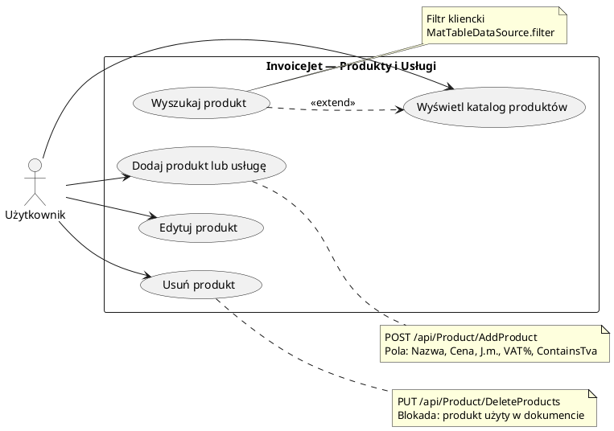

# Use Case: Zarządzanie produktami

| Pole | Wartość |
|---|---|
| ID dokumentu | UC-Produkty-Produkty |
| Typ dokumentu | use case |
| Wersja | 0.1 |
| Status | szkic |
| Autor (ostatnia modyfikacja) | Agent Claudiusz Sonte 4.6 max |
| Data ostatniej modyfikacji | 2026-05-31 |

## Streszczenie

Przypadek użycia opisuje kompletny CRUD katalogu produktów i usług przypisanych do firmy użytkownika. Produkty definiują nazwę, cenę jednostkową, jednostkę miary, stawkę VAT oraz flagę określającą, czy cena zawiera VAT. Katalog produktów jest wykorzystywany jako źródło pozycji podczas wystawiania dokumentów (faktur, proform, storn).

## Aktorzy

| Aktor | Rola |
|---|---|
| Użytkownik | Zalogowany właściciel konta; zarządza katalogiem produktów swojej firmy |

## Warunki wstępne

- Użytkownik zalogowany (ważny token JWT)
- Firma użytkownika zarejestrowana w systemie (`UserFirm` istnieje)

## Scenariusz główny — Przeglądanie listy produktów

1. Użytkownik klika „Produkty" w pasku bocznym
2. System ładuje ekran `/dashboard/products`
3. System wywołuje `GET /api/Product/GetAllProductsForUserId`
4. Wyświetlana jest tabela z kolumnami: Nazwa, Cena, J.m., VAT %, Zawiera VAT
5. Użytkownik może filtrować tabelę przez pole wyszukiwania (filtr po stronie frontendu)
6. Tabela obsługuje sortowanie i paginację

## Scenariusz główny — Dodanie produktu

1. Użytkownik klika „Dodaj produkt"
2. Otwiera się dialog `AddOrEditProductDialogComponent`
3. Użytkownik wypełnia pola: Nazwa, Cena, Jednostka miary, Stawka VAT (%), Zawiera VAT (checkbox)
4. Klika „Zapisz" → system wywołuje `POST /api/Product/AddProduct`
5. Dialog zamyka się; lista produktów odświeża się automatycznie

## Scenariusz główny — Edycja produktu

1. Użytkownik klika „Edytuj" w wierszu wybranego produktu
2. Otwiera się dialog `AddOrEditProductDialogComponent` w trybie edycji z wypełnionymi danymi
3. Użytkownik modyfikuje wybrane pola
4. Klika „Zapisz" → system wywołuje `PUT /api/Product/EditProduct`
5. Dialog zamyka się; lista produktów odświeża się

## Scenariusz główny — Usunięcie produktów

1. Użytkownik zaznacza jeden lub więcej produktów checkboxami
2. Klika „Usuń zaznaczone"
3. System wywołuje `PUT /api/Product/DeleteProducts?productIds=...` (query string z tablicą ID)
4. Produkty są usuwane (hard delete)
5. Lista produktów odświeża się

## Scenariusze alternatywne

### A1: Pusta lista produktów

1. System wywołuje `GET /api/Product/GetAllProductsForUserId` i otrzymuje pustą tablicę
2. Ekran wyświetla komunikat „Brak produktów" lub pusty widok tabeli
3. Przycisk „Dodaj produkt" pozostaje aktywny

### A2: Błąd zapisu produktu — duplikat nazwy

1. Użytkownik klika „Zapisz" w dialogu dodawania/edycji
2. Backend zwraca błąd walidacji (np. duplikat)
3. Dialog wyświetla komunikat o błędzie
4. Formularz pozostaje otwarty z danymi użytkownika

### A3: Usunięcie produktu użytego w dokumencie

1. Użytkownik zaznacza produkt i klika „Usuń zaznaczone"
2. Backend wykrywa powiązanie z pozycją dokumentu i zwraca błąd
3. System wyświetla komunikat o niemożności usunięcia
4. Produkt pozostaje na liście

## Diagram (PlantUML UseCase)

## Powiązane ekrany

| Ekran | Link |
|---|---|
| Lista produktów | `../../01_ekrany/produkty/ekran.md` |

## Powiązane procesy

| Proces | Link |
|---|---|
| Pobierz produkty | `../../02_procesy/produkty/pobierz_produkty/proces.md` |
| Usuń produkty | `../../02_procesy/produkty/usun_produkty/proces.md` |

## Wątpliwości i braki

- Brak potwierdzenia (dialog confirm) przed usunięciem produktów — operacja hard delete jest natychmiastowa.
- Brak informacji w UI o tym, czy produkt jest używany w istniejących dokumentach.

## Rejestr zmian

| Wersja | Data | Autor | Opis zmiany |
|---|---|---|---|
| 0.1 | 2026-05-31 | Agent Claudiusz Sonte 4.6 max | Pierwsza wersja — na podstawie ekranu produktów (EKRAN-Produkty). |
