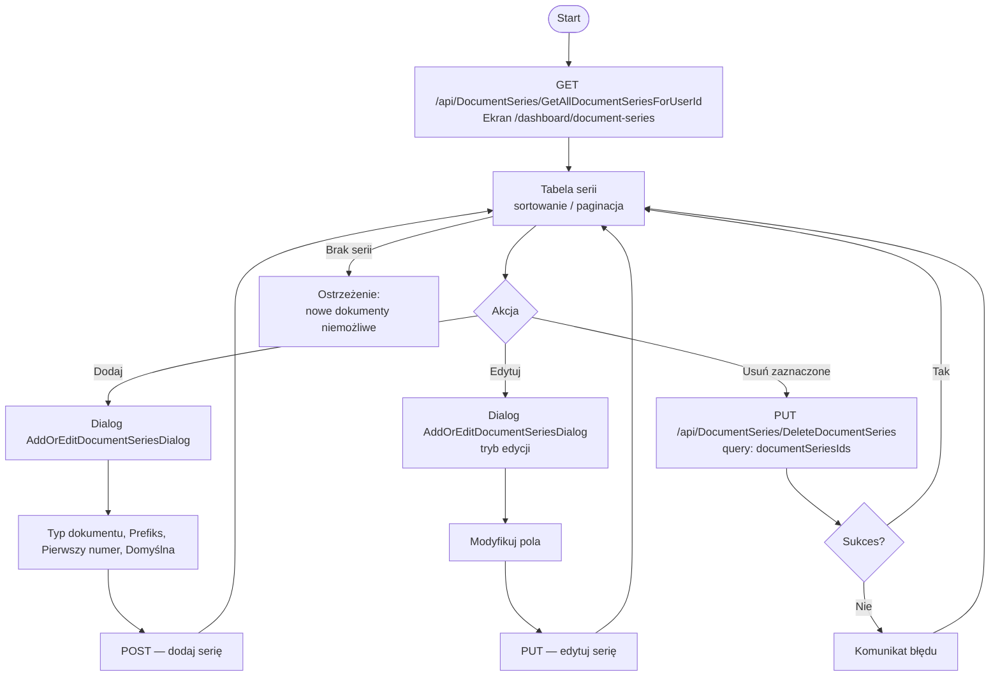

# Use Case: Zarządzanie seriami dokumentów

| Pole | Wartość |
|---|---|
| ID dokumentu | UC-SerieDokumentow-SerieDokumentow |
| Typ dokumentu | use case |
| Wersja | 0.1 |
| Status | szkic |
| Autor (ostatnia modyfikacja) | Agent Claudiusz Sonte 4.6 max |
| Data ostatniej modyfikacji | 2026-05-31 |

## Streszczenie

Przypadek użycia opisuje zarządzanie seriami numeracji dokumentów w InvoiceJet. Seria numeracji definiuje prefiks (np. `FV`, `PRF`) oraz bieżący licznik, na podstawie których system automatycznie generuje unikalne numery kolejnych dokumentów (np. `FV0015`, `PRF0003`). Dla każdego z trzech typów dokumentów (Factura, Proforma, Storno) można zdefiniować wiele serii. Wybranie domyślnej serii przyspiesza wystawianie dokumentów.

## Aktorzy

| Aktor | Rola |
|---|---|
| Użytkownik | Zalogowany właściciel konta; konfiguruje serie numeracji dla swojej firmy |

## Warunki wstępne

- Użytkownik zalogowany (ważny token JWT)
- Firma użytkownika zarejestrowana w systemie (`UserFirm` istnieje)

## Scenariusz główny — Przeglądanie serii

1. Użytkownik klika „Serie dokumentów" w pasku bocznym
2. System ładuje ekran `/dashboard/document-series`
3. System wywołuje `GET /api/DocumentSeries/GetAllDocumentSeriesForUserId`
4. Wyświetlana jest tabela z kolumnami: Typ dokumentu, Nazwa serii, Pierwszy numer, Bieżący numer, Domyślna
5. Tabela obsługuje sortowanie i paginację

## Scenariusz główny — Dodanie serii

1. Użytkownik klika „Dodaj serię"
2. Otwiera się dialog `AddOrEditDocumentSeriesDialog`
3. Użytkownik wypełnia pola: Typ dokumentu (Factura / Proforma / Storno), Nazwa serii (prefiks), Pierwszy numer, flaga Domyślna
4. Klika „Zapisz" → system zapisuje nową serię przez API
5. Dialog zamyka się; lista serii odświeża się

## Scenariusz główny — Edycja serii

1. Użytkownik klika „Edytuj" w wierszu wybranej serii
2. Otwiera się dialog `AddOrEditDocumentSeriesDialog` z danymi serii
3. Użytkownik modyfikuje pola (np. zmienia flagę domyślną)
4. Klika „Zapisz" → system aktualizuje serię przez API
5. Dialog zamyka się; lista serii odświeża się

## Scenariusz główny — Usunięcie serii

1. Użytkownik zaznacza jedną lub więcej serii checkboxami
2. Klika „Usuń zaznaczone"
3. System wywołuje `PUT /api/DocumentSeries/DeleteDocumentSeries?documentSeriesIds=...` (query string)
4. Serie są usuwane (hard delete)
5. Lista serii odświeża się

## Scenariusze alternatywne

### A1: Brak serii przy wystawianiu dokumentu

1. Użytkownik próbuje wystawić fakturę, lecz brak zdefiniowanych serii
2. Formularz dokumentu (`GET /api/Document/GetDocumentAutofillInfo/1`) nie zwraca żadnej serii
3. Selektor serii w formularzu dokumentu jest pusty
4. Użytkownik nie może zapisać dokumentu bez wybrania serii
5. Użytkownik przechodzi do `/dashboard/document-series` i dodaje serię

### A2: Zmiana numeru bieżącego przy edycji

1. Użytkownik edytuje serię i zmienia `currentNumber` na wyższą wartość
2. System aktualizuje wartość bez walidacji ciągłości (możliwa luka w numeracji)
3. Kolejny wystawiony dokument otrzyma zaktualizowany numer

### A3: Próba usunięcia serii domyślnej

1. Użytkownik zaznacza serię oznaczoną jako domyślna i klika „Usuń zaznaczone"
2. Backend może zezwolić lub zablokować operację (zachowanie do weryfikacji)
3. Jeśli usunięto jedyną serię danego typu — formularz dokumentu nie będzie miał serii do wyboru

## Diagram (Mermaid flowchart)

## Powiązane ekrany

| Ekran | Link |
|---|---|
| Serie dokumentów | `../../01_ekrany/serie_dokumentow/ekran.md` |

## Powiązane procesy

| Proces | Link |
|---|---|
| Pobierz serie dokumentów | `../../02_procesy/serie_dokumentow/pobierz_serie/proces.md` |
| Usuń serie dokumentów | `../../02_procesy/serie_dokumentow/usun_serie/proces.md` |

## Wątpliwości i braki

- `console.log(series)` aktywny w metodzie `getDocumentSeries()` — kod produkcyjny.
- `console.log(selectedIds)` aktywny w metodzie `deleteSelected()` — kod produkcyjny.
- Podwójne wywołanie `selection.clear()` w `deleteSelected()` — potencjalnie niegroźne, wymaga weryfikacji.
- Brak walidacji unikalności kombinacji (typ dokumentu + prefiks serii) w obrębie firmy.

## Rejestr zmian

| Wersja | Data | Autor | Opis zmiany |
|---|---|---|---|
| 0.1 | 2026-05-31 | Agent Claudiusz Sonte 4.6 max | Pierwsza wersja — na podstawie ekranu serii dokumentów (EKRAN-SerieDokumentow). |
