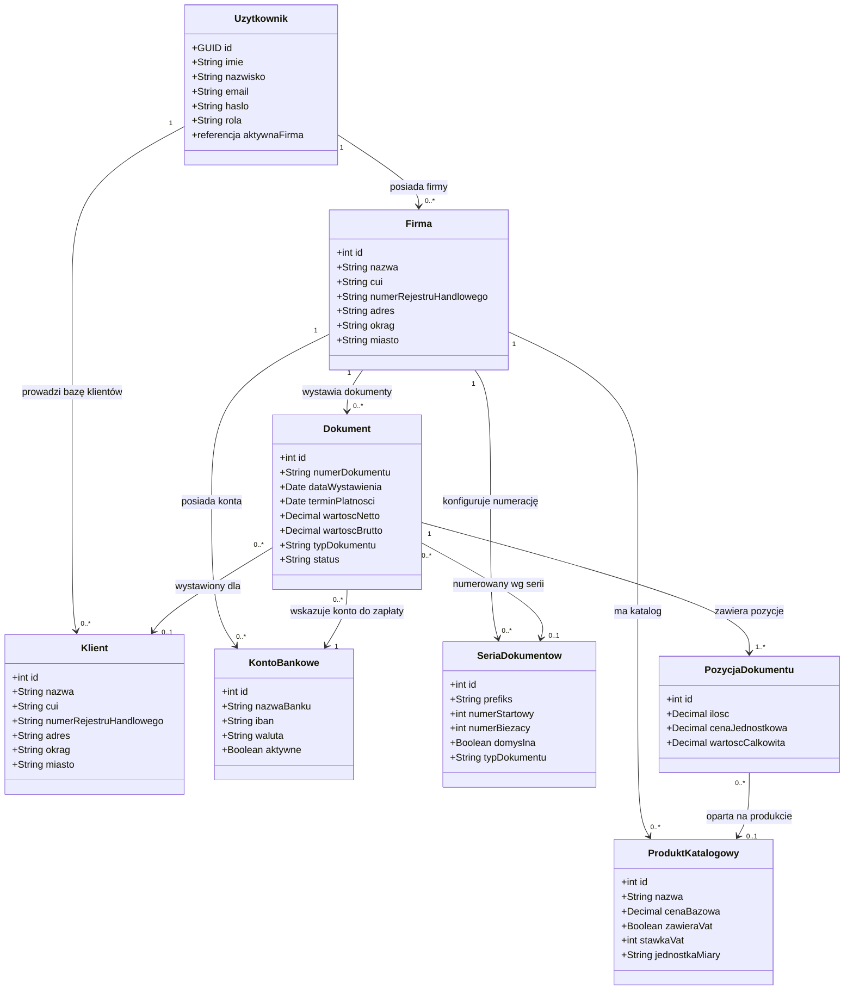

# Model klas biznesowych InvoiceJet — diagram główny

| Pole | Wartość |
|---|---|
| ID dokumentu | MOD-GLOWNY |
| Typ dokumentu | diagram klas |
| Wersja | 0.1 |
| Status | szkic |
| Autor (ostatnia modyfikacja) | Agent Claudiusz Sonte 4.6 max |
| Data ostatniej modyfikacji | 2026-05-31 |

## Streszczenie

Diagram przedstawia główne klasy biznesowe systemu InvoiceJet oraz ich powiązania. Centralnym elementem jest `Dokument`, który łączy firmę wystawiającą (`Firma`), odbiorcę (`Klient`), konto bankowe (`KontoBankowe`) i pozycje (`PozycjaDokumentu`). Właścicielem wszystkich bytów jest `Uzytkownik`, który zarządza zasobami w kontekście swojej aktywnej firmy.

## Diagram klas

## Legenda typów powiązań

| Notacja | Znaczenie |
|---|---|
| `1 --> 0..*` | Jeden do wielu (opcjonalne po stronie wielu) |
| `1 --> 1..*` | Jeden do wielu (co najmniej jedna po stronie wielu) |
| `0..*  --> 0..1` | Wiele do opcjonalnego jednego |
| `0..*  --> 1` | Wiele do wymaganego jednego |

## Uwagi do diagramu

- `Klient` i `Firma` to ta sama struktura danych w bazie (tabela `dbo.Firm`) — rozróżniane przez kontekst powiązania z użytkownikiem (`UserFirm.IsClient`).
- `Uzytkownik` posiada wskaźnik aktywnej firmy — w danej chwili pracuje w kontekście jednej firmy.
- `PozycjaDokumentu` przechowuje migawkę cenową niezależną od aktualnej ceny w `ProduktKatalogowy`.
- Powiązanie `Dokument → SeriaDokumentow` jest pośrednie — dokument przechowuje wygenerowany numer tekstowy, nie referencję do serii.

## Rejestr zmian

| Wersja | Data | Autor | Opis zmiany |
|---|---|---|---|
| 0.1 | 2026-05-31 | Agent Claudiusz Sonte 4.6 max | Pierwsza wersja. |
