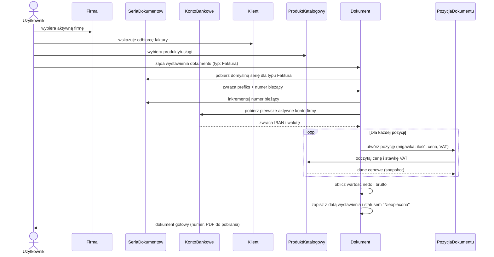

# Perspektywa dokumentów

| Pole | Wartość |
|---|---|
| ID dokumentu | PERS-Dokumenty |
| Typ dokumentu | perspektywa procesowa |
| Wersja | 0.1 |
| Status | szkic |
| Autor (ostatnia modyfikacja) | Agent Claudiusz Sonte 4.6 max |
| Data ostatniej modyfikacji | 2026-05-31 |

## Streszczenie

Perspektywa dokumentów opisuje, w jaki sposób klasy biznesowe współpracują podczas procesu wystawiania dokumentu finansowego (faktury, proformy lub storna). Centralnym bytem jest `Dokument`, który agreguje: firmę wystawiającą (`Firma`), odbiorcę (`Klient`), konto bankowe (`KontoBankowe`), schemat numeracji (`SeriaDokumentow`) oraz pozycje z produktami (`PozycjaDokumentu` i `ProduktKatalogowy`).

## Uczestnicy perspektywy

| Klasa | Rola w procesie wystawiania dokumentu |
|---|---|
| Uzytkownik | Inicjuje wystawienie dokumentu; działa w kontekście aktywnej firmy |
| Firma | Wystawca — dane firmy drukowane w nagłówku dokumentu |
| Klient | Odbiorca — dane nabywcy drukowane w dokumencie |
| KontoBankowe | Rachunek bankowy wskazany jako numer do przelewu należności |
| SeriaDokumentow | Dostarcza kolejny numer w serii — generuje `DocumentNumber` |
| Dokument | Centralny byt procesu — gromadzi wszystkie dane i jest utrwalany |
| PozycjaDokumentu | Poszczególne linie dokumentu z ilością, ceną i wartością |
| ProduktKatalogowy | Wzorzec produktu/usługi; dostarcza cenę i stawkę VAT dla pozycji |

## Diagram sekwencji — wystawianie faktury

## Powiązania klas w kontekście dokumentu

| Klasa źródłowa | Klasa docelowa | Typ powiązania | Opis roli |
|---|---|---|---|
| Dokument | Firma | N:1 (wymagane) | Firma figuruje jako wystawca na dokumencie |
| Dokument | Klient | N:1 (opcjonalne) | Klient figuruje jako odbiorca na dokumencie |
| Dokument | KontoBankowe | N:1 (wymagane) | Konto drukowane jako numer do przelewu |
| Dokument | SeriaDokumentow | N:1 (pośrednie) | Seria dostarcza kolejny numer dokumentu |
| Dokument | PozycjaDokumentu | 1:N | Dokument zawiera wiele pozycji |
| PozycjaDokumentu | ProduktKatalogowy | N:1 (opcjonalne) | Pozycja oparta na produkcie z katalogu |

## Stany dokumentu i przejścia

| Stan | Opis | Przejście |
|---|---|---|
| Nieopłacona | Stan domyślny po wystawieniu | Użytkownik zmienia ręcznie na Opłacona |
| Opłacona | Należność uregulowana | Użytkownik może cofnąć do Nieopłacona |

## Typy dokumentów i ich specyfika

| Typ | Rumuńska nazwa | Seria domyślna (przykład) | Uwagi |
|---|---|---|---|
| Faktura | Factura | FV0001, FV0002, ... | Główny typ; obsługuje generowanie PDF |
| Proforma | Factura Proforma | PRO0001, PRO0002, ... | Dokument przed fakturą; PDF w przygotowaniu |
| Storno | Factura Storno | STORNO0001, ... | Faktura korygująca; PDF w przygotowaniu |

## Wyjątki procesowe

| Sytuacja | Skutek biznesowy |
|---|---|
| Brak aktywnego konta bankowego | Wystawienie dokumentu jest niemożliwe (wyjątek: NoBankAccountAddedException) |
| Brak domyślnej serii numeracji | System nie może wygenerować numeru dokumentu |
| Usunięcie konta bankowego | Wszystkie dokumenty powiązane z tym kontem są trwale usuwane |
| Race condition przy numeracji | Możliwe zduplikowane numery dokumentów przy równoczesnym wystawianiu |

## Rejestr zmian

| Wersja | Data | Autor | Opis zmiany |
|---|---|---|---|
| 0.1 | 2026-05-31 | Agent Claudiusz Sonte 4.6 max | Pierwsza wersja. |
