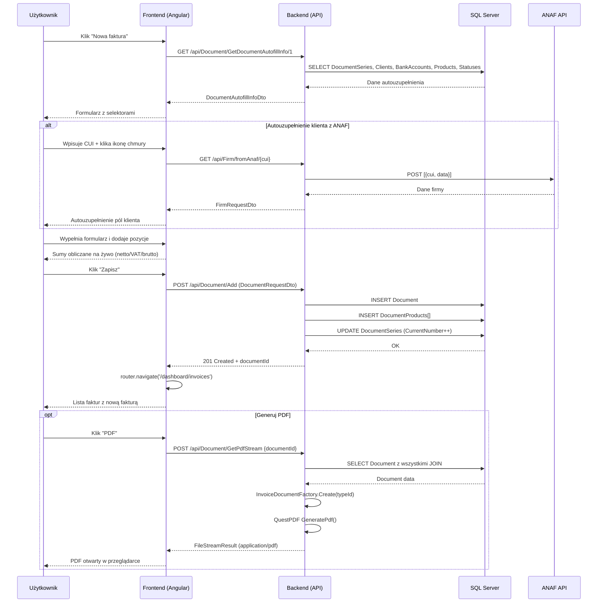

# Proces biznesowy: Wystawienie faktury (BPMN)

| Atrybut | Wartość |
|---|---|
| ID | BPMN-01 |
| Nazwa | Wystawienie faktury |
| Uczestnicy | Użytkownik, InvoiceJet Frontend, InvoiceJet Backend, ANAF API |
| Ostatnia walidacja | 2026-05-31 |
| Autor | Agent Claudiusz Sonte 4.6 max |

## Diagram procesu (Mermaid)

## Ścieżki alternatywne

### Błąd walidacji
- Brak wymaganego pola → frontend pokazuje błąd walidacji; żądanie nie wysyłane
- DocumentSeries nie istnieje → Backend 404 → Frontend toastr error

### Wygaśnięcie sesji w trakcie
- JWT wygasa → JwtInterceptor łapie 401 → TokenExpiredDialog → redirect do /login
- Dane niezapisanego formularza przepadają

### ANAF niedostępny
- Timeout lub błąd → Frontend toastr error → Użytkownik wpisuje dane ręcznie

## Rejestr zmian

| Wersja | Data | Autor | Opis |
|---|---|---|---|
| 1.0 | 2026-05-31 | Agent Claudiusz Sonte 4.6 max | Dokument wstępny. |
