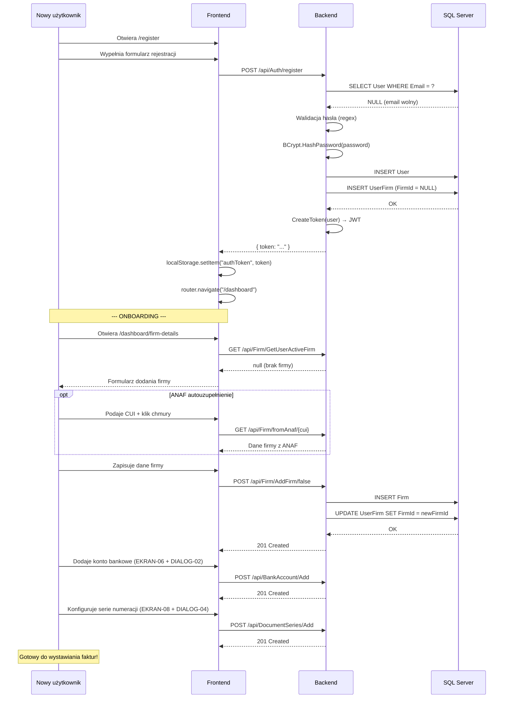

# Proces biznesowy: Rejestracja i onboarding (BPMN)

| Atrybut | Wartość |
|---|---|
| ID | BPMN-02 |
| Nazwa | Rejestracja i konfiguracja konta |
| Uczestnicy | Nowy użytkownik, InvoiceJet Frontend, InvoiceJet Backend |
| Ostatnia walidacja | 2026-05-31 |
| Autor | Agent Claudiusz Sonte 4.6 max |

## Diagram procesu (Mermaid)

## Wymagania do pierwszej faktury

Aby wystawić pierwszą fakturę, użytkownik musi kolejno:
1. ✅ Zarejestrować konto
2. ✅ Dodać dane własnej firmy (EKRAN-04)
3. ✅ Dodać konto bankowe (EKRAN-06)
4. ✅ Dodać serię numeracji (EKRAN-08)
5. Opcjonalnie: Dodać klientów (EKRAN-05)
6. Opcjonalnie: Dodać produkty do katalogu (EKRAN-07)

Aplikacja nie wymusza tych kroków w określonej kolejności — użytkownik może próbować wystawić fakturę bez konfiguracji i natrafi na puste selektory.

## Rejestr zmian

| Wersja | Data | Autor | Opis |
|---|---|---|---|
| 1.0 | 2026-05-31 | Agent Claudiusz Sonte 4.6 max | Dokument wstępny. |
