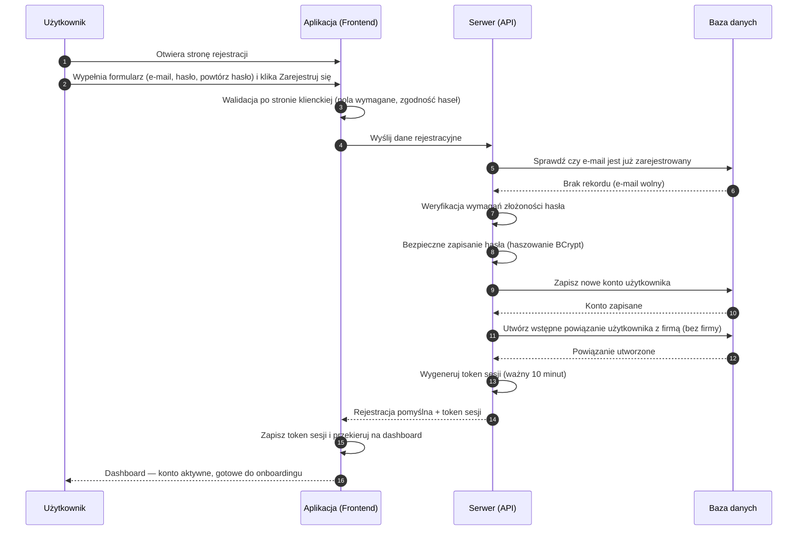

# BP-AUTH-01 Rejestracja konta

| Pole | Wartość |
|---|---|
| ID dokumentu | BP-AUTH-01 |
| Obszar | Autentykacja |
| Wersja | 0.1 |
| Status | szkic |
| Autor | Agent Claudiusz Sonte 4.6 max |
| Data | 2026-06-01 |

## Cel biznesowy

Umożliwić nowej osobie założenie konta w systemie InvoiceJet i uzyskanie natychmiastowego dostępu do aplikacji — bez konieczności potwierdzania adresu e-mail.

## Kontekst

Użytkownik trafia na ten proces przy pierwszym wejściu do aplikacji. Ekran rejestracji dostępny jest pod adresem `/register`. Po pomyślnej rejestracji system automatycznie loguje użytkownika i przekierowuje go na dashboard, gdzie rozpoczyna się onboarding (dodanie danych firmy, konta bankowego, serii numeracji).

## Aktorzy

| Aktor | Rola |
|---|---|
| Użytkownik (nowy) | Wypełnia formularz i inicjuje proces rejestracji |
| Aplikacja (Frontend) | Waliduje formularz, wysyła dane, przechowuje token |
| Serwer (API) | Sprawdza unikalność e-maila, hashuje hasło, wystawia token JWT |
| Baza danych | Trwale przechowuje dane konta |

## Warunki wejścia

- Użytkownik nie posiada jeszcze konta w systemie
- Aplikacja dostępna pod adresem `/register`

## Przebieg główny

1. **Użytkownik** otwiera stronę rejestracji i widzi formularz z polami: adres e-mail, hasło, powtórz hasło
2. **Użytkownik** wypełnia formularz i klika „Zarejestruj się"
3. **Aplikacja** waliduje po stronie klienckiej (wymagane pola, zgodność haseł)
4. **Aplikacja** wysyła dane rejestracyjne do serwera
5. **Serwer** sprawdza, czy podany adres e-mail nie jest już zarejestrowany w systemie
6. **Serwer** weryfikuje, czy hasło spełnia wymagania złożoności
7. **Serwer** bezpiecznie zapisuje hasło (haszowanie) i tworzy konto użytkownika
8. **Serwer** tworzy wstępne powiązanie użytkownika z firmą (bez przypisanej firmy — do uzupełnienia w onboardingu)
9. **Serwer** wystawia token sesji i zwraca go do aplikacji
10. **Aplikacja** zapisuje token, przekierowuje użytkownika na dashboard
11. **System** wyświetla dashboard w stanie pustym — gotowy do onboardingu

## Reguły biznesowe

| ID | Reguła | Objaśnienie |
|---|---|---|
| RB-01 | Adres e-mail musi być unikalny | Dwa konta z tym samym e-mailem są niedozwolone |
| RB-02 | Hasło musi spełniać wymagania złożoności | Minimum 8 znaków, co najmniej: jedna mała litera, jedna wielka litera, jedna cyfra, jeden znak specjalny (@$!%*?&) |
| RB-03 | Oba pola hasła muszą być zgodne | Walidacja wykonywana po stronie frontendu |
| RB-04 | Rejestracja nie wymaga potwierdzenia e-mail | Konto aktywne natychmiast po rejestracji |
| RB-05 | Po rejestracji użytkownik jest automatycznie zalogowany | Nie trzeba osobno logować się po założeniu konta |
| RB-06 | Nowe konto nie ma przypisanej firmy | Użytkownik musi przejść onboarding, by wystawiać dokumenty |

## Wyjątki i scenariusze alternatywne

| ID | Scenariusz | Warunek | Reakcja systemu |
|---|---|---|---|
| WYJ-01 | E-mail już zarejestrowany | Podany adres e-mail istnieje już w bazie | Formularz wyświetla komunikat błędu; użytkownik proszony o użycie innego adresu lub zalogowanie |
| WYJ-02 | Hasło zbyt słabe | Hasło nie spełnia wymogów złożoności | Komunikat o wymaganiach hasła; formularz zablokowany |
| WYJ-03 | Niezgodność haseł | Oba pola hasła się różnią | Komunikat inline przy polu; formularz zablokowany |
| WYJ-04 | Błąd techniczny | Tymczasowy problem z dostępem do bazy danych | Ogólny komunikat błędu; użytkownik proszony o ponowienie próby |

## Wynik procesu

- Konto użytkownika zapisane w systemie
- Użytkownik zalogowany (token sesji w przeglądarce)
- Użytkownik na dashboardzie — gotowy do uzupełnienia danych firmy w onboardingu

## Diagram sekwencji

## Powiązania analityczne

| Typ | Dokument |
|---|---|
| Use Case | [UC-01 Zarządzanie kontem](../../07_use_case/UC-01_ZarzadzanieKontem.md) |
| Use Case | [uc_autentykacja](../../07_use_case/globalny/uc_autentykacja.md) |
| Proces powiązany | [BP-AUTH-02 Logowanie](./BP-AUTH-02_logowanie.md) |
| Proces powiązany | [BP-CFG-01 Onboarding](../konfiguracja/BP-CFG-01_onboarding.md) |

## Powiązania techniczne

| Typ | Dokument |
|---|---|
| Proces techniczny | [rejestracja/proces.md](../../02_procesy/autentykacja/rejestracja/proces.md) |
| API | [POST /api/Auth/register](../../04_api_i_integracje/01_api_frontend/auth/POST_Auth_register.md) |
| Model DB | [dbo.User](../../05_model_danych/01_db/dbo/dbo.User.md) |
| Model DB | [dbo.UserFirm](../../05_model_danych/01_db/dbo/dbo.UserFirm.md) |
| Algorytm | [tworzenie_tokenu_jwt](../../03_algorytmy/autoryzacyjne/tworzenie_tokenu_jwt.md) |
| Algorytm | [walidacja_hasla](../../03_algorytmy/walidacji/walidacja_hasla.md) |

## Wątpliwości i braki

- Brak weryfikacji e-maila po rejestracji — konto aktywne natychmiast; ryzyko rejestracji na cudzy adres
- Zgodność haseł weryfikowana tylko na frontendzie — można ominąć przez bezpośrednie wywołanie API
- Token sesji wygasa po 10 minutach — bardzo krótki czas dla aplikacji biznesowej; brak mechanizmu odświeżania tokenu
- Brak "kreatora onboardingu" — użytkownik musi samodzielnie odkryć kolejność konfiguracji (firma → konto bankowe → serie)

## Rejestr zmian

| Wersja | Data | Autor | Opis zmiany |
|---|---|---|---|
| 0.1 | 2026-06-01 | Agent Claudiusz Sonte 4.6 max | Pierwsza wersja BP — na podstawie BPMN-AUTH-01 i PROC-RegisterUser; format analityczny BP-NN |
