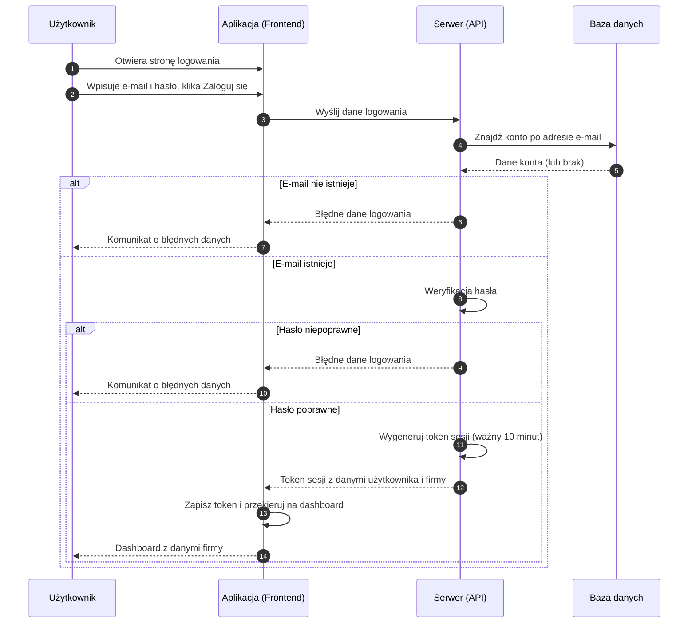

# BP-AUTH-02 Logowanie i wylogowanie

| Pole | Wartość |
|---|---|
| ID dokumentu | BP-AUTH-02 |
| Obszar | Autentykacja |
| Wersja | 0.1 |
| Status | szkic |
| Autor | Agent Claudiusz Sonte 4.6 max |
| Data | 2026-06-01 |

## Cel biznesowy

Umożliwić zarejestrowanemu użytkownikowi bezpieczne uzyskanie dostępu do swojego konta i danych firmy, oraz bezpieczne zakończenie sesji.

## Kontekst

Użytkownik trafia na ekran logowania pod adresem `/login` przy każdym nowym wejściu lub po wygaśnięciu sesji. Token sesji ważny jest 10 minut — po upływie tego czasu aplikacja automatycznie wyświetla dialog z informacją o wygaśnięciu i przekierowuje na stronę logowania.

## Aktorzy

| Aktor | Rola |
|---|---|
| Użytkownik | Podaje dane logowania, inicjuje i kończy sesję |
| Aplikacja (Frontend) | Zarządza tokenem sesji, przechwytuje wygaśnięcia sesji |
| Serwer (API) | Weryfikuje dane logowania, wystawia token JWT |
| Baza danych | Dostarcza dane konta do weryfikacji |

## Warunki wejścia

- Użytkownik posiada zarejestrowane konto w systemie
- Aplikacja dostępna pod adresem `/login`

## Przebieg główny — Logowanie

1. **Użytkownik** otwiera stronę logowania i widzi formularz z polami: adres e-mail, hasło
2. **Użytkownik** wpisuje swój adres e-mail i hasło, klika „Zaloguj się"
3. **Aplikacja** wysyła dane logowania do serwera
4. **Serwer** sprawdza, czy konto z podanym adresem e-mail istnieje
5. **Serwer** weryfikuje poprawność hasła
6. **Serwer** wystawia token sesji z danymi użytkownika i jego firmy
7. **Aplikacja** zapisuje token i przekierowuje użytkownika na dashboard
8. **System** wyświetla dashboard z danymi firmy użytkownika

## Przebieg główny — Wylogowanie

1. **Użytkownik** klika „Wyloguj" w menu nawigacji
2. **Aplikacja** usuwa token sesji z przeglądarki
3. **Aplikacja** przekierowuje użytkownika na stronę logowania

## Przebieg alternatywny — Wygaśnięcie sesji

1. **System** wykrywa, że token sesji wygasł (po 10 minutach nieaktywności lub w trakcie pracy)
2. **Aplikacja** wyświetla dialog z informacją o wygaśnięciu sesji
3. **Użytkownik** klika „Zaloguj ponownie" w dialogu
4. **Aplikacja** przekierowuje na stronę logowania

## Reguły biznesowe

| ID | Reguła | Objaśnienie |
|---|---|---|
| RB-01 | Logowanie wymaga podania e-maila i hasła | Oba pola są obowiązkowe |
| RB-02 | Token sesji ważny jest 10 minut | Po upływie tego czasu konieczne jest ponowne zalogowanie |
| RB-03 | Błędne dane nie ujawniają szczegółów | System informuje ogólnie o błędnych danych (nie precyzuje czy błędny e-mail czy hasło) |
| RB-04 | Wylogowanie usuwa token z przeglądarki | Strona logowania dostępna bez uwierzytelnienia |
| RB-05 | Token zawiera dane użytkownika i firmy | System odczytuje tożsamość użytkownika i powiązaną firmę bez dodatkowych zapytań |

## Wyjątki i scenariusze alternatywne

| ID | Scenariusz | Warunek | Reakcja systemu |
|---|---|---|---|
| WYJ-01 | Nieznany adres e-mail | Podany e-mail nie istnieje w systemie | Komunikat o błędnych danych logowania (bez wskazania co jest błędne) |
| WYJ-02 | Błędne hasło | Podane hasło nie pasuje do konta | Komunikat o błędnych danych logowania |
| WYJ-03 | Wygaśnięcie sesji w trakcie pracy | Token sesji wygasł podczas korzystania z aplikacji | Dialog z informacją o wygaśnięciu; przekierowanie na stronę logowania; niezapisane dane przepadają |
| WYJ-04 | Błąd techniczny | Tymczasowy problem z serwerem | Ogólny komunikat błędu; możliwość ponowienia próby |

## Wynik procesu

Po logowaniu:
- Użytkownik uwierzytelniony i przekierowany na dashboard
- Token sesji aktywny przez 10 minut

Po wylogowaniu:
- Token sesji usunięty z przeglądarki
- Użytkownik na stronie logowania

## Diagram sekwencji

## Powiązania analityczne

| Typ | Dokument |
|---|---|
| Use Case | [UC-01 Zarządzanie kontem](../../07_use_case/UC-01_ZarzadzanieKontem.md) |
| Use Case | [uc_autentykacja](../../07_use_case/globalny/uc_autentykacja.md) |
| Proces powiązany | [BP-AUTH-01 Rejestracja](./BP-AUTH-01_rejestracja.md) |
| Proces powiązany | [BP-CFG-01 Onboarding](../konfiguracja/BP-CFG-01_onboarding.md) |

## Powiązania techniczne

| Typ | Dokument |
|---|---|
| Proces techniczny | [logowanie/proces.md](../../02_procesy/autentykacja/logowanie/proces.md) |
| API | [POST /api/Auth/login](../../04_api_i_integracje/01_api_frontend/auth/POST_Auth_login.md) |
| Model DB | [dbo.User](../../05_model_danych/01_db/dbo/dbo.User.md) |
| Algorytm | [tworzenie_tokenu_jwt](../../03_algorytmy/autoryzacyjne/tworzenie_tokenu_jwt.md) |
| Algorytm | [weryfikacja_tokenu_jwt](../../03_algorytmy/autoryzacyjne/weryfikacja_tokenu_jwt.md) |

## Wątpliwości i braki

- Token sesji wygasa po zaledwie 10 minutach — bardzo krótki czas dla aplikacji biznesowej; brak mechanizmu odświeżania tokenu oznacza konieczność ponownego logowania nawet przy aktywnej pracy
- Brak blokady konta po wielokrotnych nieudanych próbach logowania — ryzyko ataków brute-force
- Wylogowanie usuwa jedynie token z przeglądarki; brak blacklisty tokenów po stronie serwera — skradziony token pozostaje ważny do wygaśnięcia
- Dane niezapisanego formularza przepadają przy wygaśnięciu sesji — brak mechanizmu auto-save

## Rejestr zmian

| Wersja | Data | Autor | Opis zmiany |
|---|---|---|---|
| 0.1 | 2026-06-01 | Agent Claudiusz Sonte 4.6 max | Pierwsza wersja BP — na podstawie PROC-LoginUser; format analityczny BP-NN |
