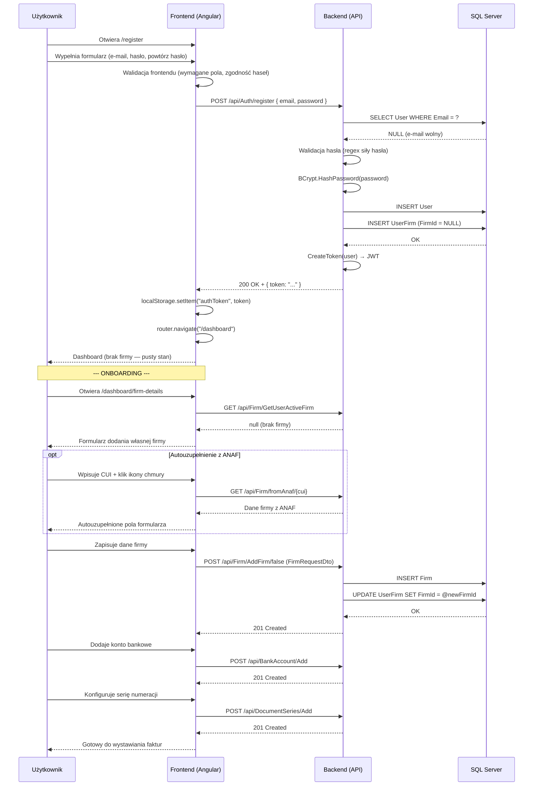

# Proces biznesowy: Rejestracja i logowanie

| Pole | Wartość |
|---|---|
| ID dokumentu | BPMN-AUTH-01 |
| Typ dokumentu | proces biznesowy |
| Wersja | 0.1 |
| Status | szkic |
| Autor (ostatnia modyfikacja) | Agent Claudiusz Sonte 4.6 max |
| Data ostatniej modyfikacji | 2026-05-31 |

## Streszczenie

Proces obejmuje rejestrację nowego użytkownika w systemie InvoiceJet: podanie e-maila i hasła, walidację po stronie backendu, hashowanie BCrypt, zapis do bazy i wydanie tokenu JWT. Po rejestracji następuje automatyczne przekierowanie do dashboardu i inicjalny onboarding — dodanie danych własnej firmy, konta bankowego i serii numeracji, niezbędnych do wystawienia pierwszej faktury.

## Uczestnicy

| Uczestnik | Rola |
|---|---|
| Użytkownik | Inicjator akcji (nowe konto) |
| Frontend (Angular) | Warstwa prezentacji — formularze rejestracji i logowania |
| Backend (API) | Logika biznesowa — walidacja, BCrypt, JWT |
| SQL Server | Trwałe przechowywanie danych użytkowników i firm |

## Diagram procesu (Mermaid sequenceDiagram)

## Kroki procesu

| # | Krok | Uczestnik | Opis |
|---|---|---|---|
| 1 | Otwarcie formularza rejestracji | Użytkownik / Frontend | Użytkownik nawiguje do `/register`. |
| 2 | Wypełnienie formularza | Użytkownik | Podaje e-mail, hasło i potwierdzenie hasła. |
| 3 | Walidacja frontendu | Frontend | Sprawdzenie wymaganych pól i zgodności haseł. |
| 4 | Wysłanie żądania rejestracji | Frontend | POST `/api/Auth/register` z danymi użytkownika. |
| 5 | Sprawdzenie unikalności e-maila | Backend / DB | SELECT — jeśli e-mail zajęty → 400 Bad Request. |
| 6 | Walidacja siły hasła | Backend | Regex; jeśli niezgodne → 400 Bad Request. |
| 7 | Hashowanie hasła | Backend | BCrypt.HashPassword(password, workFactor). |
| 8 | Zapis użytkownika | Backend / DB | INSERT User + INSERT UserFirm (FirmId=NULL). |
| 9 | Wydanie tokenu JWT | Backend | CreateToken(user) → podpisany JWT. |
| 10 | Odbiór tokenu | Frontend | Zapisuje JWT do localStorage, przekierowuje na dashboard. |
| 11 | Onboarding — dodanie firmy | Użytkownik / Frontend / Backend | POST `/api/Firm/AddFirm/false` — własna firma. |
| 12 | Onboarding — konto bankowe | Użytkownik / Frontend / Backend | POST `/api/BankAccount/Add`. |
| 13 | Onboarding — seria numeracji | Użytkownik / Frontend / Backend | POST `/api/DocumentSeries/Add`. |

## Obsługa wyjątków

| Sytuacja | Reakcja systemu |
|---|---|
| E-mail już zajęty | Backend zwraca 400 Bad Request; frontend wyświetla komunikat błędu w formularzu. |
| Hasło niezgodne z polityką | Backend 400; frontend toastr lub inline error. |
| Niezgodność haseł (frontend) | Blokada wysłania formularza; komunikat inline. |
| Błąd DB przy zapisie | Backend 500; ExceptionMiddleware zwraca ogólny komunikat. |
| JWT wygasa w trakcie onboardingu | JwtInterceptor przechwytuje 401 → TokenExpiredDialog → przekierowanie na /login. |

## Powiązane procesy techniczne

| Proces | Link |
|---|---|
| Dodaj firmę (techniczny) | `../../02_procesy/firma/dodaj_firme/proces.md` |
| Zarządzanie firmą (BPMN) | `../firma/zarzadzanie_firma.md` |
| Konfiguracja firmy (BPMN) | `../konfiguracja/konfiguracja_firmy.md` |

## Wątpliwości i braki

- Aplikacja nie wymusza kolejności onboardingu — użytkownik może próbować wystawić fakturę bez konfiguracji i natrafi na puste selektory.
- Brak mechanizmu "kreatora onboardingu" — użytkownik musi samodzielnie znaleźć kolejne ekrany konfiguracyjne.
- Brak e-maila weryfikacyjnego po rejestracji (aktualnie rejestracja jest natychmiastowa).

## Rejestr zmian

| Wersja | Data | Autor | Opis zmiany |
|---|---|---|---|
| 0.1 | 2026-05-31 | Agent Claudiusz Sonte 4.6 max | Pierwsza wersja — na podstawie BPMN-02_Rejestracja_i_OnBoarding.md z nowym ID i rozszerzonym formatem. |
