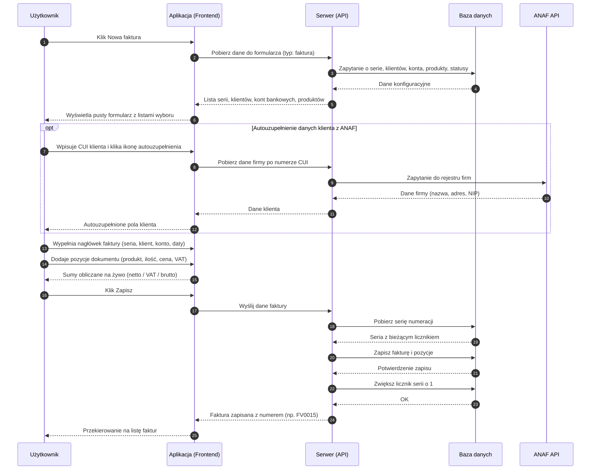

# BP-DOC-01 Wystawienie faktury zwykłej

| Pole | Wartość |
|---|---|
| ID dokumentu | BP-DOC-01 |
| Obszar | Dokumenty |
| Wersja | 0.1 |
| Status | szkic |
| Autor | Agent Claudiusz Sonte 4.6 max |
| Data | 2026-06-01 |

## Cel biznesowy

Umożliwić użytkownikowi wystawienie faktury VAT dla klienta, z automatyczną numeracją, obliczeniami kwot i możliwością wygenerowania PDF.

## Kontekst

Użytkownik trafia na ten proces z listy faktur (ekran `/dashboard/invoices`) klikając „Nowa faktura", lub z dashboardu. Warunkiem jest wcześniejsze skonfigurowanie: danych własnej firmy, co najmniej jednego konta bankowego i co najmniej jednej serii numeracji dla faktur. System automatycznie ładuje listy klientów, serii, kont i produktów do wyboru.

## Aktorzy

| Aktor | Rola |
|---|---|
| Użytkownik | Wypełnia formularz i zatwierdza fakturę |
| Aplikacja (Frontend) | Wyświetla formularz, oblicza kwoty na żywo, wysyła dane |
| Serwer (API) | Generuje numer faktury, zapisuje dokument, aktualizuje licznik serii |
| Baza danych | Trwale przechowuje fakturę i jej pozycje |
| ANAF API (opcjonalnie) | Dostarcza dane klienta na podstawie numeru CUI |

## Warunki wejścia

- Użytkownik zalogowany
- Dane własnej firmy uzupełnione
- Co najmniej jedno konto bankowe skonfigurowane
- Co najmniej jedna seria numeracji dla faktur skonfigurowana

## Przebieg główny

1. **Użytkownik** otwiera listę faktur i klika „Nowa faktura"
2. **Aplikacja** pobiera z serwera dane do formularza: listę klientów, serie numeracji, konta bankowe, produkty, dostępne statusy
3. **Aplikacja** wyświetla pusty formularz z wypełnionymi listami wyboru
4. **Użytkownik** wybiera serię numeracji, klienta, konto bankowe, datę wystawienia i termin płatności
5. **Użytkownik** dodaje pozycje faktury — dla każdej wybiera lub wpisuje: produkt/usługę, jednostkę miary, ilość, cenę netto, stawkę VAT
6. **Aplikacja** oblicza i wyświetla na żywo wartości netto, kwotę VAT i wartość brutto każdej pozycji oraz sumę końcową
7. **Użytkownik** klika „Zapisz"
8. **Serwer** generuje numer faktury według wybranej serii (np. FV/0015) i zapisuje fakturę wraz z pozycjami
9. **Serwer** zwiększa licznik serii o 1
10. **Aplikacja** przekierowuje użytkownika na listę faktur
11. **System** wyświetla listę faktur z nowo wystawioną fakturą

## Reguły biznesowe

| ID | Reguła | Objaśnienie |
|---|---|---|
| RB-01 | Faktura wymaga co najmniej jednej pozycji | Nie można zapisać faktury bez żadnego produktu lub usługi |
| RB-02 | Seria numeracji musi być skonfigurowana | Brak serii = brak możliwości nadania numeru; formularz nie pozwoli zapisać |
| RB-03 | Konto bankowe firmy musi istnieć | Konto drukowane jest na PDF; brak konta blokuje wystawienie |
| RB-04 | Numer faktury generowany jest automatycznie | Użytkownik nie może samodzielnie wpisać numeru dokumentu |
| RB-05 | Termin płatności powinien być po dacie wystawienia | Walidacja po stronie formularza |
| RB-06 | Obliczenia kwot wykonywane są na żywo | Frontend aktualizuje sumy przy każdej zmianie pozycji |
| RB-07 | Klient może być wybrany z listy lub dodany jako nowy | Użytkownik może wpisać dane nowego klienta bezpośrednio w formularzu |

## Wyjątki i scenariusze alternatywne

| ID | Scenariusz | Warunek | Reakcja systemu |
|---|---|---|---|
| WYJ-01 | Brak skonfigurowanej serii numeracji | Użytkownik nie ma serii dla faktur | Lista serii pusta; zapis niemożliwy; komunikat kieruje do ekranu konfiguracji serii |
| WYJ-02 | Brak konta bankowego | Firma użytkownika nie ma przypisanego konta | Zapis zablokowany; komunikat o brakującym koncie bankowym |
| WYJ-03 | ANAF niedostępny | Użytkownik próbuje autouzupełnić dane klienta, ale ANAF nie odpowiada | Komunikat o niedostępności; użytkownik wpisuje dane klienta ręcznie |
| WYJ-04 | CUI nieznany w ANAF | Podany numer CUI nie figuruje w rejestrze ANAF | Komunikat „Firma nie znaleziona"; użytkownik wpisuje dane ręcznie |
| WYJ-05 | Wygaśnięcie sesji w trakcie edycji | Token sesji wygasł podczas wypełniania formularza | Dialog o wygaśnięciu sesji; przekierowanie na logowanie; dane niezapisanego formularza przepadają |
| WYJ-06 | Błąd zapisu | Tymczasowy błąd bazy danych | Ogólny komunikat błędu; faktura nie zapisana; użytkownik może ponowić próbę |

## Wynik procesu

- Faktura zapisana w systemie z unikalnym numerem (np. FV/0015)
- Pozycje faktury zapisane z cenami, ilościami i stawkami VAT
- Licznik serii numeracji zwiększony o 1
- Faktura widoczna na liście faktur
- Możliwy wydruk PDF

## Diagram sekwencji

## Powiązania analityczne

| Typ | Dokument |
|---|---|
| Use Case | [UC-02 Wystawienie faktury](../../07_use_case/UC-02_WystawienieFaktury.md) |
| Use Case | [uc_faktury](../../07_use_case/dokumenty/uc_faktury.md) |
| Proces powiązany | [BP-DOC-02 Wystawienie proformy](./BP-DOC-02_wystawienie_proformy.md) |
| Proces powiązany | [BP-DOC-04 Eksport PDF](./BP-DOC-04_eksport_pdf.md) |
| Proces powiązany | [BP-CFG-02 Konta bankowe](../konfiguracja/BP-CFG-02_konta_bankowe.md) |
| Proces powiązany | [BP-CFG-03 Serie dokumentów](../konfiguracja/BP-CFG-03_serie_dokumentow.md) |
| Proces powiązany | [BP-FIRM-02 Zarządzanie klientami](../firma/BP-FIRM-02_klienci.md) |

## Powiązania techniczne

| Typ | Dokument |
|---|---|
| Proces techniczny | [dodaj_dokument/proces.md](../../02_procesy/dokumenty/dodaj_dokument/proces.md) |
| Proces techniczny | [edytuj_dokument/proces.md](../../02_procesy/dokumenty/edytuj_dokument/proces.md) |
| API | [POST /api/Document/Add](../../04_api_i_integracje/01_api_frontend/document/POST_Document_Add.md) |
| Model DB | [dbo.Document](../../05_model_danych/01_db/dbo/dbo.Document.md) |
| Algorytm | [generowanie_numeru_dokumentu](../../03_algorytmy/dedykowane/generowanie_numeru_dokumentu.md) |
| Algorytm | [obliczanie_wartosci_dokumentu](../../03_algorytmy/wyliczeniowe/obliczanie_wartosci_dokumentu.md) |

## Wątpliwości i braki

- Brak informacji o blokadzie formularza gdy brak serii — użytkownik może dostać pusty selektor bez wyraźnego komunikatu
- Dane niezapisanego formularza przepadają przy wygaśnięciu sesji — brak auto-save
- Brak weryfikacji czy wybrany klient należy do zalogowanego użytkownika (potencjalne IDOR)
- Dwa osobne zapisy na serwerze (dokument + aktualizacja licznika serii) bez transakcji — przy błędzie możliwa niespójność

## Rejestr zmian

| Wersja | Data | Autor | Opis zmiany |
|---|---|---|---|
| 0.1 | 2026-06-01 | Agent Claudiusz Sonte 4.6 max | Pierwsza wersja BP — na podstawie BPMN-DOC-01 i PROC-AddDocument; format analityczny BP-NN; diagram uproszczony |
