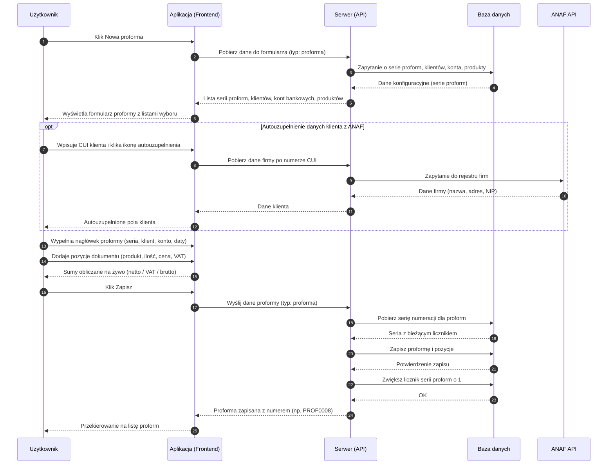

# BP-DOC-02 Wystawienie proformy

| Pole | Wartość |
|---|---|
| ID dokumentu | BP-DOC-02 |
| Obszar | Dokumenty |
| Wersja | 0.1 |
| Status | szkic |
| Autor | Agent Claudiusz Sonte 4.6 max |
| Data | 2026-06-01 |

## Cel biznesowy

Umożliwić użytkownikowi wystawienie faktury proforma — dokumentu wstępnego informującego klienta o planowanej transakcji przed wystawieniem właściwej faktury VAT.

## Kontekst

Użytkownik trafia na ten proces z listy proform (ekran `/dashboard/proforma-invoices`) klikając „Nowa proforma". Formularz proformy jest identyczny z formularzem faktury — różni się wyłącznie etykietą i typem dokumentu. System automatycznie ładuje serie numeracji dla proform (oddzielne od serii faktur).

## Aktorzy

| Aktor | Rola |
|---|---|
| Użytkownik | Wypełnia formularz i zatwierdza proformę |
| Aplikacja (Frontend) | Wyświetla formularz, oblicza kwoty na żywo, wysyła dane |
| Serwer (API) | Generuje numer proformy, zapisuje dokument, aktualizuje licznik serii |
| Baza danych | Trwale przechowuje proformę i jej pozycje |
| ANAF API (opcjonalnie) | Dostarcza dane klienta na podstawie numeru CUI |

## Warunki wejścia

- Użytkownik zalogowany
- Dane własnej firmy uzupełnione
- Co najmniej jedno konto bankowe skonfigurowane
- Co najmniej jedna seria numeracji dla proform skonfigurowana

## Przebieg główny

1. **Użytkownik** otwiera listę proform i klika „Nowa proforma"
2. **Aplikacja** pobiera z serwera dane do formularza: listę klientów, serie numeracji dla proform, konta bankowe, produkty
3. **Aplikacja** wyświetla pusty formularz oznaczony jako „Proforma"
4. **Użytkownik** wybiera serię numeracji dla proform, klienta, konto bankowe, datę wystawienia i termin płatności
5. **Użytkownik** dodaje pozycje dokumentu — dla każdej wybiera lub wpisuje: produkt/usługę, jednostkę miary, ilość, cenę netto, stawkę VAT
6. **Aplikacja** oblicza i wyświetla na żywo wartości netto, kwotę VAT i wartość brutto każdej pozycji oraz sumę końcową
7. **Użytkownik** klika „Zapisz"
8. **Serwer** generuje numer proformy według wybranej serii (np. PROF/0008) i zapisuje dokument wraz z pozycjami
9. **Serwer** zwiększa licznik serii proform o 1
10. **Aplikacja** przekierowuje użytkownika na listę proform
11. **System** wyświetla listę proform z nowo wystawioną proformą

## Reguły biznesowe

| ID | Reguła | Objaśnienie |
|---|---|---|
| RB-01 | Proforma wymaga co najmniej jednej pozycji | Nie można zapisać proformy bez żadnego produktu lub usługi |
| RB-02 | Seria numeracji dla proform musi być skonfigurowana | Seria proform jest odrębna od serii faktur |
| RB-03 | Konto bankowe firmy musi istnieć | Konto drukowane jest na PDF proformy |
| RB-04 | Numer proformy generowany jest automatycznie | Użytkownik nie może samodzielnie wpisać numeru |
| RB-05 | Proforma nie jest dokumentem fiskalnym | Nie rodzi obowiązku podatkowego — służy do informacji handlowej |
| RB-06 | Proforma nie konwertuje się automatycznie na fakturę | Brak dedykowanego mechanizmu konwersji proforma → faktura |

## Wyjątki i scenariusze alternatywne

| ID | Scenariusz | Warunek | Reakcja systemu |
|---|---|---|---|
| WYJ-01 | Brak skonfigurowanej serii proform | Użytkownik nie ma serii dla proform | Lista serii pusta; zapis niemożliwy; komunikat kieruje do ekranu konfiguracji serii |
| WYJ-02 | Brak konta bankowego | Firma użytkownika nie ma przypisanego konta | Zapis zablokowany; komunikat o brakującym koncie bankowym |
| WYJ-03 | ANAF niedostępny | Użytkownik próbuje autouzupełnić dane klienta | Komunikat o niedostępności; użytkownik wpisuje dane klienta ręcznie |
| WYJ-04 | Wygaśnięcie sesji w trakcie edycji | Token sesji wygasł podczas wypełniania formularza | Dialog o wygaśnięciu sesji; przekierowanie na logowanie; dane przepadają |

## Wynik procesu

- Proforma zapisana w systemie z unikalnym numerem (np. PROF/0008)
- Pozycje dokumentu zapisane z cenami, ilościami i stawkami VAT
- Licznik serii proform zwiększony o 1
- Proforma widoczna na liście proform
- Możliwy wydruk PDF z szablonem proformy

## Diagram sekwencji

## Powiązania analityczne

| Typ | Dokument |
|---|---|
| Use Case | [uc_faktury_proforma](../../07_use_case/dokumenty/uc_faktury_proforma.md) |
| Proces powiązany | [BP-DOC-01 Wystawienie faktury](./BP-DOC-01_wystawienie_faktury.md) |
| Proces powiązany | [BP-DOC-04 Eksport PDF](./BP-DOC-04_eksport_pdf.md) |
| Proces powiązany | [BP-CFG-03 Serie dokumentów](../konfiguracja/BP-CFG-03_serie_dokumentow.md) |

## Powiązania techniczne

| Typ | Dokument |
|---|---|
| Proces techniczny | [dodaj_dokument/proces.md](../../02_procesy/dokumenty/dodaj_dokument/proces.md) |
| API | [POST /api/Document/Add](../../04_api_i_integracje/01_api_frontend/document/POST_Document_Add.md) |
| Model DB | [dbo.Document](../../05_model_danych/01_db/dbo/dbo.Document.md) |
| Algorytm | [generowanie_numeru_dokumentu](../../03_algorytmy/dedykowane/generowanie_numeru_dokumentu.md) |

## Wątpliwości i braki

- Brak mechanizmu konwersji proformy na fakturę VAT — użytkownik musi ręcznie stworzyć nową fakturę na podstawie proformy
- Formularz identyczny z fakturą może mylić użytkownika — brak wyraźnego oznaczenia „PROFORMA" w nagłówku formularza
- `GenerateInvoicePdf` (pomocniczy endpoint PDF) ignoruje typ dokumentu i generuje proformę z szablonem faktury zwykłej (znana anomalia techniczna)

## Rejestr zmian

| Wersja | Data | Autor | Opis zmiany |
|---|---|---|---|
| 0.1 | 2026-06-01 | Agent Claudiusz Sonte 4.6 max | Pierwsza wersja BP — na podstawie BPMN-DOC-02; format analityczny BP-NN |
