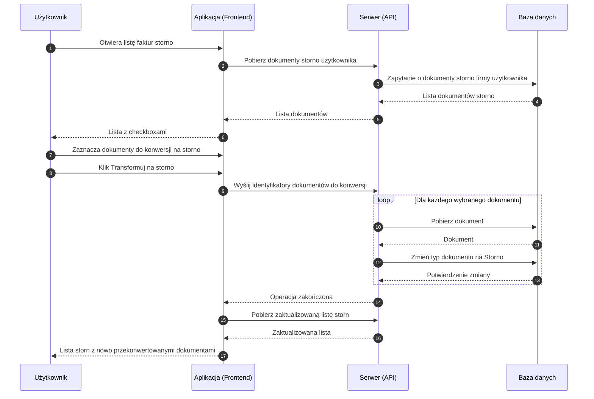

# BP-DOC-03 Wystawienie / konwersja na storno

| Pole | Wartość |
|---|---|
| ID dokumentu | BP-DOC-03 |
| Obszar | Dokumenty |
| Wersja | 0.1 |
| Status | szkic |
| Autor | Agent Claudiusz Sonte 4.6 max |
| Data | 2026-06-01 |

## Cel biznesowy

Umożliwić użytkownikowi anulowanie wystawionych faktur lub proform poprzez ich przekształcenie w faktury storno — dokumenty korygujące, które widoczne są na liście storn i mogą być wydrukowane z odpowiednim szablonem PDF.

## Kontekst

Użytkownik trafia na ten proces z listy faktur storno (`/dashboard/storno-invoices`). Konwersja na storno działa na zasadzie **zmiany typu** istniejącego dokumentu — nie tworzy nowego dokumentu, lecz modyfikuje istniejący. Operację można wykonać masowo na wielu dokumentach jednocześnie. Konwersja jest **nieodwracalna** — brak funkcji cofnięcia.

## Aktorzy

| Aktor | Rola |
|---|---|
| Użytkownik | Wybiera dokumenty do konwersji i inicjuje operację |
| Aplikacja (Frontend) | Wyświetla listę z checkboxami, wysyła identyfikatory wybranych dokumentów |
| Serwer (API) | Zmienia typ każdego dokumentu na „Storno" |
| Baza danych | Trwale zapisuje zmianę typu dokumentów |

## Warunki wejścia

- Użytkownik zalogowany
- Istnieje co najmniej jeden dokument (faktura lub proforma) przeznaczony do anulowania

## Przebieg główny

1. **Użytkownik** otwiera listę faktur storno
2. **Aplikacja** pobiera i wyświetla dokumenty oznaczone jako storno, wraz z checkboxami
3. **Użytkownik** zaznacza dokumenty (faktury lub proformy) przeznaczone do konwersji na storno
4. **Użytkownik** klika „Transformuj na storno"
5. **Aplikacja** wysyła do serwera listę identyfikatorów wybranych dokumentów
6. **Serwer** dla każdego dokumentu zmienia jego typ na „Faktura Storno"
7. **Serwer** potwierdza zakończenie operacji
8. **Aplikacja** odświeża listę storn
9. **System** wyświetla zaktualizowaną listę z nowo przekonwertowanymi dokumentami

## Reguły biznesowe

| ID | Reguła | Objaśnienie |
|---|---|---|
| RB-01 | Konwersja zmienia typ istniejącego dokumentu | Nie powstaje nowy dokument — modyfikowany jest istniejący rekord |
| RB-02 | Numer dokumentu pozostaje bez zmian po konwersji | Faktura FV/0015 pozostaje FV/0015 po zmianie na storno |
| RB-03 | Wartości pozycji pozostają dodatnie w bazie danych | Ujemne wartości (efekt korekty) widoczne są wyłącznie na szablonie PDF storno |
| RB-04 | Konwersja jest nieodwracalna | Brak mechanizmu cofnięcia przekształcenia na storno |
| RB-05 | Operacja może obejmować wiele dokumentów jednocześnie | Użytkownik może zaznaczyć wiele dokumentów i przekształcić je jednym kliknięciem |
| RB-06 | Dokument storno wyświetlany jest na liście storn | Po konwersji dokument znika z listy faktur/proform i pojawia się na liście storn |

## Wyjątki i scenariusze alternatywne

| ID | Scenariusz | Warunek | Reakcja systemu |
|---|---|---|---|
| WYJ-01 | Dokument nie istnieje | Przekazany identyfikator dokumentu nie istnieje w bazie | Dokument pominięty lub ogólny komunikat błędu (zachowanie nieokreślone) |
| WYJ-02 | Błąd w trakcie konwersji wielu dokumentów | Błąd techniczny przy przetwarzaniu jednego z dokumentów | Część dokumentów może zostać przekonwertowana, część nie — brak cofnięcia (anomalia TS-01) |
| WYJ-03 | Wygaśnięcie sesji | Token sesji wygasł podczas operacji | Dialog o wygaśnięciu sesji; przekierowanie na logowanie |

## Wynik procesu

- Wybrane dokumenty zmienione na typ „Faktura Storno"
- Dokumenty niewidoczne na pierwotnych listach (faktur / proform)
- Dokumenty widoczne na liście storn
- Możliwy wydruk PDF z szablonem storno (wartości prezentowane jako korekta)

## Diagram sekwencji

## Powiązania analityczne

| Typ | Dokument |
|---|---|
| Use Case | [UC-04 Konwersja na storno](../../07_use_case/UC-04_KonwersjaNaStorno.md) |
| Use Case | [uc_faktury_storno](../../07_use_case/dokumenty/uc_faktury_storno.md) |
| Proces powiązany | [BP-DOC-01 Wystawienie faktury](./BP-DOC-01_wystawienie_faktury.md) |
| Proces powiązany | [BP-DOC-04 Eksport PDF](./BP-DOC-04_eksport_pdf.md) |

## Powiązania techniczne

| Typ | Dokument |
|---|---|
| Proces techniczny | [transformuj_na_storno/proces.md](../../02_procesy/dokumenty/transformuj_na_storno/proces.md) |
| API | [PUT /api/Document/TransformToStorno](../../04_api_i_integracje/01_api_frontend/document/PUT_Document_TransformToStorno.md) |
| Model DB | [dbo.Document](../../05_model_danych/01_db/dbo/dbo.Document.md) |
| Algorytm | [ALG-08 TransformToStorno](../../03_algorytmy/ALG-08_TransformToStorno.md) |

## Wątpliwości i braki

- Konwersja jest nieodwracalna — brak endpointu „cofnij storno"
- Numer dokumentu nie zmienia się po konwersji (FV/0015 zamiast STORNO/0001) — może wprowadzać zamieszanie
- Brak atomowości przy konwersji wielu dokumentów — przy błędzie w trakcie przetwarzania lista część jest przekonwertowana, część nie
- Brak weryfikacji czy dokumenty należą do zalogowanego użytkownika

## Rejestr zmian

| Wersja | Data | Autor | Opis zmiany |
|---|---|---|---|
| 0.1 | 2026-06-01 | Agent Claudiusz Sonte 4.6 max | Pierwsza wersja BP — na podstawie BPMN-DOC-03 i PROC-TransformToStorno; format analityczny BP-NN |
