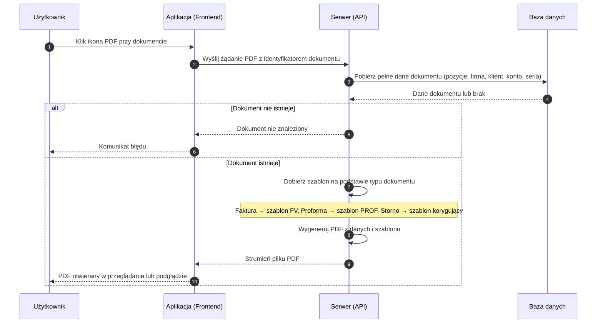

# BP-DOC-04 Generowanie i podgląd PDF

| Pole | Wartość |
|---|---|
| ID dokumentu | BP-DOC-04 |
| Obszar | Dokumenty |
| Wersja | 0.1 |
| Status | szkic |
| Autor | Agent Claudiusz Sonte 4.6 max |
| Data | 2026-06-01 |

## Cel biznesowy

Umożliwić użytkownikowi wygenerowanie pliku PDF dokumentu handlowego (faktura, proforma lub storno) w formacie gotowym do wydruku lub wysłania klientowi.

## Kontekst

Użytkownik inicjuje generowanie PDF z listy faktur, proform lub storn — klikając ikonę PDF przy wybranym dokumencie, lub z podglądu dokumentu. System generuje PDF na żądanie (bez cache) przy użyciu biblioteki QuestPDF, dobierając szablon odpowiedni do typu dokumentu. PDF otwiera się w przeglądarce lub w modalnym podglądzie aplikacji.

## Aktorzy

| Aktor | Rola |
|---|---|
| Użytkownik | Inicjuje generowanie, pobiera lub drukuje PDF |
| Aplikacja (Frontend) | Wysyła żądanie, odbiera strumień PDF, wyświetla w przeglądarce |
| Serwer (API) | Pobiera dane dokumentu z bazy, dobiera szablon, generuje PDF |
| Baza danych | Dostarcza kompletne dane dokumentu (pozycje, dane firmy, klienta, konta bankowego) |

## Warunki wejścia

- Użytkownik zalogowany
- Dokument istnieje w systemie

## Przebieg główny

1. **Użytkownik** klika ikonę PDF przy wybranym dokumencie (na liście faktur, proform lub storn)
2. **Aplikacja** wysyła żądanie wygenerowania PDF z identyfikatorem dokumentu
3. **Serwer** pobiera z bazy kompletne dane dokumentu: pozycje, dane firmy wystawiającego, dane klienta, dane konta bankowego, serię numeracji
4. **Serwer** dobiera szablon PDF odpowiedni do typu dokumentu:
   - Faktura → szablon faktury VAT
   - Proforma → szablon proformy
   - Storno → szablon faktury korygującej
5. **Serwer** generuje plik PDF na podstawie danych i wybranego szablonu
6. **Serwer** zwraca plik PDF jako strumień do przeglądarki
7. **Aplikacja** otwiera PDF w przeglądarce lub w modalnym podglądzie
8. **Użytkownik** może pobrać plik lub wydrukować dokument

## Reguły biznesowe

| ID | Reguła | Objaśnienie |
|---|---|---|
| RB-01 | Szablon PDF dobierany jest automatycznie na podstawie typu dokumentu | Faktura, proforma i storno mają odrębne szablony wizualne |
| RB-02 | PDF generowany jest za każdym razem na żądanie | Brak pamięci podręcznej — każde kliknięcie generuje nowy plik |
| RB-03 | Faktura storno prezentuje wartości jako korektę (ujemne) | Wartości pozycji są ujemne wyłącznie na szablonie; w bazie danych pozostają dodatnie |
| RB-04 | PDF zawiera pełne dane firmy wystawiającego i klienta | Dane pobierane z bazy w momencie generowania |
| RB-05 | PDF zawiera numer konta bankowego do przelewu | Konto bankowe przypisane do dokumentu |

## Wyjątki i scenariusze alternatywne

| ID | Scenariusz | Warunek | Reakcja systemu |
|---|---|---|---|
| WYJ-01 | Dokument nie istnieje | Identyfikator dokumentu nie istnieje w bazie | Komunikat błędu (dokument nie znaleziony) |
| WYJ-02 | Błąd generowania PDF | Błąd w bibliotece generującej PDF | Ogólny komunikat błędu; użytkownik proszony o ponowienie próby |
| WYJ-03 | Wygaśnięcie sesji | Token sesji wygasł podczas oczekiwania na PDF | Dialog o wygaśnięciu sesji; przekierowanie na logowanie |

## Wynik procesu

- Plik PDF wygenerowany i dostarczony do przeglądarki użytkownika
- PDF zawiera: dane firmy, dane klienta, pozycje dokumentu z kwotami, numer konta bankowego, numer i datę dokumentu

## Diagram sekwencji

## Powiązania analityczne

| Typ | Dokument |
|---|---|
| Use Case | [uc_faktury](../../07_use_case/dokumenty/uc_faktury.md) |
| Proces powiązany | [BP-DOC-01 Wystawienie faktury](./BP-DOC-01_wystawienie_faktury.md) |
| Proces powiązany | [BP-DOC-02 Wystawienie proformy](./BP-DOC-02_wystawienie_proformy.md) |
| Proces powiązany | [BP-DOC-03 Wystawienie storno](./BP-DOC-03_wystawienie_storno.md) |

## Powiązania techniczne

| Typ | Dokument |
|---|---|
| Proces techniczny | [generuj_pdf/proces.md](../../02_procesy/dokumenty/generuj_pdf/proces.md) |
| API | [POST /api/Document/GetPdfStream](../../04_api_i_integracje/01_api_frontend/document/POST_Document_GetPdfStream.md) |
| API | [POST /api/Document/GenerateInvoicePdf](../../04_api_i_integracje/01_api_frontend/document/POST_Document_GeneratePdf.md) |
| Model DB | [dbo.Document](../../05_model_danych/01_db/dbo/dbo.Document.md) |
| Algorytm | [generuj_pdf_stream](../../03_algorytmy/generowania_pdf/generuj_pdf_stream.md) |

## Wątpliwości i braki

- Dwa endpointy PDF o różnym zachowaniu: `GetPdfStream` (główny — dobiera szablon poprawnie) i `GenerateInvoicePdf` (pomocniczy — zawsze generuje szablon faktury niezależnie od typu dokumentu); proforma i storno wydrukowane przez pomocniczy endpoint wyglądają jak zwykła faktura
- Brak pamięci podręcznej PDF — każde kliknięcie generuje plik od nowa; przy dużych dokumentach może być zauważalne opóźnienie
- Brak przycisku „Pobierz plik PDF" — tylko podgląd w przeglądarce przez `GetPdfStream`

## Rejestr zmian

| Wersja | Data | Autor | Opis zmiany |
|---|---|---|---|
| 0.1 | 2026-06-01 | Agent Claudiusz Sonte 4.6 max | Pierwsza wersja BP — na podstawie BPMN-DOC-04 i PROC-GeneratePdf; format analityczny BP-NN |
