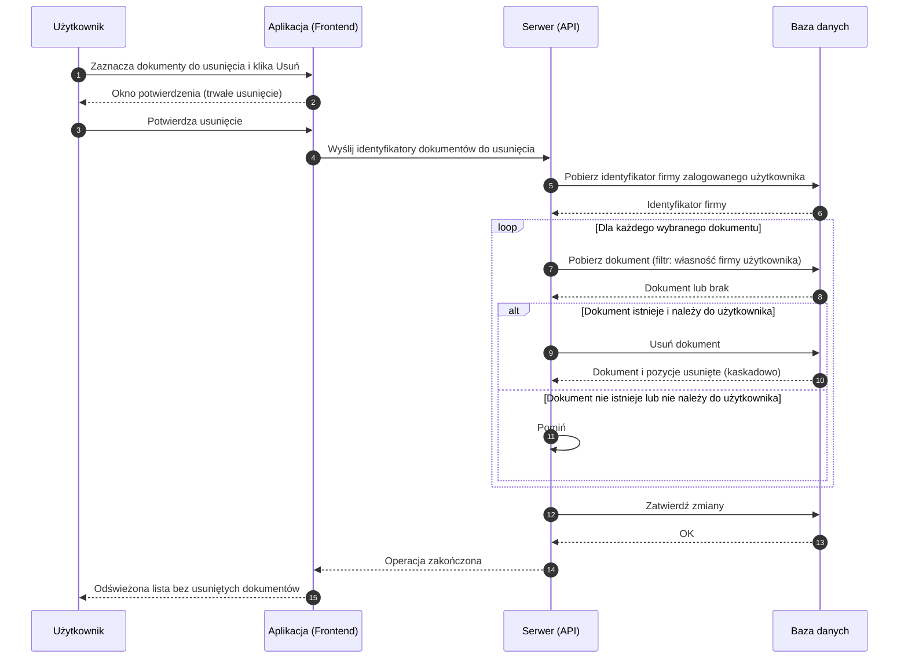

# BP-DOC-05 Usuwanie dokumentów

| Pole | Wartość |
|---|---|
| ID dokumentu | BP-DOC-05 |
| Obszar | Dokumenty |
| Wersja | 0.1 |
| Status | szkic |
| Autor | Agent Claudiusz Sonte 4.6 max |
| Data | 2026-06-01 |

## Cel biznesowy

Umożliwić użytkownikowi trwałe usunięcie błędnie wystawionych lub nieaktualnych dokumentów z systemu, z możliwością usunięcia wielu dokumentów jednocześnie.

## Kontekst

Użytkownik inicjuje usunięcie z listy faktur, proform lub storn — zaznaczając jeden lub więcej dokumentów i klikając „Usuń". Operacja jest **nieodwracalna** — dokumenty i ich pozycje usuwane są trwale z bazy danych. System wymaga potwierdzenia przed wykonaniem operacji.

## Aktorzy

| Aktor | Rola |
|---|---|
| Użytkownik | Wybiera dokumenty do usunięcia i potwierdza operację |
| Aplikacja (Frontend) | Wyświetla żądanie potwierdzenia, wysyła identyfikatory dokumentów do serwera |
| Serwer (API) | Weryfikuje przynależność dokumentów do użytkownika, usuwa dokumenty |
| Baza danych | Trwale usuwa dokumenty i ich pozycje |

## Warunki wejścia

- Użytkownik zalogowany
- Co najmniej jeden dokument zaznaczony na liście

## Przebieg główny

1. **Użytkownik** otwiera listę faktur (lub proform / storn) i zaznacza checkboxami dokumenty do usunięcia
2. **Użytkownik** klika „Usuń"
3. **Aplikacja** wyświetla okno potwierdzenia z pytaniem o zgodę na trwałe usunięcie
4. **Użytkownik** potwierdza usunięcie
5. **Aplikacja** wysyła do serwera listę identyfikatorów wybranych dokumentów
6. **Serwer** weryfikuje, że każdy dokument należy do firmy zalogowanego użytkownika
7. **Serwer** usuwa każdy dokument wraz z jego pozycjami
8. **Serwer** potwierdza zakończenie operacji
9. **Aplikacja** odświeża listę dokumentów
10. **System** wyświetla zaktualizowaną listę bez usuniętych dokumentów

## Reguły biznesowe

| ID | Reguła | Objaśnienie |
|---|---|---|
| RB-01 | Usunięcie jest trwałe i nieodwracalne | Brak kosza lub archiwum — dokument znika bezpowrotnie |
| RB-02 | Wraz z dokumentem usuwane są wszystkie jego pozycje | Pozycje faktury usuwane automatycznie jako powiązane z dokumentem |
| RB-03 | Użytkownik może usunąć jednocześnie wiele dokumentów | Operacja wsadowa — zaznaczenie wielu i jedno kliknięcie |
| RB-04 | Usunięcie dotyczy wyłącznie dokumentów własnej firmy | System weryfikuje przynależność przed usunięciem |
| RB-05 | Wymagane potwierdzenie przed usunięciem | Aplikacja wyświetla dialog potwierdzenia |

## Wyjątki i scenariusze alternatywne

| ID | Scenariusz | Warunek | Reakcja systemu |
|---|---|---|---|
| WYJ-01 | Użytkownik anuluje operację | Kliknięcie „Anuluj" w oknie potwierdzenia | Operacja przerwana; dokumenty niezmienione |
| WYJ-02 | Dokument nie istnieje lub nie należy do użytkownika | Identyfikator dokumentu nie pasuje do firmy użytkownika | Dokument pominięty lub ogólny komunikat błędu |
| WYJ-03 | Błąd w trakcie usuwania wielu dokumentów | Błąd techniczny przy przetwarzaniu jednego z dokumentów | Część dokumentów może zostać usunięta, część nie (anomalia) |
| WYJ-04 | Wygaśnięcie sesji | Token sesji wygasł podczas operacji | Dialog o wygaśnięciu sesji; przekierowanie na logowanie |

## Wynik procesu

- Wybrane dokumenty i ich pozycje trwale usunięte z systemu
- Lista dokumentów odświeżona — usunięte dokumenty niewidoczne
- Liczniki serii numeracji **nie są** cofane po usunięciu dokumentu

## Diagram sekwencji

## Powiązania analityczne

| Typ | Dokument |
|---|---|
| Use Case | [uc_faktury](../../07_use_case/dokumenty/uc_faktury.md) |
| Proces powiązany | [BP-DOC-01 Wystawienie faktury](./BP-DOC-01_wystawienie_faktury.md) |
| Proces powiązany | [BP-DOC-02 Wystawienie proformy](./BP-DOC-02_wystawienie_proformy.md) |
| Proces powiązany | [BP-DOC-03 Wystawienie storno](./BP-DOC-03_wystawienie_storno.md) |

## Powiązania techniczne

| Typ | Dokument |
|---|---|
| Proces techniczny | [usun_dokumenty/proces.md](../../02_procesy/dokumenty/usun_dokumenty/proces.md) |
| API | [PUT /api/Document/Delete](../../04_api_i_integracje/01_api_frontend/document/PUT_Document_Delete.md) |
| Model DB | [dbo.Document](../../05_model_danych/01_db/dbo/dbo.Document.md) |

## Wątpliwości i braki

- Brak soft-delete (kosza) — dokumenty usuwane natychmiast bez możliwości odzyskania
- Brak cofnięcia operacji po usunięciu
- Brak walidacji integralności biznesowej — można usunąć dokument który był już wysłany do klienta
- Przy błędzie technicznym w trakcie usuwania wielu dokumentów część może zostać usunięta a część nie

## Rejestr zmian

| Wersja | Data | Autor | Opis zmiany |
|---|---|---|---|
| 0.1 | 2026-06-01 | Agent Claudiusz Sonte 4.6 max | Pierwsza wersja BP — na podstawie PROC-DeleteDocuments; format analityczny BP-NN |
