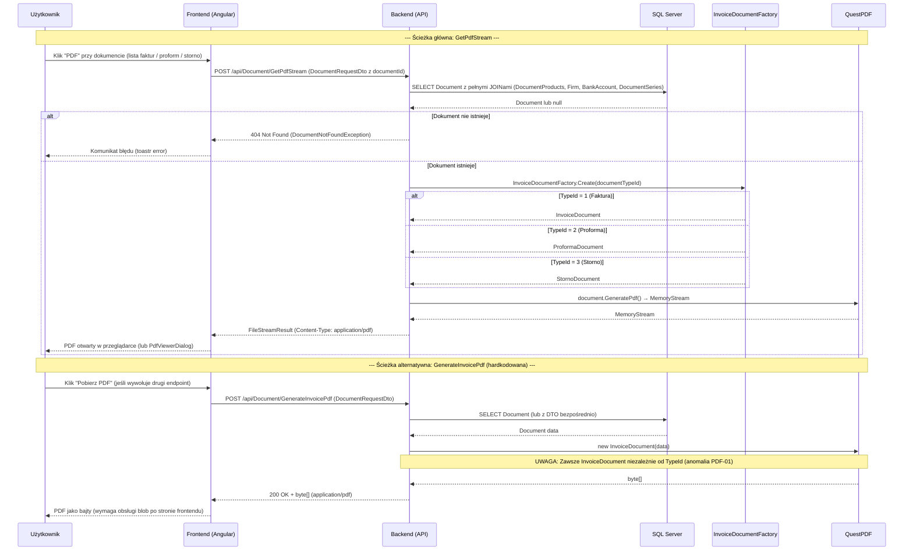

# Proces biznesowy: Eksport PDF

| Pole | Wartość |
|---|---|
| ID dokumentu | BPMN-DOC-04 |
| Typ dokumentu | proces biznesowy |
| Wersja | 0.1 |
| Status | szkic |
| Autor (ostatnia modyfikacja) | Agent Claudiusz Sonte 4.6 max |
| Data ostatniej modyfikacji | 2026-05-31 |

## Streszczenie

Proces generowania i pobierania pliku PDF dokumentu handlowego (faktura, proforma, storno). System udostępnia dwa endpointy o różnym zachowaniu: `GetPdfStream` (główny — strumieniuje PDF do przeglądarki przez fabrykę szablonów) oraz `GenerateInvoicePdf` (pomocniczy — zwraca bajty PDF, hardkoduje szablon faktury niezależnie od typu dokumentu). Biblioteka QuestPDF 2024.3.10 Community generuje plik na żądanie — bez cache.

## Uczestnicy

| Uczestnik | Rola |
|---|---|
| Użytkownik | Inicjator akcji (klika PDF przy dokumencie) |
| Frontend (Angular) | Warstwa prezentacji — wywołanie endpointu, wyświetlenie PDF |
| Backend (API) | Logika biznesowa — pobranie dokumentu, wybór szablonu, generowanie PDF |
| SQL Server | Źródło danych dokumentu (Document + JOINy) |

## Diagram procesu (Mermaid sequenceDiagram)

## Kroki procesu

| # | Krok | Uczestnik | Opis |
|---|---|---|---|
| 1 | Inicjacja | Użytkownik | Klik "PDF" przy dokumencie na liście faktur, proform lub storno. |
| 2 | Wysłanie żądania (GetPdfStream) | Frontend | POST `/api/Document/GetPdfStream` z DocumentRequestDto (documentId). |
| 3 | Pobranie dokumentu z DB | Backend | `DocumentRepository.GetByIdWithDetailsAsync(id)` — pełne JOINy. |
| 4 | Weryfikacja istnienia | Backend | Jeśli null → DocumentNotFoundException → HTTP 404. |
| 5 | Wybór szablonu PDF | Backend / Factory | `InvoiceDocumentFactory.Create(typeId)` → InvoiceDocument / ProformaDocument / StornoDocument. |
| 6 | Generowanie PDF | Backend / QuestPDF | `document.GeneratePdf()` → MemoryStream. |
| 7 | Odpowiedź | Backend | FileStreamResult z Content-Type: application/pdf. |
| 8 | Wyświetlenie PDF | Frontend | PDF otwiera się w przeglądarce lub w PdfViewerDialog (modal). |

## Obsługa wyjątków

| Sytuacja | Reakcja systemu |
|---|---|
| Dokument nie istnieje (GetPdfStream) | Backend 404 DocumentNotFoundException; frontend toastr error. |
| Błąd generowania QuestPDF | Backend 500 Internal Server Error; ExceptionMiddleware. |
| Brak autoryzacji (wygasły JWT) | JwtInterceptor 401 → TokenExpiredDialog → /login. |
| GenerateInvoicePdf dla proformy/storno | PDF wygenerowany z szablonem faktury zwykłej (anomalia PDF-01 — znana luka). |

## Powiązane procesy techniczne

| Proces | Link |
|---|---|
| Generuj PDF (techniczny) | `../../02_procesy/dokumenty/generuj_pdf/proces.md` |
| Wystawienie faktury (BPMN) | `wystawienie_faktury.md` |
| Wystawienie proformy (BPMN) | `wystawienie_proformy.md` |
| Wystawienie storno (BPMN) | `wystawienie_storno.md` |

## Wątpliwości i braki

- **KRYTYCZNE (PDF-01):** `GenerateInvoicePdf` hardkoduje `new InvoiceDocument()` — proforma i storno generują PDF z szablonem faktury zwykłej. Poprawna implementacja: użyć fabryki tak jak w `GetPdfStream`.
- **PDF-02:** Dwa endpointy o różnym zachowaniu — niejasne dla konsumentów API który używać i kiedy.
- **PDF-03:** Brak cache PDF — każde kliknięcie generuje PDF od nowa (wydajność przy dużych dokumentach).
- Brak możliwości pobrania pliku PDF na dysk bezpośrednio przez przycisk "Pobierz" (tylko podgląd w przeglądarce przez GetPdfStream).

## Rejestr zmian

| Wersja | Data | Autor | Opis zmiany |
|---|---|---|---|
| 0.1 | 2026-05-31 | Agent Claudiusz Sonte 4.6 max | Pierwsza wersja — na podstawie PROC-GeneratePdf z nowym ID i formatem biznesowym. |
