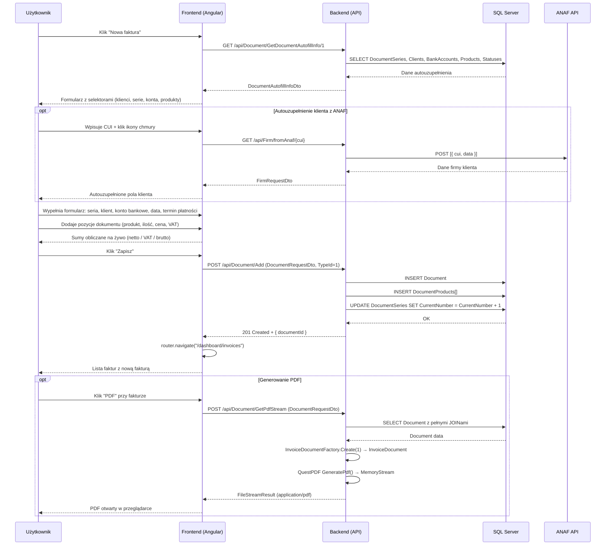

# Proces biznesowy: Wystawienie faktury

| Pole | Wartość |
|---|---|
| ID dokumentu | BPMN-DOC-01 |
| Typ dokumentu | proces biznesowy |
| Wersja | 0.1 |
| Status | szkic |
| Autor (ostatnia modyfikacja) | Agent Claudiusz Sonte 4.6 max |
| Data ostatniej modyfikacji | 2026-05-31 |

## Streszczenie

Proces wystawienia faktury (DocumentTypeId = 1) obejmuje pobranie danych autouzupełnienia, opcjonalne autouzupełnienie klienta z ANAF API, wypełnienie formularza z pozycjami dokumentu, zapis do bazy z aktualizacją serii numeracji oraz opcjonalne generowanie PDF. Frontend oblicza sumy (netto / VAT / brutto) na żywo podczas edycji.

## Uczestnicy

| Uczestnik | Rola |
|---|---|
| Użytkownik | Inicjator akcji (wystawia fakturę) |
| Frontend (Angular) | Warstwa prezentacji — formularz faktury, obliczenia na żywo |
| Backend (API) | Logika biznesowa — zapis dokumentu, aktualizacja serii |
| SQL Server | Trwałe przechowywanie danych dokumentów |
| ANAF API | Autouzupełnienie danych klienta po CUI (opcjonalne) |

## Diagram procesu (Mermaid sequenceDiagram)

## Kroki procesu

| # | Krok | Uczestnik | Opis |
|---|---|---|---|
| 1 | Inicjacja | Użytkownik | Klik "Nowa faktura" na liście faktur lub dashboardzie. |
| 2 | Pobranie danych autouzupełnienia | Frontend / Backend | GET `/api/Document/GetDocumentAutofillInfo/1` — serie, klienci, konta, produkty, statusy. |
| 3 | Wyświetlenie formularza | Frontend | Formularz z selektorami zasilonymi danymi autouzupełnienia. |
| 4 | Autouzupełnienie klienta (opcja) | Użytkownik / Frontend / Backend / ANAF | Wpisanie CUI → GET fromAnaf → autouzupełnienie pól klienta. |
| 5 | Wypełnienie nagłówka | Użytkownik | Seria numeracji, klient, konto bankowe, data wystawienia, termin płatności. |
| 6 | Dodanie pozycji | Użytkownik | Produkt z katalogu lub ręcznie — ilość, cena, stawka VAT. |
| 7 | Obliczenia na żywo | Frontend | Sumy netto / VAT / brutto aktualizowane w czasie rzeczywistym. |
| 8 | Zapis dokumentu | Frontend / Backend / DB | POST `/api/Document/Add` → INSERT Document + Products + UPDATE Series. |
| 9 | Przekierowanie | Frontend | router.navigate na listę faktur; nowa faktura widoczna. |
| 10 | Generowanie PDF (opcja) | Użytkownik / Frontend / Backend | POST GetPdfStream → QuestPDF → FileStreamResult. |

## Obsługa wyjątków

| Sytuacja | Reakcja systemu |
|---|---|
| Brak wymaganego pola (walidacja frontend) | Blokada wysłania; komunikat inline w formularzu. |
| DocumentSeries nie istnieje | Backend 404; frontend toastr error. |
| ANAF niedostępny | Backend zwraca błąd; frontend toastr; użytkownik wpisuje dane ręcznie. |
| JWT wygasa w trakcie edycji | JwtInterceptor 401 → TokenExpiredDialog → /login; dane niezapisanego formularza przepadają. |
| Błąd zapisu do DB | Backend 500; ExceptionMiddleware zwraca ogólny komunikat. |
| Dokument nie istnieje przy GET PDF | Backend 404 DocumentNotFoundException. |

## Powiązane procesy techniczne

| Proces | Link |
|---|---|
| Eksport PDF (BPMN) | `eksport_pdf.md` |
| Wystawienie proformy (BPMN) | `wystawienie_proformy.md` |
| Wystawienie storno (BPMN) | `wystawienie_storno.md` |
| Generuj PDF (techniczny) | `../../02_procesy/dokumenty/generuj_pdf/proces.md` |

## Wątpliwości i braki

- Brak blokady wystawienia faktury gdy brak aktywnej serii numeracji — użytkownik widzi pusty selektor.
- Brak walidacji czy wybrany klient należy do zalogowanego użytkownika (potencjalne IDOR).
- Dane niezapisanego formularza przepadają przy wygaśnięciu sesji — brak auto-save.

## Rejestr zmian

| Wersja | Data | Autor | Opis zmiany |
|---|---|---|---|
| 0.1 | 2026-05-31 | Agent Claudiusz Sonte 4.6 max | Pierwsza wersja — na podstawie BPMN-01_WystawienieFaktury.md z nowym ID i rozszerzonym formatem. |
