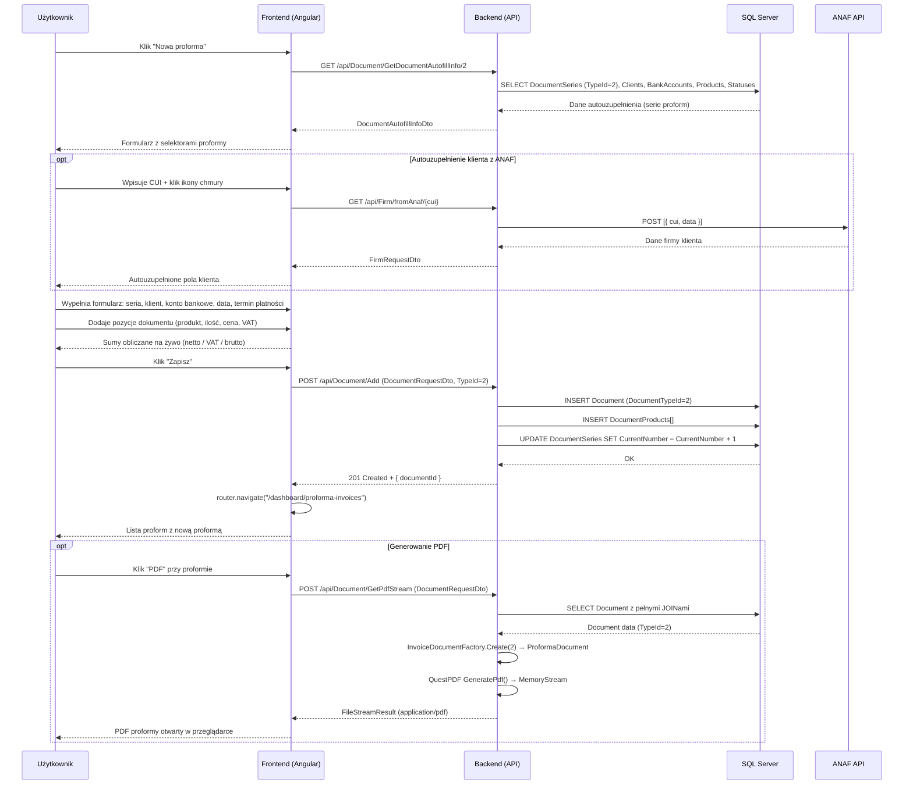

# Proces biznesowy: Wystawienie proformy

| Pole | Wartość |
|---|---|
| ID dokumentu | BPMN-DOC-02 |
| Typ dokumentu | proces biznesowy |
| Wersja | 0.1 |
| Status | szkic |
| Autor (ostatnia modyfikacja) | Agent Claudiusz Sonte 4.6 max |
| Data ostatniej modyfikacji | 2026-05-31 |

## Streszczenie

Proces wystawienia proformy (DocumentTypeId = 2) jest identyczny jak wystawienie faktury — różnica polega wyłącznie na przekazaniu `TypeId=2` w żądaniu autouzupełnienia i zapisie dokumentu. Backend dobiera inną serię numeracji (DocumentSeries powiązaną z typem 2) oraz QuestPDF używa szablonu `ProformaDocument` zamiast `InvoiceDocument`. Frontend wyświetla ten sam formularz z etykietą "Proforma".

## Uczestnicy

| Uczestnik | Rola |
|---|---|
| Użytkownik | Inicjator akcji (wystawia proformę) |
| Frontend (Angular) | Warstwa prezentacji — formularz proformy, obliczenia na żywo |
| Backend (API) | Logika biznesowa — zapis dokumentu z TypeId=2, aktualizacja serii |
| SQL Server | Trwałe przechowywanie danych dokumentów |
| ANAF API | Autouzupełnienie danych klienta po CUI (opcjonalne) |

## Diagram procesu (Mermaid sequenceDiagram)

## Kroki procesu

| # | Krok | Uczestnik | Opis |
|---|---|---|---|
| 1 | Inicjacja | Użytkownik | Klik "Nowa proforma" na liście proform. |
| 2 | Pobranie danych autouzupełnienia | Frontend / Backend | GET `/api/Document/GetDocumentAutofillInfo/2` — serie proform, klienci, konta, produkty. |
| 3 | Wyświetlenie formularza | Frontend | Formularz identyczny z fakturą — etykieta "Proforma". |
| 4 | Autouzupełnienie klienta (opcja) | Użytkownik / Frontend / Backend / ANAF | Wpisanie CUI → GET fromAnaf → autouzupełnienie pól klienta. |
| 5 | Wypełnienie nagłówka | Użytkownik | Seria numeracji proform, klient, konto bankowe, daty. |
| 6 | Dodanie pozycji | Użytkownik | Produkty z katalogu lub ręcznie — ilość, cena, VAT. |
| 7 | Obliczenia na żywo | Frontend | Sumy netto / VAT / brutto aktualizowane w czasie rzeczywistym. |
| 8 | Zapis dokumentu | Frontend / Backend / DB | POST `/api/Document/Add` z TypeId=2 → INSERT Document + Products + UPDATE Series. |
| 9 | Przekierowanie | Frontend | router.navigate na listę proform; nowa proforma widoczna. |
| 10 | Generowanie PDF (opcja) | Użytkownik / Frontend / Backend | POST GetPdfStream → Factory.Create(2) → ProformaDocument → QuestPDF. |

## Obsługa wyjątków

| Sytuacja | Reakcja systemu |
|---|---|
| Brak wymaganego pola (walidacja frontend) | Blokada wysłania; komunikat inline w formularzu. |
| Brak serii numeracji dla proform | Backend 404; frontend toastr error; użytkownik musi skonfigurować serię. |
| ANAF niedostępny | Backend zwraca błąd; frontend toastr; użytkownik wpisuje dane ręcznie. |
| JWT wygasa w trakcie edycji | JwtInterceptor 401 → TokenExpiredDialog → /login; dane przepadają. |
| Błąd QuestPDF przy GetPdfStream | Backend 500; ExceptionMiddleware zwraca ogólny komunikat. |

## Powiązane procesy techniczne

| Proces | Link |
|---|---|
| Wystawienie faktury (BPMN) | `wystawienie_faktury.md` |
| Eksport PDF (BPMN) | `eksport_pdf.md` |
| Generuj PDF (techniczny) | `../../02_procesy/dokumenty/generuj_pdf/proces.md` |

## Wątpliwości i braki

- `GenerateInvoicePdf` (drugi endpoint PDF) ignoruje TypeId i zawsze generuje szablon faktury zwykłej — proforma generuje się z błędnym szablonem jeśli wywołany przez ten endpoint (anomalia PDF-01).
- Brak konwersji proformy na fakturę (odwrotny kierunek do storno) — nie ma dedykowanego endpointu.
- Identyczny formularz jak faktura może mylić użytkownika — brak wyraźnego oznaczenia "Proforma" w nagłówku formularza.

## Rejestr zmian

| Wersja | Data | Autor | Opis zmiany |
|---|---|---|---|
| 0.1 | 2026-05-31 | Agent Claudiusz Sonte 4.6 max | Pierwsza wersja — wzorowana na BPMN-DOC-01, dostosowana do TypeId=2. |
