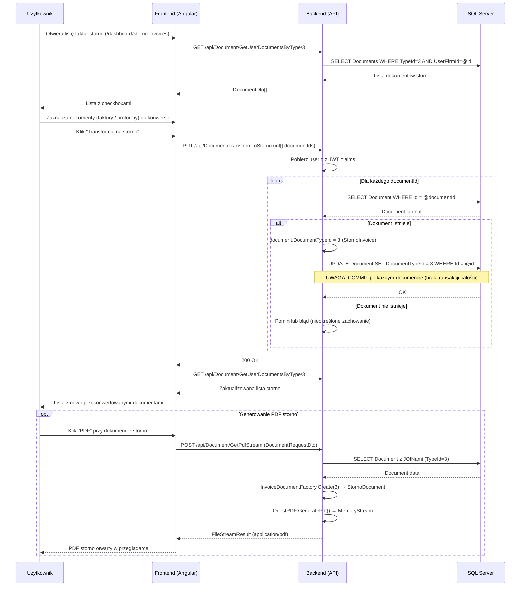

# Proces biznesowy: Wystawienie storno

| Pole | Wartość |
|---|---|
| ID dokumentu | BPMN-DOC-03 |
| Typ dokumentu | proces biznesowy |
| Wersja | 0.1 |
| Status | szkic |
| Autor (ostatnia modyfikacja) | Agent Claudiusz Sonte 4.6 max |
| Data ostatniej modyfikacji | 2026-05-31 |

## Streszczenie

Proces konwersji istniejących dokumentów (faktur lub proform) na faktury storno (DocumentTypeId = 3). Użytkownik zaznacza dokumenty na liście faktur storno i klika "Transformuj na storno". Backend zmienia `DocumentTypeId` na `3` dla każdego dokumentu z listy. KRYTYCZNA ANOMALIA: zapis (`CompleteAsync`) następuje wewnątrz pętli — brak transakcji obejmującej całą operację, możliwa częściowa konwersja przy błędzie.

## Uczestnicy

| Uczestnik | Rola |
|---|---|
| Użytkownik | Inicjator akcji (wybiera dokumenty do konwersji) |
| Frontend (Angular) | Warstwa prezentacji — lista faktur storno z checkboxami |
| Backend (API) | Logika biznesowa — zmiana TypeId w pętli, brak transakcji |
| SQL Server | Trwałe przechowywanie danych dokumentów |

## Diagram procesu (Mermaid sequenceDiagram)

## Kroki procesu

| # | Krok | Uczestnik | Opis |
|---|---|---|---|
| 1 | Otwarcie listy storno | Użytkownik / Frontend | Nawigacja do `/dashboard/storno-invoices`; GET GetUserDocumentsByType/3. |
| 2 | Zaznaczenie dokumentów | Użytkownik | Checkboxy przy dokumentach przeznaczonych do konwersji. |
| 3 | Inicjacja konwersji | Użytkownik | Klik "Transformuj na storno". |
| 4 | Wysłanie żądania | Frontend | PUT `/api/Document/TransformToStorno` z tablicą int[]. |
| 5 | Ekstrakcja userId | Backend | Pobierz userId z claims JWT. |
| 6 | Pętla konwersji | Backend | Dla każdego ID: SELECT → zmień TypeId=3 → UPDATE → COMMIT (osobno per dokument). |
| 7 | Odpowiedź | Backend / Frontend | HTTP 200; frontend odświeża listę storno. |
| 8 | Generowanie PDF (opcja) | Użytkownik / Frontend / Backend | POST GetPdfStream → Factory.Create(3) → StornoDocument → QuestPDF. |

## Obsługa wyjątków

| Sytuacja | Reakcja systemu |
|---|---|
| Dokument nie istnieje w DB | Pominięcie lub błąd (zachowanie nieokreślone w dokumentacji). |
| Błąd w trakcie pętli (anomalia TS-01) | Część dokumentów przekonwertowana, część nie — brak rollback. |
| Nieprawidłowy format `int[]` (anomalia TS-04) | Potencjalny HTTP 400 Bad Request (brak `[FromBody]`). |
| Brak autoryzacji | JwtInterceptor 401 → TokenExpiredDialog → /login. |
| Błąd DB | Backend 500; ExceptionMiddleware. |

## Powiązane procesy techniczne

| Proces | Link |
|---|---|
| Transformuj na storno (techniczny) | `../../02_procesy/dokumenty/transformuj_na_storno/proces.md` |
| Eksport PDF (BPMN) | `eksport_pdf.md` |
| Wystawienie faktury (BPMN) | `wystawienie_faktury.md` |

## Wątpliwości i braki

- **KRYTYCZNE (TS-01):** Brak transakcji obejmującej całą pętlę — możliwa częściowa konwersja bez możliwości cofnięcia.
- **TS-02:** Brak weryfikacji właściciela dokumentu — `GetByIdAsync` może nie filtrować po `UserFirmId`.
- **TS-03:** Numer dokumentu nie zmienia się po konwersji (`FV0001` pozostaje zamiast `STORNO0001`).
- **TS-04:** Parametr `int[]` bez jawnego `[FromBody]` — potencjalny problem z deserializacją.
- Konwersja jest nieodwracalna — brak endpointu "cofnij storno".

## Rejestr zmian

| Wersja | Data | Autor | Opis zmiany |
|---|---|---|---|
| 0.1 | 2026-05-31 | Agent Claudiusz Sonte 4.6 max | Pierwsza wersja — na podstawie PROC-TransformToStorno z nowym ID i formatem biznesowym. |
