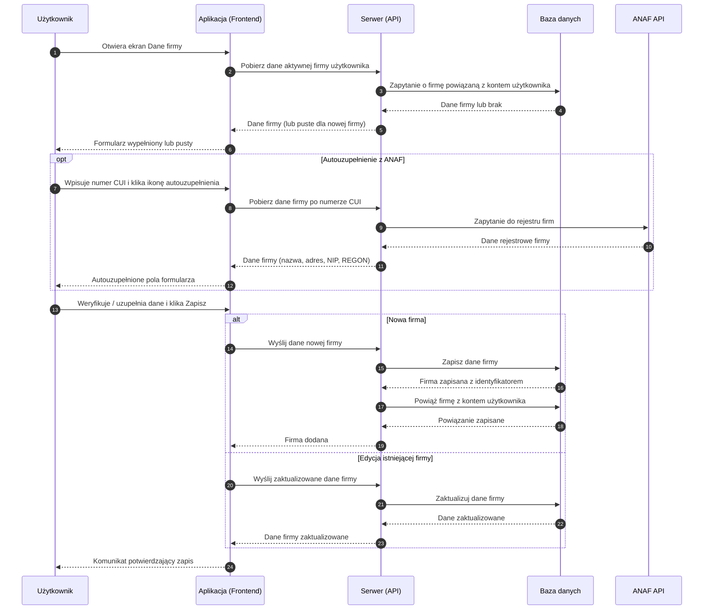

# BP-FIRM-01 Zarządzanie danymi własnej firmy

| Pole | Wartość |
|---|---|
| ID dokumentu | BP-FIRM-01 |
| Obszar | Firma |
| Wersja | 0.1 |
| Status | szkic |
| Autor | Agent Claudiusz Sonte 4.6 max |
| Data | 2026-06-01 |

## Cel biznesowy

Umożliwić użytkownikowi wprowadzenie i aktualizację danych rejestrowych własnej firmy, które będą drukowane na każdym wystawionym dokumencie handlowym.

## Kontekst

Użytkownik trafia na ten proces na ekranie „Dane firmy" (`/dashboard/firm-details`). Jest to kluczowy krok onboardingu — bez wypełnienia danych firmy nie można wystawić faktury. System umożliwia autouzupełnienie danych z publicznego rejestru ANAF (dla firm rumuńskich) na podstawie numeru CUI.

## Aktorzy

| Aktor | Rola |
|---|---|
| Użytkownik | Wprowadza lub aktualizuje dane firmy |
| Aplikacja (Frontend) | Wyświetla formularz, obsługuje autouzupełnienie z ANAF |
| Serwer (API) | Zapisuje dane firmy, powiązuje z kontem użytkownika |
| Baza danych | Trwale przechowuje dane firmy |
| ANAF API (opcjonalnie) | Dostarcza dane rejestrowe firmy na podstawie numeru CUI |

## Warunki wejścia

- Użytkownik zalogowany
- Ekran danych firmy otwarty

## Przebieg główny — Dodanie własnej firmy (pierwsza konfiguracja)

1. **Użytkownik** otwiera ekran „Dane firmy"
2. **Aplikacja** sprawdza, czy użytkownik ma już przypisaną firmę — formularz wyświetlany jest pusty
3. **Użytkownik** opcjonalnie wpisuje numer CUI i klika ikonę autouzupełnienia
4. **Aplikacja** pobiera dane firmy z rejestru ANAF i wypełnia pola: nazwa, NIP, REGON, adres, województwo, miasto
5. **Użytkownik** weryfikuje, uzupełnia lub poprawia dane i klika „Zapisz"
6. **Serwer** zapisuje dane firmy i powiązuje ją z kontem użytkownika
7. **System** wyświetla komunikat potwierdzający zapis; dane firmy dostępne w formularzach dokumentów

## Przebieg główny — Edycja danych firmy

1. **Użytkownik** otwiera ekran „Dane firmy"
2. **Aplikacja** pobiera i wyświetla aktualne dane firmy użytkownika w formularzu
3. **Użytkownik** modyfikuje wybrane pola
4. **Użytkownik** klika „Zapisz"
5. **Serwer** aktualizuje dane firmy w bazie
6. **System** wyświetla komunikat potwierdzający zapis

## Reguły biznesowe

| ID | Reguła | Objaśnienie |
|---|---|---|
| RB-01 | Dane firmy wymagane do wystawienia faktury | Bez danych firmy formularz faktury nie może być poprawnie wypełniony |
| RB-02 | Firma powiązana jest wyłącznie z kontem użytkownika | Dane firmy widoczne są tylko dla właściciela konta |
| RB-03 | CUI służy do autouzupełnienia z ANAF | Wpisanie CUI i kliknięcie ikony chmury pobiera dane z rejestru rumuńskiego |
| RB-04 | Dane z ANAF można modyfikować przed zapisem | Pobranie z ANAF tylko sugestia — użytkownik może zmienić dowolne pole |
| RB-05 | Brak walidacji unikalności CUI | System nie blokuje zduplikowanych numerów CUI |

## Wyjątki i scenariusze alternatywne

| ID | Scenariusz | Warunek | Reakcja systemu |
|---|---|---|---|
| WYJ-01 | ANAF niedostępny | Serwis ANAF nie odpowiada na zapytanie | Komunikat o niedostępności; użytkownik wpisuje dane ręcznie |
| WYJ-02 | CUI nieznany w ANAF | Podany numer CUI nie figuruje w rejestrze | Komunikat „Firma nie znaleziona"; użytkownik wpisuje dane ręcznie |
| WYJ-03 | Brak wymaganych pól | Użytkownik próbuje zapisać bez wypełnienia wymaganych pól | Formularz blokuje zapis; wskazuje brakujące pola |
| WYJ-04 | Błąd zapisu | Tymczasowy błąd bazy danych | Ogólny komunikat błędu; możliwość ponowienia próby |

## Wynik procesu

- Dane firmy zapisane i powiązane z kontem użytkownika
- Dane firmy widoczne w formularzu przy wystawianiu dokumentów (jako wystawiający)
- Dane firmy drukowane na PDF każdego dokumentu

## Diagram sekwencji

## Powiązania analityczne

| Typ | Dokument |
|---|---|
| Use Case | [uc_firma](../../07_use_case/firma/uc_firma.md) |
| Proces powiązany | [BP-CFG-01 Onboarding](../konfiguracja/BP-CFG-01_onboarding.md) |
| Proces powiązany | [BP-FIRM-02 Zarządzanie klientami](./BP-FIRM-02_klienci.md) |
| Proces powiązany | [BP-DOC-01 Wystawienie faktury](../dokumenty/BP-DOC-01_wystawienie_faktury.md) |

## Powiązania techniczne

| Typ | Dokument |
|---|---|
| Proces techniczny | [dodaj_firme/proces.md](../../02_procesy/firma/dodaj_firme/proces.md) |
| Proces techniczny | [edytuj_firme/proces.md](../../02_procesy/firma/edytuj_firme/proces.md) |
| Proces techniczny | [pobierz_z_anaf/proces.md](../../02_procesy/firma/pobierz_z_anaf/proces.md) |
| API | [POST /api/Firm/AddFirm](../../04_api_i_integracje/01_api_frontend/firm/POST_Firm_AddFirm.md) |
| API | [PUT /api/Firm/EditFirm](../../04_api_i_integracje/01_api_frontend/firm/PUT_Firm_EditFirm.md) |
| API | [GET /api/Firm/fromAnaf](../../04_api_i_integracje/01_api_frontend/firm/GET_Firm_fromAnaf.md) |
| Model DB | [dbo.Firm](../../05_model_danych/01_db/dbo/dbo.Firm.md) |
| Model DB | [dbo.UserFirm](../../05_model_danych/01_db/dbo/dbo.UserFirm.md) |

## Wątpliwości i braki

- Brak walidacji unikalności CUI — możliwe zduplikowane firmy z tym samym numerem NIP
- Brak możliwości usunięcia firmy przez użytkownika (brak endpointu usuwania)
- ANAF API może nie odpowiadać — brak obsługi timeoutu i brak fallback
- Edycja firmy klienta przez ten sam ekran — logika `isClient` wymaga weryfikacji

## Rejestr zmian

| Wersja | Data | Autor | Opis zmiany |
|---|---|---|---|
| 0.1 | 2026-06-01 | Agent Claudiusz Sonte 4.6 max | Pierwsza wersja BP — na podstawie BPMN-FIRMA-01, PROC-AddFirm i PROC-EditFirm; format analityczny BP-NN |
