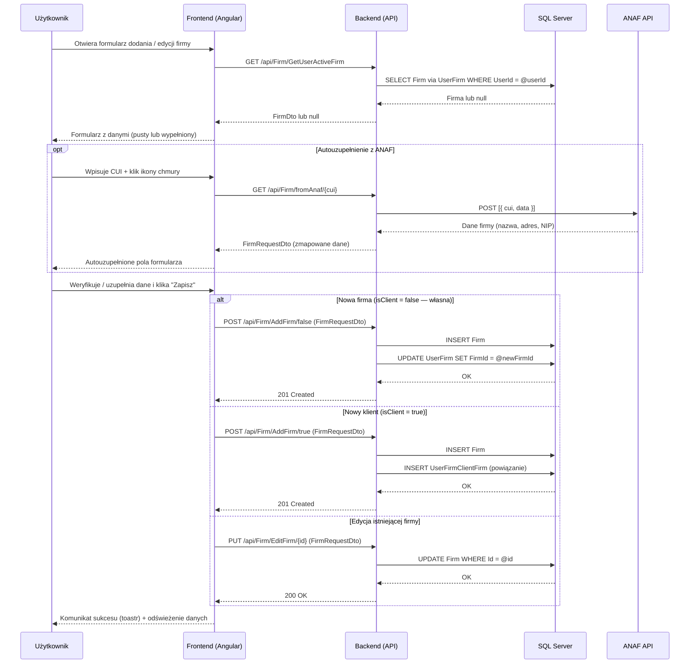

# Proces biznesowy: Zarządzanie firmą

| Pole | Wartość |
|---|---|
| ID dokumentu | BPMN-FIRMA-01 |
| Typ dokumentu | proces biznesowy |
| Wersja | 0.1 |
| Status | szkic |
| Autor (ostatnia modyfikacja) | Agent Claudiusz Sonte 4.6 max |
| Data ostatniej modyfikacji | 2026-05-31 |

## Streszczenie

Proces umożliwia zalogowanemu użytkownikowi dodanie lub edycję danych firmy — własnej firmy wystawiającego (`isClient=false`) lub firmy klienta (`isClient=true`). Użytkownik może skorzystać z autouzupełnienia danych przez ANAF API na podstawie numeru CUI (rumuński NIP). Po zapisaniu firma jest dostępna w selektorach formularzy dokumentów.

## Uczestnicy

| Uczestnik | Rola |
|---|---|
| Użytkownik | Inicjator akcji (dodaje / edytuje firmę) |
| Frontend (Angular) | Warstwa prezentacji — formularz danych firmy |
| Backend (API) | Logika biznesowa — zapis, powiązanie z UserFirm |
| SQL Server | Trwałe przechowywanie danych firm |
| ANAF API | Zewnętrzny rejestr firm rumuńskich — źródło autouzupełnienia |

## Diagram procesu (Mermaid sequenceDiagram)

## Kroki procesu

| # | Krok | Uczestnik | Opis |
|---|---|---|---|
| 1 | Otwarcie formularza | Użytkownik / Frontend | Ekran danych firmy (`/dashboard/firm-details`) lub dialog dodania klienta. |
| 2 | Pobranie aktywnej firmy | Frontend / Backend | GET `/api/Firm/GetUserActiveFirm` — jeśli null, formularz pusty (onboarding). |
| 3 | Autouzupełnienie ANAF (opcja) | Użytkownik / Frontend / Backend / ANAF | Wpisanie CUI, pobranie danych z ANAF, wypełnienie pól. |
| 4 | Wypełnienie formularza | Użytkownik | Wpisanie lub weryfikacja: nazwa, adres, CUI, numer EUID, e-mail, telefon. |
| 5 | Zapis — własna firma | Frontend / Backend / DB | POST `/api/Firm/AddFirm/false` — INSERT Firm + UPDATE UserFirm. |
| 6 | Zapis — klient | Frontend / Backend / DB | POST `/api/Firm/AddFirm/true` — INSERT Firm + INSERT powiązania. |
| 7 | Edycja | Frontend / Backend / DB | PUT `/api/Firm/EditFirm/{id}` — UPDATE Firm. |
| 8 | Potwierdzenie | Frontend | Toastr sukces; dane firmy dostępne w selektorach dokumentów. |

## Obsługa wyjątków

| Sytuacja | Reakcja systemu |
|---|---|
| ANAF niedostępny (timeout / błąd) | Backend zwraca błąd; frontend wyświetla toastr error; użytkownik wpisuje dane ręcznie. |
| ANAF: CUI nie istnieje w rejestrze | Backend zwraca pustą odpowiedź lub 404; frontend informuje użytkownika. |
| Błąd zapisu do DB | Backend 500; ExceptionMiddleware zwraca ogólny komunikat. |
| Brak autoryzacji (wygasły JWT) | JwtInterceptor przechwytuje 401 → TokenExpiredDialog → /login. |
| Duplikat CUI (brak walidacji backendowej) | System zapisuje duplikat — brak ochrony na poziomie DB ani API (znana luka). |

## Powiązane procesy techniczne

| Proces | Link |
|---|---|
| Dodaj firmę (techniczny) | `../../02_procesy/firma/dodaj_firme/proces.md` |
| Rejestracja i logowanie (BPMN) | `../autentykacja/rejestracja_i_logowanie.md` |
| Wystawienie faktury (BPMN) | `../dokumenty/wystawienie_faktury.md` |

## Wątpliwości i braki

- Brak walidacji unikalności CUI na poziomie backendu — możliwe zduplikowane firmy z tym samym NIP.
- Niejasna logika powiązania UserFirm dla pierwszej firmy (brak "kreatora" wymuszającego kolejność).
- Brak możliwości usunięcia firmy przez użytkownika (brak endpointu DELETE Firm w udokumentowanym API).
- Edycja firmy klienta nie jest jednoznacznie obsługiwana — wymaga weryfikacji czy `EditFirm` działa dla klientów.

## Rejestr zmian

| Wersja | Data | Autor | Opis zmiany |
|---|---|---|---|
| 0.1 | 2026-05-31 | Agent Claudiusz Sonte 4.6 max | Pierwsza wersja — na podstawie PROC-AddFirm i diagramu z BPMN-02. |
