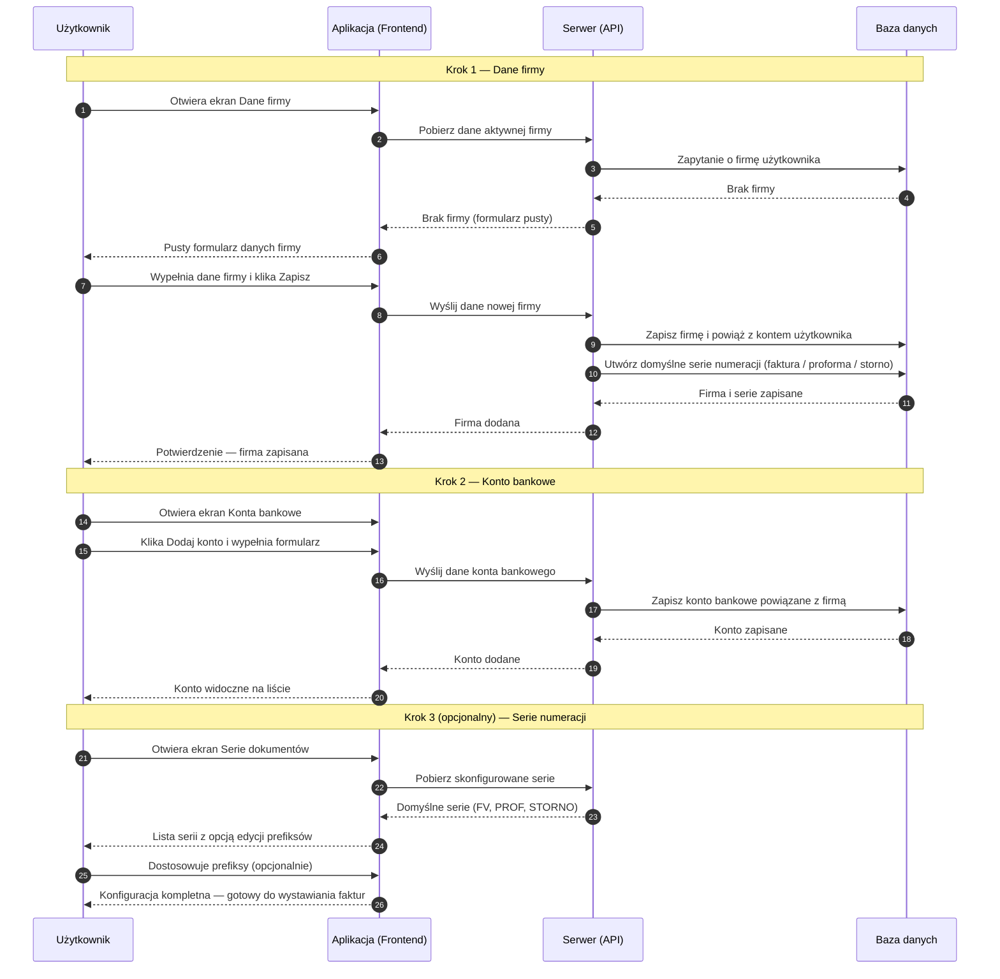

# BP-CFG-01 Pierwsze kroki — onboarding nowego użytkownika

| Pole | Wartość |
|---|---|
| ID dokumentu | BP-CFG-01 |
| Obszar | Konfiguracja |
| Wersja | 0.1 |
| Status | szkic |
| Autor | Agent Claudiusz Sonte 4.6 max |
| Data | 2026-06-01 |

## Cel biznesowy

Przeprowadzić nowego użytkownika przez minimalną konfigurację systemu niezbędną do wystawienia pierwszej faktury: dodanie danych firmy, konta bankowego i serii numeracji dokumentów.

## Kontekst

Onboarding następuje bezpośrednio po rejestracji. Po zalogowaniu użytkownik trafia na dashboard z pustymi ekranami — brak danych firmy, kont bankowych i serii numeracji. Aplikacja nie wymusza kolejności kroków ani nie prowadzi użytkownika przez kreator — musi on samodzielnie odwiedzić kolejne ekrany konfiguracyjne. Każdy z trzech kroków konfiguracyjnych jest warunkiem koniecznym do wystawienia pierwszej faktury.

## Aktorzy

| Aktor | Rola |
|---|---|
| Użytkownik (nowy) | Przechodzi przez kolejne ekrany konfiguracyjne |
| Aplikacja (Frontend) | Wyświetla ekrany konfiguracji, informuje o brakujących danych |
| Serwer (API) | Zapisuje kolejne elementy konfiguracji |
| Baza danych | Trwale przechowuje konfigurację firmy |

## Warunki wejścia

- Użytkownik zarejestrowany i zalogowany
- Konto użytkownika bez przypisanej firmy (nowa rejestracja)

## Przebieg główny

1. **Użytkownik** loguje się lub kończy rejestrację i trafia na dashboard
2. **System** wyświetla dashboard z pustymi listami (brak faktur, proform, storn)
3. **Użytkownik** przechodzi do ekranu „Dane firmy"
4. **Użytkownik** wypełnia dane własnej firmy (opcjonalnie korzystając z autouzupełnienia ANAF)
5. **Serwer** zapisuje dane firmy i automatycznie tworzy domyślne serie numeracji dla trzech typów dokumentów (faktury, proformy, storno)
6. **Użytkownik** przechodzi do ekranu „Konta bankowe"
7. **Użytkownik** dodaje co najmniej jedno konto bankowe firmy
8. **Serwer** zapisuje konto bankowe
9. **Użytkownik** opcjonalnie przechodzi do ekranu „Serie dokumentów" i dostosowuje prefiksy numeracji
10. **System** informuje użytkownika że konfiguracja jest kompletna
11. **Użytkownik** może teraz wystawić pierwszą fakturę

## Reguły biznesowe

| ID | Reguła | Objaśnienie |
|---|---|---|
| RB-01 | Dane firmy są warunkiem koniecznym do wystawiania dokumentów | Bez firmy pola „wystawiający" w formularzu faktury są puste |
| RB-02 | Konto bankowe jest warunkiem koniecznym | Bez konta bankowego zapis faktury jest zablokowany |
| RB-03 | Seria numeracji jest warunkiem koniecznym | Bez serii lista selektora numeracji jest pusta; faktura nie ma numeru |
| RB-04 | Domyślne serie tworzone są automatycznie po dodaniu firmy | System tworzy serie z domyślnymi prefiksami dla każdego z 3 typów dokumentów |
| RB-05 | Aplikacja nie wymusza kolejności kroków onboardingu | Użytkownik może pominąć ekrany — natrafi na brakujące dane przy próbie wystawienia faktury |

## Wyjątki i scenariusze alternatywne

| ID | Scenariusz | Warunek | Reakcja systemu |
|---|---|---|---|
| WYJ-01 | Próba wystawienia faktury bez konfiguracji | Użytkownik przechodzi na nową fakturę bez wcześniejszej konfiguracji | Formularz wyświetla puste listy wyboru (seria, konto); zapis niemożliwy; brak wyraźnego komunikatu kierującego do konfiguracji |
| WYJ-02 | Pominięcie konta bankowego | Użytkownik pominął ekran kont bankowych | Przy próbie zapisu faktury — komunikat o brakującym koncie bankowym |
| WYJ-03 | ANAF niedostępny przy dodawaniu firmy | Serwis ANAF nie odpowiada | Komunikat o niedostępności; użytkownik wpisuje dane firmy ręcznie |

## Wynik procesu

- Dane własnej firmy zapisane w systemie
- Co najmniej jedno konto bankowe skonfigurowane
- Domyślne serie numeracji dla faktur, proform i storno skonfigurowane
- Użytkownik gotowy do wystawienia pierwszej faktury

## Diagram sekwencji

## Powiązania analityczne

| Typ | Dokument |
|---|---|
| Use Case | [UC-01 Zarządzanie kontem](../../07_use_case/UC-01_ZarzadzanieKontem.md) |
| Use Case | [uc_autentykacja](../../07_use_case/globalny/uc_autentykacja.md) |
| Proces powiązany | [BP-AUTH-01 Rejestracja](../autentykacja/BP-AUTH-01_rejestracja.md) |
| Proces powiązany | [BP-FIRM-01 Dane firmy](../firma/BP-FIRM-01_dane_firmy.md) |
| Proces powiązany | [BP-CFG-02 Konta bankowe](./BP-CFG-02_konta_bankowe.md) |
| Proces powiązany | [BP-CFG-03 Serie dokumentów](./BP-CFG-03_serie_dokumentow.md) |
| Proces powiązany | [BP-DOC-01 Wystawienie faktury](../dokumenty/BP-DOC-01_wystawienie_faktury.md) |

## Powiązania techniczne

| Typ | Dokument |
|---|---|
| Proces techniczny | [dodaj_firme/proces.md](../../02_procesy/firma/dodaj_firme/proces.md) |
| Proces techniczny | [dodaj_konto/proces.md](../../02_procesy/konta_bankowe/dodaj_konto/proces.md) |
| Proces techniczny | [dodaj_serie/proces.md](../../02_procesy/serie_dokumentow/dodaj_serie/proces.md) |
| Model DB | [dbo.UserFirm](../../05_model_danych/01_db/dbo/dbo.UserFirm.md) |

## Wątpliwości i braki

- Brak kreatora onboardingu — użytkownik musi samodzielnie odnaleźć kolejne ekrany konfiguracyjne
- Brak wskaźnika postępu onboardingu ani powiadomień „uzupełnij dane firmy"
- Próba wystawienia faktury bez konfiguracji skutkuje trudno zrozumiałymi pustymi listami wyboru zamiast wyraźnego komunikatu kierującego do konfiguracji

## Rejestr zmian

| Wersja | Data | Autor | Opis zmiany |
|---|---|---|---|
| 0.1 | 2026-06-01 | Agent Claudiusz Sonte 4.6 max | Pierwsza wersja BP — na podstawie BPMN-AUTH-01 (sekcja onboarding) i BPMN-KONF-01; format analityczny BP-NN |
