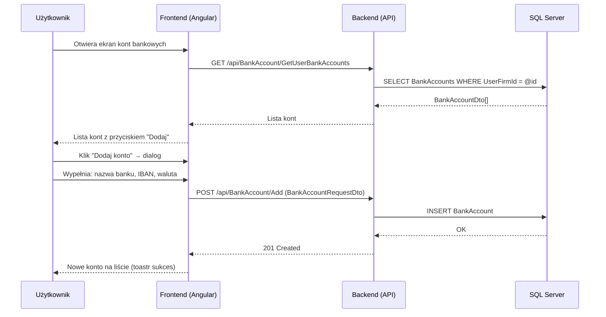

# Proces biznesowy: Konfiguracja firmy

| Pole | Wartość |
|---|---|
| ID dokumentu | BPMN-KONF-01 |
| Typ dokumentu | proces biznesowy |
| Wersja | 0.1 |
| Status | szkic |
| Autor (ostatnia modyfikacja) | Agent Claudiusz Sonte 4.6 max |
| Data ostatniej modyfikacji | 2026-05-31 |

## Streszczenie

Proces konfiguracji firmy obejmuje trzy niezależne obszary: zarządzanie katalogiem produktów (dodawanie / edycja / usuwanie produktów używanych w pozycjach dokumentów), zarządzanie kontami bankowymi (dane konta widoczne na fakturze) oraz zarządzanie seriami numeracji dokumentów (sekwencje numerów dla faktur, proform i storno). Każdy z tych obszarów jest warunkiem koniecznym do wystawienia pierwszej faktury.

## Uczestnicy

| Uczestnik | Rola |
|---|---|
| Użytkownik | Inicjator akcji (konfiguruje dane) |
| Frontend (Angular) | Warstwa prezentacji — ekrany i dialogi konfiguracyjne |
| Backend (API) | Logika biznesowa — CRUD dla produktów, kont, serii |
| SQL Server | Trwałe przechowywanie danych konfiguracyjnych |

## Diagram procesu (Mermaid flowchart)

```mermaid
flowchart TD
    START([Użytkownik zalogowany]) --> MENU{Co chce skonfigurować?}

    MENU --> PROD[Katalog produktów]
    MENU --> BANK[Konta bankowe]
    MENU --> SERIE[Serie numeracji]

    PROD --> PROD_LIST[GET /api/Product/GetUserProducts\nLista produktów]
    PROD_LIST --> PROD_ACTION{Akcja}
    PROD_ACTION --> PROD_ADD[POST /api/Product/Add\nNowy produkt]
    PROD_ACTION --> PROD_EDIT[PUT /api/Product/Edit/{id}\nEdycja produktu]
    PROD_ACTION --> PROD_DEL[DELETE /api/Product/Delete/{id}\nUsunięcie produktu]
    PROD_ADD --> PROD_OK[201 Created]
    PROD_EDIT --> PROD_OK2[200 OK]
    PROD_DEL --> PROD_OK3[200 OK]

    BANK --> BANK_LIST[GET /api/BankAccount/GetUserBankAccounts\nLista kont]
    BANK_LIST --> BANK_ACTION{Akcja}
    BANK_ACTION --> BANK_ADD[POST /api/BankAccount/Add\nNowe konto]
    BANK_ACTION --> BANK_EDIT[PUT /api/BankAccount/Edit/{id}\nEdycja konta]
    BANK_ACTION --> BANK_DEL[DELETE /api/BankAccount/Delete/{id}\nUsunięcie konta]
    BANK_ADD --> BANK_OK[201 Created]
    BANK_EDIT --> BANK_OK2[200 OK]
    BANK_DEL --> BANK_OK3[200 OK]

    SERIE --> SERIE_LIST[GET /api/DocumentSeries/GetUserDocumentSeries\nLista serii]
    SERIE_LIST --> SERIE_ACTION{Akcja}
    SERIE_ACTION --> SERIE_ADD[POST /api/DocumentSeries/Add\nNowa seria]
    SERIE_ACTION --> SERIE_EDIT[PUT /api/DocumentSeries/Edit/{id}\nEdycja serii]
    SERIE_ACTION --> SERIE_DEL[DELETE /api/DocumentSeries/Delete/{id}\nUsunięcie serii]
    SERIE_ADD --> SERIE_OK[201 Created]
    SERIE_EDIT --> SERIE_OK2[200 OK]
    SERIE_DEL --> SERIE_OK3[200 OK]

    PROD_OK --> END_PROD([Produkt dostępny\nw formularzach dokumentów])
    BANK_OK --> END_BANK([Konto dostępne\nw formularzach dokumentów])
    SERIE_OK --> END_SERIE([Seria dostępna\nprzy wystawianiu dokumentów])
```

## Diagram sekwencji — dodanie konta bankowego (przykład)



## Kroki procesu

| # | Krok | Uczestnik | Opis |
|---|---|---|---|
| 1 | Nawigacja do ekranu konfiguracji | Użytkownik | Wybór: Produkty / Konta bankowe / Serie numeracji z menu bocznego. |
| 2 | Pobranie listy elementów | Frontend / Backend | GET odpowiedniego endpointu (Products / BankAccounts / DocumentSeries). |
| 3 | Wyświetlenie listy | Frontend | Tabela z elementami i przyciskami akcji (Dodaj / Edytuj / Usuń). |
| 4 | Dodanie elementu | Użytkownik / Frontend / Backend | Dialog z formularzem → POST Add → INSERT → 201 Created. |
| 5 | Edycja elementu | Użytkownik / Frontend / Backend | Dialog z wypełnionym formularzem → PUT Edit/{id} → UPDATE → 200 OK. |
| 6 | Usunięcie elementu | Użytkownik / Frontend / Backend | Potwierdzenie → DELETE Delete/{id} → 200 OK. |
| 7 | Dostępność w formularzach | System | Po dodaniu, element pojawia się w selektorach formularzy dokumentów (via GetDocumentAutofillInfo). |

## Szczegóły konfigurowanych elementów

### Produkty (katalog)
| Pole | Opis |
|---|---|
| Nazwa produktu | Wyświetlana w pozycjach dokumentu |
| Jednostka miary | szt., kg, godz. itp. |
| Cena jednostkowa | Domyślna cena netto |
| Stawka VAT | Domyślna stawka VAT dla produktu |

### Konta bankowe
| Pole | Opis |
|---|---|
| Nazwa banku | Wyświetlana na fakturze |
| Numer IBAN | Numer rachunku bankowego |
| Waluta | RON, EUR, USD itp. |

### Serie numeracji dokumentów
| Pole | Opis |
|---|---|
| Prefiks serii | Np. FV, PROF, STORNO |
| Numer bieżący | Ostatni użyty numer (auto-inkrementowany) |
| Typ dokumentu | Faktura (1) / Proforma (2) / Storno (3) |

## Obsługa wyjątków

| Sytuacja | Reakcja systemu |
|---|---|
| Brak wymaganego pola | Frontend blokuje wysłanie; komunikat inline. |
| Błąd zapisu do DB | Backend 500; ExceptionMiddleware; toastr error. |
| Usunięcie elementu używanego w dokumencie | Zachowanie nieokreślone — brak walidacji integralności (możliwy błąd FK na DB). |
| JWT wygasa | JwtInterceptor 401 → TokenExpiredDialog → /login. |

## Powiązane procesy techniczne

| Proces | Link |
|---|---|
| Rejestracja i logowanie / Onboarding (BPMN) | `../autentykacja/rejestracja_i_logowanie.md` |
| Wystawienie faktury (BPMN) | `../dokumenty/wystawienie_faktury.md` |

## Wątpliwości i braki

- Brak walidacji czy seria numeracji powiązana jest z właściwym typem dokumentu — użytkownik może przypadkowo użyć serii proform przy fakturze.
- Brak ochrony przed usunięciem elementu używanego w wystawionych dokumentach — możliwy błąd klucza obcego na poziomie DB.
- Brak zbiorczego importu produktów (np. z CSV) — każdy produkt dodawany ręcznie.
- Serie numeracji nie mają walidacji formatu prefiksu — możliwe wpisanie specjalnych znaków.

## Rejestr zmian

| Wersja | Data | Autor | Opis zmiany |
|---|---|---|---|
| 0.1 | 2026-05-31 | Agent Claudiusz Sonte 4.6 max | Pierwsza wersja. |
