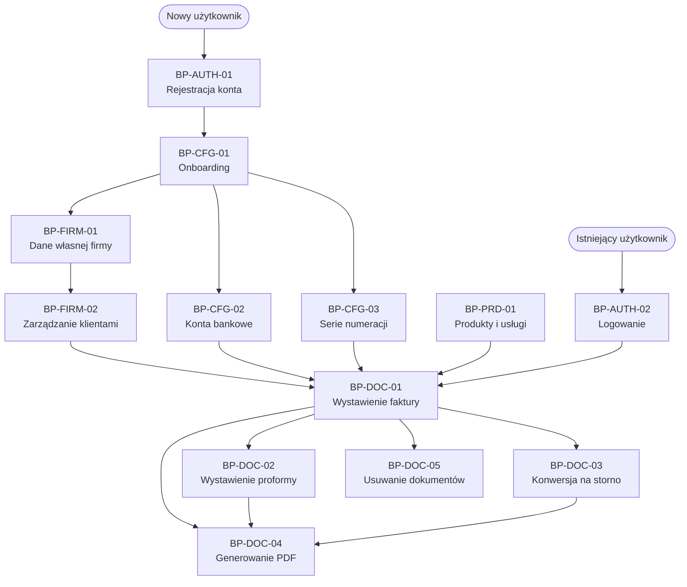

# Mapa procesów biznesowych — InvoiceJet

| Pole | Wartość |
|---|---|
| ID dokumentu | BP-MAPA |
| Typ dokumentu | mapa procesów |
| Wersja | 0.2 |
| Status | aktywny |
| Autor (ostatnia modyfikacja) | Agent Claudiusz Sonte 4.6 max |
| Data ostatniej modyfikacji | 2026-06-01 |

## Katalog wszystkich procesów BP-NN

| ID | Nazwa procesu | Obszar | Plik |
|---|---|---|---|
| BP-AUTH-01 | Rejestracja konta | Autentykacja | [autentykacja/BP-AUTH-01_rejestracja.md](autentykacja/BP-AUTH-01_rejestracja.md) |
| BP-AUTH-02 | Logowanie i wylogowanie | Autentykacja | [autentykacja/BP-AUTH-02_logowanie.md](autentykacja/BP-AUTH-02_logowanie.md) |
| BP-DOC-01 | Wystawienie faktury zwykłej | Dokumenty | [dokumenty/BP-DOC-01_wystawienie_faktury.md](dokumenty/BP-DOC-01_wystawienie_faktury.md) |
| BP-DOC-02 | Wystawienie proformy | Dokumenty | [dokumenty/BP-DOC-02_wystawienie_proformy.md](dokumenty/BP-DOC-02_wystawienie_proformy.md) |
| BP-DOC-03 | Wystawienie / konwersja na storno | Dokumenty | [dokumenty/BP-DOC-03_wystawienie_storno.md](dokumenty/BP-DOC-03_wystawienie_storno.md) |
| BP-DOC-04 | Generowanie i podgląd PDF | Dokumenty | [dokumenty/BP-DOC-04_eksport_pdf.md](dokumenty/BP-DOC-04_eksport_pdf.md) |
| BP-DOC-05 | Usuwanie dokumentów | Dokumenty | [dokumenty/BP-DOC-05_usuwanie_dokumentow.md](dokumenty/BP-DOC-05_usuwanie_dokumentow.md) |
| BP-FIRM-01 | Zarządzanie danymi własnej firmy | Firma | [firma/BP-FIRM-01_dane_firmy.md](firma/BP-FIRM-01_dane_firmy.md) |
| BP-FIRM-02 | Zarządzanie klientami (kontrahentami) | Firma | [firma/BP-FIRM-02_klienci.md](firma/BP-FIRM-02_klienci.md) |
| BP-CFG-01 | Pierwsze kroki — onboarding | Konfiguracja | [konfiguracja/BP-CFG-01_onboarding.md](konfiguracja/BP-CFG-01_onboarding.md) |
| BP-CFG-02 | Zarządzanie kontami bankowymi | Konfiguracja | [konfiguracja/BP-CFG-02_konta_bankowe.md](konfiguracja/BP-CFG-02_konta_bankowe.md) |
| BP-CFG-03 | Konfiguracja serii numeracji | Konfiguracja | [konfiguracja/BP-CFG-03_serie_dokumentow.md](konfiguracja/BP-CFG-03_serie_dokumentow.md) |
| BP-PRD-01 | Zarządzanie katalogiem produktów i usług | Produkty | [produkty/BP-PRD-01_produkty_i_uslugi.md](produkty/BP-PRD-01_produkty_i_uslugi.md) |

## Diagram — zależności i kolejność procesów



## Ścieżka krytyczna — wystawienie pierwszej faktury

```
BP-AUTH-01 (rejestracja)
  → BP-CFG-01 (onboarding)
    → BP-FIRM-01 (dane firmy)        ← WYMAGANE
    → BP-CFG-02 (konto bankowe)      ← WYMAGANE
    → BP-CFG-03 (seria numeracji)    ← WYMAGANE
  → BP-FIRM-02 (dodaj klienta)       ← opcjonalne (można wpisać ręcznie)
  → BP-PRD-01 (dodaj produkt)        ← opcjonalne (można wpisać ręcznie)
  → BP-DOC-01 (wystaw fakturę)       ← CEL
    → BP-DOC-04 (generuj PDF)        ← opcjonalne po wystawieniu
```

## Procesy według inicjatora ekranu

| Ekran | Proces |
|---|---|
| `/register` | BP-AUTH-01 |
| `/login` | BP-AUTH-02 |
| `/dashboard/firm-details` | BP-FIRM-01 |
| `/dashboard/clients` | BP-FIRM-02 |
| `/dashboard/invoices` | BP-DOC-01, BP-DOC-04, BP-DOC-05 |
| `/dashboard/proforma-invoices` | BP-DOC-02, BP-DOC-04, BP-DOC-05 |
| `/dashboard/storno-invoices` | BP-DOC-03, BP-DOC-04, BP-DOC-05 |
| `/dashboard/bank-accounts` | BP-CFG-02 |
| `/dashboard/document-series` | BP-CFG-03 |
| `/dashboard/products` | BP-PRD-01 |

## Rejestr zmian

| Wersja | Data | Autor | Opis zmiany |
|---|---|---|---|
| 0.1 | 2026-05-31 | Agent Claudiusz Sonte 4.6 max | Pierwsza wersja mapy (stare BPMN-XX IDs) |
| 0.2 | 2026-06-01 | Agent Claudiusz Sonte 4.6 max | Migracja do nowego formatu BP-NN; 13 procesów; ścieżka krytyczna; tabela ekranów |
