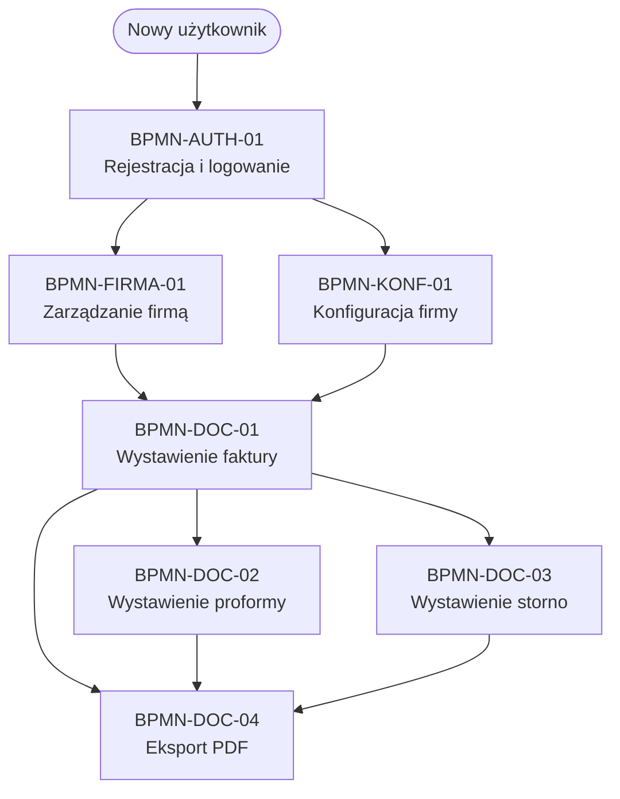

# Mapa procesów biznesowych — InvoiceJet

| Pole | Wartość |
|---|---|
| ID dokumentu | BPMN-MAPA |
| Typ dokumentu | mapa procesów |
| Wersja | 0.1 |
| Status | szkic |
| Autor (ostatnia modyfikacja) | Agent Claudiusz Sonte 4.6 max |
| Data ostatniej modyfikacji | 2026-05-31 |

## Streszczenie

Globalna mapa wszystkich procesów biznesowych systemu InvoiceJet pogrupowanych według obszaru funkcjonalnego. Jeden aktor: Użytkownik (zalogowany). Diagramy tworzone w Mermaid `sequenceDiagram` / `flowchart` (decyzja D-03 z PLAN.md).

## Grupy procesów

| Grupa | Folder | Liczba procesów |
|---|---|---|
| Autentykacja | `autentykacja/` | 1 |
| Firma | `firma/` | 1 |
| Dokumenty | `dokumenty/` | 4 |
| Konfiguracja | `konfiguracja/` | 1 |

## Pełna lista procesów

| # | ID dokumentu | Nazwa procesu | Grupa | Plik | Opis skrócony |
|---|---|---|---|---|---|
| 1 | BPMN-AUTH-01 | Rejestracja i logowanie | Autentykacja | `autentykacja/rejestracja_i_logowanie.md` | Rejestracja nowego konta, hashowanie hasła BCrypt, wydanie JWT, onboarding konfiguracji. |
| 2 | BPMN-FIRMA-01 | Zarządzanie firmą | Firma | `firma/zarzadzanie_firma.md` | Dodanie własnej firmy lub klienta, autouzupełnienie danych z ANAF API po CUI. |
| 3 | BPMN-DOC-01 | Wystawienie faktury | Dokumenty | `dokumenty/wystawienie_faktury.md` | Pobranie danych autouzupełnienia, wypełnienie formularza, zapis dokumentu (typ 1). |
| 4 | BPMN-DOC-02 | Wystawienie proformy | Dokumenty | `dokumenty/wystawienie_proformy.md` | Identyczny flow jak faktura, różnica: DocumentTypeId = 2 (Proforma). |
| 5 | BPMN-DOC-03 | Wystawienie storno | Dokumenty | `dokumenty/wystawienie_storno.md` | Konwersja istniejącego dokumentu na fakturę storno (PUT TransformToStorno). |
| 6 | BPMN-DOC-04 | Eksport PDF | Dokumenty | `dokumenty/eksport_pdf.md` | Generowanie PDF przez QuestPDF i pobranie pliku przez przeglądarkę. |
| 7 | BPMN-KONF-01 | Konfiguracja firmy | Konfiguracja | `konfiguracja/konfiguracja_firmy.md` | Zarządzanie produktami, kontami bankowymi i seriami numeracji dokumentów. |

## Diagram — powiązania między procesami

## Rejestr zmian

| Wersja | Data | Autor | Opis zmiany |
|---|---|---|---|
| 0.1 | 2026-05-31 | Agent Claudiusz Sonte 4.6 max | Pierwsza wersja mapy. |
