# Mapa przejść między ekranami (M-10)

| Pole | Wartość |
|---|---|
| ID dokumentu | M-10 |
| Typ dokumentu | mapa krzyżowa |
| Wersja | 0.1 |
| Status | szkic |
| Autor | Agent Claudiusz Sonte 4.6 max |
| Data | 2026-05-31 |

## Streszczenie

Diagram i tabela nawigacyjna wszystkich możliwych przejść między ekranami aplikacji InvoiceJet. Ekrany publiczne (`/login`, `/register`) są dostępne bez autoryzacji; wszystkie ekrany wewnątrz `/dashboard/` chronione są przez `AuthGuard` (rola: User). Modale (`MatDialog`) nie zmieniają URL — są traktowane jako nakładki na ekrany.

## Diagram przejść (Mermaid)

```mermaid
flowchart TD
    subgraph Publiczne["Ekrany publiczne (bez AuthGuard)"]
        LOGIN[/"Login\n/login"/]
        REGISTER[/"Register\n/register"/]
    end

    subgraph Dashboard["Ekrany chronione (AuthGuard — rola: User)"]
        DASH[/"Dashboard\n/dashboard"/]

        subgraph Firma["Grupa: Firma"]
            DANE_FIRMY[/"Dane firmy\n/dashboard/firm-details"/]
            KLIENCI[/"Klienci\n/dashboard/clients"/]
            KONTA[/"Konta bankowe\n/dashboard/bank-accounts"/]
        end

        PRODUKTY[/"Produkty\n/dashboard/products"/]
        SERIE[/"Serie dokumentów\n/dashboard/document-series"/]

        subgraph Faktury["Dokumenty — Faktury"]
            LISTA_FAK[/"Lista faktur\n/dashboard/invoices"/]
            DODAJ_FAK[/"Formularz faktury\n/dashboard/add-invoice\n/dashboard/edit-invoice/:id"/]
        end

        subgraph Proformy["Dokumenty — Proformy"]
            LISTA_PRO[/"Lista proform\n/dashboard/invoice-proformas"/]
            DODAJ_PRO[/"Formularz proformy\n/dashboard/add-invoice-proforma\n/dashboard/edit-invoice-proforma/:id"/]
        end

        subgraph Storna["Dokumenty — Storna"]
            LISTA_STO[/"Lista storn\n/dashboard/invoice-stornos"/]
            DODAJ_STO[/"Formularz storna\n/dashboard/edit-invoice-storno/:id"/]
        end
    end

    subgraph Modale["Modale (otwierane z ekranów — nie zmieniają URL)"]
        M_KLIENT["Modal: Dodaj/Edytuj klienta\n(DIALOG-01)"]
        M_KONTO["Modal: Dodaj/Edytuj konto bankowe\n(DIALOG-02)"]
        M_PRODUKT["Modal: Dodaj/Edytuj produkt\n(DIALOG-03)"]
        M_SERIA["Modal: Dodaj/Edytuj serię\n(DIALOG-04)"]
        M_TOKEN["Modal: Token wygasł\n(DIALOG-06 — globalny)"]
        M_PDF["PdfViewer\n(DIALOG-05 — podgląd PDF)"]
    end

    %% Publiczne → Dashboard
    LOGIN -->|"Sukces logowania → token do localStorage"| DASH
    REGISTER -->|"Sukces rejestracji → token do localStorage"| DASH
    LOGIN -->|"Klik 'Zarejestruj się'"| REGISTER
    REGISTER -->|"Klik 'Zaloguj się'"| LOGIN

    %% Dashboard → sekcje (Sidebar)
    DASH -->|"Sidebar: Dane firmy"| DANE_FIRMY
    DASH -->|"Sidebar: Klienci"| KLIENCI
    DASH -->|"Sidebar: Konta bankowe"| KONTA
    DASH -->|"Sidebar: Produkty"| PRODUKTY
    DASH -->|"Sidebar: Serie dokumentów"| SERIE
    DASH -->|"Sidebar: Faktury"| LISTA_FAK
    DASH -->|"Sidebar: Proformy"| LISTA_PRO
    DASH -->|"Sidebar: Storna"| LISTA_STO

    %% Powrót do Dashboardu (Sidebar dostępny z każdego ekranu)
    DANE_FIRMY & KLIENCI & KONTA & PRODUKTY & SERIE -->|"Sidebar: Dashboard"| DASH
    LISTA_FAK & LISTA_PRO & LISTA_STO -->|"Sidebar: Dashboard"| DASH

    %% Faktury
    LISTA_FAK -->|"Klik 'Add Invoice'"| DODAJ_FAK
    LISTA_FAK -->|"Klik wiersza (edycja)"| DODAJ_FAK
    LISTA_FAK -->|"TransformToStorno (zaznaczone wiersze)"| LISTA_STO
    DODAJ_FAK -->|"Sukces zapisu"| LISTA_FAK
    DODAJ_FAK -->|"Klik 'Podgląd PDF'"| M_PDF

    %% Proformy
    LISTA_PRO -->|"Klik 'Add Proforma'"| DODAJ_PRO
    LISTA_PRO -->|"Klik wiersza (edycja)"| DODAJ_PRO
    DODAJ_PRO -->|"Sukces zapisu"| LISTA_PRO
    DODAJ_PRO -->|"Klik 'Podgląd PDF'"| M_PDF

    %% Storna
    LISTA_STO -->|"Klik wiersza (edycja)"| DODAJ_STO
    DODAJ_STO -->|"Sukces zapisu"| LISTA_STO
    DODAJ_STO -->|"Klik 'Podgląd PDF'"| M_PDF

    %% Modale — Klienci
    KLIENCI -->|"Klik 'Add Client'"| M_KLIENT
    KLIENCI -->|"Klik 'Edit' przy wierszu"| M_KLIENT
    M_KLIENT -->|"Zamknięcie (anuluj/sukces)"| KLIENCI

    %% Modale — Konta bankowe
    KONTA -->|"Klik 'Add Bank Account'"| M_KONTO
    KONTA -->|"Klik 'Edit' przy wierszu"| M_KONTO
    M_KONTO -->|"Zamknięcie (anuluj/sukces)"| KONTA

    %% Modale — Produkty
    PRODUKTY -->|"Klik 'Add Product'"| M_PRODUKT
    PRODUKTY -->|"Klik 'Edit' przy wierszu"| M_PRODUKT
    M_PRODUKT -->|"Zamknięcie (anuluj/sukces)"| PRODUKTY

    %% Modale — Serie
    SERIE -->|"Klik 'Add Series'"| M_SERIA
    SERIE -->|"Klik 'Edit' przy wierszu"| M_SERIA
    M_SERIA -->|"Zamknięcie (anuluj/sukces)"| SERIE

    %% Token wygasł — globalny (AuthInterceptor)
    M_TOKEN -->|"Klik 'OK' → localStorage.removeItem('authToken')"| LOGIN

    %% Wylogowanie (Navbar — dostępny z każdego ekranu dashboard)
    DASH & DANE_FIRMY & KLIENCI & KONTA & PRODUKTY & SERIE & LISTA_FAK & LISTA_PRO & LISTA_STO & DODAJ_FAK & DODAJ_PRO & DODAJ_STO -->|"Navbar: Logout"| LOGIN
```

## Tabela przejść

| Ekran źródłowy | Akcja | Ekran docelowy | Wymagana rola |
|---|---|---|---|
| Login | Klik „Zarejestruj się" | Register | Brak |
| Login | Sukces logowania | Dashboard | Brak (token uzyskiwany tu) |
| Register | Klik „Zaloguj się" | Login | Brak |
| Register | Sukces rejestracji | Dashboard | Brak (token uzyskiwany tu) |
| Dashboard | Sidebar: Dane firmy | Dane firmy | User |
| Dashboard | Sidebar: Klienci | Klienci | User |
| Dashboard | Sidebar: Konta bankowe | Konta bankowe | User |
| Dashboard | Sidebar: Produkty | Produkty | User |
| Dashboard | Sidebar: Serie dokumentów | Serie dokumentów | User |
| Dashboard | Sidebar: Faktury | Lista faktur | User |
| Dashboard | Sidebar: Proformy | Lista proform | User |
| Dashboard | Sidebar: Storna | Lista storn | User |
| Dowolny ekran dashboard | Sidebar: Dashboard | Dashboard | User |
| Dowolny ekran dashboard | Navbar: Logout | Login | User |
| Lista faktur | Klik „Add Invoice" | Formularz faktury | User |
| Lista faktur | Klik wiersza (edycja) | Formularz faktury | User |
| Lista faktur | TransformToStorno (batch) | Lista storn | User |
| Formularz faktury | Sukces zapisu | Lista faktur | User |
| Formularz faktury | Klik „Podgląd PDF" | Modal: PdfViewer | User |
| Lista proform | Klik „Add Proforma" | Formularz proformy | User |
| Lista proform | Klik wiersza (edycja) | Formularz proformy | User |
| Formularz proformy | Sukces zapisu | Lista proform | User |
| Formularz proformy | Klik „Podgląd PDF" | Modal: PdfViewer | User |
| Lista storn | Klik wiersza (edycja) | Formularz storna | User |
| Formularz storna | Sukces zapisu | Lista storn | User |
| Formularz storna | Klik „Podgląd PDF" | Modal: PdfViewer | User |
| Klienci | Klik „Add Client" | Modal: Dodaj/Edytuj klienta | User |
| Klienci | Klik „Edit" | Modal: Dodaj/Edytuj klienta | User |
| Modal: Klient | Zamknięcie | Klienci | User |
| Konta bankowe | Klik „Add Bank Account" | Modal: Dodaj/Edytuj konto | User |
| Konta bankowe | Klik „Edit" | Modal: Dodaj/Edytuj konto | User |
| Modal: Konto | Zamknięcie | Konta bankowe | User |
| Produkty | Klik „Add Product" | Modal: Dodaj/Edytuj produkt | User |
| Produkty | Klik „Edit" | Modal: Dodaj/Edytuj produkt | User |
| Modal: Produkt | Zamknięcie | Produkty | User |
| Serie dokumentów | Klik „Add Series" | Modal: Dodaj/Edytuj serię | User |
| Serie dokumentów | Klik „Edit" | Modal: Dodaj/Edytuj serię | User |
| Modal: Seria | Zamknięcie | Serie dokumentów | User |
| Dowolny ekran (HTTP 401) | AuthInterceptor → Token expired dialog | Login | — |

## Uwagi

- Modale (`MatDialog`) nie zmieniają URL aplikacji — są nakładkami na ekran otwierający.
- Trasa `/dashboard/add-invoice-storno` nie istnieje — storno tworzone wyłącznie przez `TransformToStorno` z listy faktur. Ekran EKRAN-14 dostępny tylko przez URL edycji (`/dashboard/edit-invoice-storno/:id`).
- Wildcard `**` w routingu przekierowuje na `DashboardComponent` (z AuthGuard).
- Sidebar jest dostępny z każdego ekranu wewnątrz `/dashboard/` — pozwala na dowolną nawigację bez powrotu.
- Źródło diagramu: [mapa_przejsc.md](../01_ekrany/mapa_przejsc.md)

## Rejestr zmian

| Wersja | Data | Autor | Opis |
|---|---|---|---|
| 0.1 | 2026-05-31 | Agent Claudiusz Sonte 4.6 max | Pierwsza wersja. |
